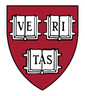

<h1 align="center">
 
CS50x projects repository</h1>

This repository is dedicated to storing my projects, notes and files related to **Harvard University's CS50x** course.

I started this course on **April 11, 2024**.

## What You'll Find Here

- **Lecture Notes**: I keep detailed notes of lectures and supplementary materials.
- **Problem Set Solutions**: Explore my solutions to the problem sets assigned in CS50x, including programs written in C, Python, and other languages.
- **Work in Progress**: This repository is a work in progress and will be continually updated as I progress through the course.

## About CS50x

[CS50x](https://cs50.harvard.edu/x/2024/) is an introductory course to computer science offered by Harvard University. It covers a wide range of topics, including programming in C, Python, web development, and more. The course is designed to be challenging yet accessible to beginners, making it an excellent choice for those looking to dive into the world of computer science.

## Gradebook

***Test***: number of successfully completed tests.

***Style***: assessing compliance with a given coding style from 0.0 to 1.0 points.

---

#### ✅ Week 0: Scratch

| *Assignment*                                                                                        | *Task*                                                                                                          | *Test*    |
|-----------------------------------------------------------------------------------------------------|-----------------------------------------------------------------------------------------------------------------|-----------|
| [Problem set 0](https://github.com/raydtutto/harvard-cs50x-2024/tree/main/src/week_0/problem_set_0) | [scratch](https://github.com/raydtutto/harvard-cs50x-2024/blob/main/src/week_0/problem_set_0/pset0_solution.md) | **8 / 8** |

#### ✅ Week 1: C

| *Assignment*                                                                                                    | *Task*                                                                                                              | *Test*      | *Style* |
|-----------------------------------------------------------------------------------------------------------------|---------------------------------------------------------------------------------------------------------------------|-------------|---------|
| [Problem set 1](https://github.com/raydtutto/harvard-cs50x-2024/tree/main/src/week_1/problem_set_1)             | [hello](https://github.com/raydtutto/harvard-cs50x-2024/blob/main/src/week_1/problem_set_1/me/hello.c)              | **5 / 5**   | 1.0     |
|                                                                                                                 | [mario-less](https://github.com/raydtutto/harvard-cs50x-2024/blob/main/src/week_1/problem_set_1/mario-less/mario.c) | **10 / 10** | 1.0     |
|                                                                                                                 | [mario-more](https://github.com/raydtutto/harvard-cs50x-2024/blob/main/src/week_1/problem_set_1/mario-more/mario.c) | **10 / 10** | 1.0     |
|                                                                                                                 | [cash](https://github.com/raydtutto/harvard-cs50x-2024/blob/main/src/week_1/problem_set_1/cash/cash.c)              | **10 / 10** | 1.0     |
|                                                                                                                 | [credit](https://github.com/raydtutto/harvard-cs50x-2024/blob/main/src/week_1/problem_set_1/credit/credit.c)        | **17 / 17** | 1.0     |
| [Additional practice](https://github.com/raydtutto/harvard-cs50x-2024/tree/main/src/week_1/additional_practice) | [debug](https://github.com/raydtutto/harvard-cs50x-2024/blob/main/src/week_1/additional_practice/debug/debug.c)     | **4 / 4**   | 1.0     |
|                                                                                                                 | [half](https://github.com/raydtutto/harvard-cs50x-2024/blob/main/src/week_1/additional_practice/half/half.c)        | **6 / 6**   | 1.0     |
|                                                                                                                 | [prime](https://github.com/raydtutto/harvard-cs50x-2024/blob/main/src/week_1/additional_practice/prime/prime.c)     | **5 / 5**   | 1.0     |

#### ✍️ Week 2: Arrays

| *Assignment*                                                                                        | *Task*                                                                                                            | *Test*      | *Style* |
|-----------------------------------------------------------------------------------------------------|-------------------------------------------------------------------------------------------------------------------|-------------|---------|
| [Problem set 2](https://github.com/raydtutto/harvard-cs50x-2024/tree/main/src/week_2/problem_set_2) | [scrabble](https://github.com/raydtutto/harvard-cs50x-2024/blob/main/src/week_2/problem_set_2/scrabble.c)         | **11 / 11** | 1.0     |
|                                                                                                     | [readability](https://github.com/raydtutto/harvard-cs50x-2024/blob/main/src/week_2/problem_set_2/readability.c)   | **11 / 11** | 1.0     |

---

#### Week 3: Algorithms
#### Week 4: Memory
#### Week 5: Data Structures
#### Week 6: Python
#### Week 6.5: Artificial Intelligence
#### Week 7: SQL
#### Week 8: HTML, CSS, JavaScript
#### Week 9: Flask
#### Week 10: Cybersecurity

---

## Instructors

- [David J. Malan](https://github.com/dmalan)
- [Doug LLoyd](https://github.com/dlloyd09)
- [Brian Yu](https://github.com/brianyu28)
- [Carter Zenke](https://github.com/carterzenke)
