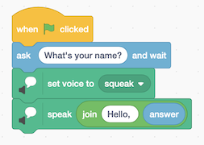

# Week 0: Scratch
Computer programming is about taking some input and creating some output, thus solving problem.  
input -> ▢ <- output

---
## Numeral systems

### Unary system
The simplest numeral system to represent natural numbers.

### Binary system
Computers speak only 0's and 1's in binary system.
Single bit = 0 or 1 (binary digit).

Imagine two light bulbs, one light bulb can only count from 0 to 1, where 0 = off and 1 = on.  
00 = 0 in unary and binary  
01 = 1 in unary and binary  
10 = 2 in binary / 1 in unary  
11 = 3 in binary / 2 in unary  
Number 4 needs third light bulb:  
100 = 4 in binary  
101 = 5  
110 = 6  
111 = 7  

### Decimal system
Uses 'base-10' system: 0, 1, 2, 3, 4, 5, 6, 7, 8, 9. Dec = 10  
In decimal system each of the digits is in a different column.

Imagine number 123:
- '3' - Rightmost digit is the ones place or the ones column.
- '2' - The tens place or the tens column.
- '1' - The hundreds place.
123 = (100 * 1) + (10 * 2) + (1 * 3)

### Back to binary system

Binary system use 'base-2' to count:

| 2^2         | 2^1        | 2^0        |
|-------------|------------|------------|
| 4           | 2          | 1          |
| Fours place | Twos place | Ones place |

That's why in binary 100 = 4, 101 = 5, 110 = 6 and so on.  
Four number 8 you need to add one more bit 1000 = 8.  

1 byte = 8 bits  
Like this:  
00000000 = 0  
11111111 = 255  

| 2^7          | 2^6        | 2^5        | 2^4         | 2^3          | 2^2         | 2^1        | 2^0        |
|--------------|------------|------------|-------------|--------------|-------------|------------|------------|
| 128          | 64         | 32         | 16          | 8            | 4           | 2          | 1          |
| 128'th place | 64's place | 32's place | 16'th place | Eights place | Fours place | Twos place | Ones place |

Actually, there is 256 bytes, but we start at 0.

---
## ASCII

A = 65 = 01000001

| 2^7          | 2^6        | 2^5        | 2^4         | 2^3          | 2^2         | 2^1        | 2^0        |
|--------------|------------|------------|-------------|--------------|-------------|------------|------------|
| 128'th place | 64's place | 32's place | 16'th place | Eights place | Fours place | Twos place | Ones place |
| 0            | 1          | 0          | 0           | 0            | 0           | 0          | 1          |
| = 0          | = 64       | = 0        | = 0         | = 0          | = 0         | = 0        | = 1        |

American Standard Code for Information Interchange - ASCII / [Wiki](https://en.wikipedia.org/wiki/ASCII)

8 bytes = 255 symbols

|         | 01001000 | 01001001 | 00100001 |
|---------|----------|----------|----------|
| Decimal | 72       | 73       | 33       |
| Symbol  | H        | I        | !        |

|         | 01000010 | 01001111 | 01010111 |
|---------|----------|----------|----------|
| Decimal | 66       | 79       | 87       |
| Symbol  | B        | O        | W        |

---
## Unicode
A text encoding standard / [Wiki](https://en.wikipedia.org/wiki/Unicode).  
Nowadays, everyone using Unicode instead of ASCII.  
May use 8 bits (1 byte), 16 bits (2 bytes), or 24 bits (3 bytes), or even 32 bits (4 bytes) per character.  
Unicode roughly represents 4 000 000 000 possible characters.  
The mission is to represent and to preserve all human languages digitally (past, present and future).

Emoji / [Wiki](https://en.wikipedia.org/wiki/Emoji)  
11110000100111111001100010000010 = 4036991106 = U+1F602 = 😂 = "face with tears of joy"

U+1F602 - Unicode code point that uses 'base-16' or hexadecimal.  
'U+' have no mathematical significance, just a visual clue.

👍 = U+1F44D  
👍🏻 = U+1F44D U+1F3FD for another skin tone

💑 = U+1F491 but if we want to change gender, look or heart representation:

|               |        |        |        |        |                |
|---------------|--------|--------|--------|--------|----------------|
| U+1F469       | U+200D | U+2764 | U+FE0F | U+200D | U+1F468        |
| Woman at left |        | Heart  | Heart  |        | Man at right   |
| U+1F469       | U+200D | U+2764 | U+FE0F | U+200D | U+1F469        |
| Woman at left |        | Heart  | Heart  |        | Woman at right |

U+200D - Zero Width Joiner (ZWJ) for connecting elements

Computer scientists faced a challenge when wanting to assign various skin tones to each emoji to allow the communication to be further personalized. In this case, the creators and contributors of emoji decided that the initial bits would be the structure of the emoji itself, followed by skin tone.

---
### RGB
How computer represent colors:
Red + Green + Blue = from 0 to 255  
Every pixel has three numbers (1 byte = 8 bits) associated with it.

72 73 33 = some kind of yellow.

Each pixel is storing 24 bits or 3 bytes.

---
## Algorithm
Let's look again at this: input -> ▢ <- output  
input -> [ algorithm ] <- output

Algorithm - step-by-step instructions (code) for solving some problems.

**big-O notation**

- n - the slowest
- n/2 - twice as fast
- log2n is the - doubling the problem would only result in one more step to solve the problem

If you have a lot of data you need to think about architecture and design of your code - the key word is **efficiency**.

---
## Pseudocode
Has no formal meaning, but you wrote your thoughts down tersely, succinct, but precisely.

Example:
1. **Pick up** phone book
2. **Open to** middle of phone code
3. **Look at** page
4. If person is on page 
   5. **Call** person
6. Else if person is earlier in book
   7. **Open to** the middle of left half of book
   8. Go back to line 3
9. Else if person is later in book
   10. **Open to** the middle of right half of book
   11. Go back to line 3
12. Else
    13. **Quit**

- The bold words = functions (actions or verbs that tell what to do);
- If and Else if - conditionals (forks in the road);
- person is on page, person is earlier in book, person is later in book - boolean expressions (true or false answers).
- Go back to line 3 - loop (a cycle for doing things again and again)
- and many more...

---
## Artificial intelligence
Needs more building blocks than just functions, loops and conditionals.

If we were implementing our own chatbot:

    If student says hello
        Say hello back
    Else if the student says goodbye
        Say goodbye back
    Else if the student asks how you are
        Say you're well
    Else if the student asks why 111 in binary is 7 in decimal
        ...

This code may become huge if we will describe every possible question.

***Large language models (LLM)*** - an implementation, in software, of code that actually takes, as input, lots and lots of language
and infers, from the pattern of any human language, what a typical human might actually say when asked a question.

LLM makes a lot of mistakes, because their inputs are imperfect with a sparkle of randomness.

CS50's own AI-based software: [CS50 Duck](https://cs50.ai) has a personality of a CS50 teaching fellow (TF) or teaching
assistant (TA) and think of itself as a duck.

Visual Studio Code for CS50: [cs50.dev](https://cs50.dev)

---
## Scratch
A visual programming language developed by [MIT](https://scratch.mit.edu)
Scratch using coding blocks in a visual manner.

**Scratch IDE** (integrated development environment):

- Left: building blocks
- Center: drag blocks here
- Right bottom: objects
- Right top: preview

Scratch operates on a coordinate system:

### Hello world

Building blocks in Scratch IDE:

- **Green flag** means "go"
- **Red Stop sign** means "stop"
- **Event**: When **Green flag** clicked
- **Looks**: I want to say "Hello fellas!"

say "Hello fellas!" = function "parameter or argument"

algorithm->output" height="395">

***input -> [ algorithm ] <- output***

### Hello, you

Text output with inserted name:

Same output but with custom voice:

### Meow

Assume that you want a cat to meow three times.

Poor design example:

Loop design example:

Better design example:

Best approach:

