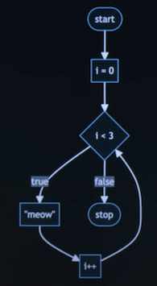

# Week 1: C

```c
#include <stdio.h>

int main(void)
{
    printf("Hello, world\n"); // function
}
```
---

## Source code
Computer understands only machine code.

*source code* -> [ **compiler** ] -> *machine code*

Compiler - is a program that translates one language to another.

---

## Hello, world
**Visual Studio Code** - the integrated development environment (IDE)

**Terminal window** - is a command line interface, known as a CLI, command line, or terminal window where we can
send commands to the computer in the cloud

Three commands in terminal to write, compile, and run our first program:
(works in VS Code)

    $ code hello.c
    // Creates a file and allows us to type instructions for this program.

    $ make hello
    // Compiles the file from our instructions in C and creates an executable file called "hello"

    $ ./hello
    // Runs the program called "hello"

    $ - is not a part of your command, this is a common convention to represent your prompt.

Rules:
- Name your files with lower keys in most of the cases;
- Never use spaces;
- File extension is always in lower keys;

Source file: *src/week_1/hello.c*

```c
#include <stdio.h>

int main(void)
{
    printf("hello, world\n");
}
```
Run target `hello` to run example `hello.c`.

**'printf'** is a function that can output a line of text.  
**'\n'** creates a new line after the words.

*arguments* -> [ **function** ] -> *side effects*

---

## Libraries
Collections of pre-written functions that others have written in the past that we can utilize in our code.

CS50 has its own library called cs50.h

Manual pages - [manual.cs50.io](https://manual.cs50.io/)

---

## Hello, world + name
*arguments* -> [ **function** ] -> *return value*

Task: Get a name and greet the user.

Let's use the function from cs50 library:

```c
string name = get_string("What's your name? ");
```

- *get_print* - prompt a user for a string;
- *string* - data type of variable;
- *name* - is the string being passed to %s.

*Variable* is a special holding place.  
*%s* is a placeholder called a format code that tells the 'printf' function to prepare to receive a string.

```c
    #include <stdio.h>
    #include <cs50.h>

    int main(void)
    {
        string answer = get_string("What's your name? ");
        printf("Hello, %s\n", answer);
    }
```

Run target `hello_with_name` to run example `hello_with_name.c`.

Type *'clear'* in the terminal to clear all commands, just for the comfort. Or hit 'ctrl + l' on your keyboard.

> Error for not using the cs50 library:
> 
> 
>
> hello_with_name.c:6:5 = file name : line6 : character5

---

## Types of data
- bool
- char
- double
- float
- int
- long
- string
- ...

> ### Format codes
> [*'printf'*](https://manual.cs50.io/3/printf) allows for many format codes.  
> Here is a non-comprehensive list of ones you may utilize in this course:
> - %c - for char variables
> - %f - for double and float variables
> - %.0f - for double and float variables, will remove zeros after dot.
> - %.2f - for double and float variables, will show 2 numbers after dot.
> - %i - for int or integer variables
> - %d - for digital numbers variables (int, float, double)
> - %li - for long variables
> - %s - for string variables
> - and many more...

---

## Conditionals

***If*** conditional:

```c
if (x < y)
{
    printf("x is less than y\n");
}
```

***If else*** conditional:

```c
if (x < y)
{
    printf("x is less than y\n");
}
else
{
    printf("x is not less than y\n");
}
```

***If else*** with several conditions:

```c
if (x < y)
{
    printf("x is less than y\n");
}
else (x > y)
{
    printf("x is greater than y\n");
}
else
// '(x == y)' is a redundant condition, just type 'else'
{
    printf("x is equal to y\n");
}
```
---

## Variables
Declaring a variable 'counter':

```c
int counter = 0;

// All three lines below are equal to each other.
// They are incrementing the value of a variable by 1.
counter = counter + 1;
counter += 1;
counter++;
```
---

## Compare.c

**Version #1**

```c
#include <cs50.h>
#include <stdio.h>

int main(void)
{
    int x = get_int("What's x? ");
    int y = get_int("What's y? ");

    if (x < y)
    {
        printf("x is less than y\n");
    }
}
```

**Flowchart for Version #1**


**Version #2**

```c
#include <cs50.h>
#include <stdio.h>

int main(void)
{
    int x = get_int("What's x? ");
    int y = get_int("What's y? ");

    if (x < y)
    {
        printf("x is less than y\n");
    }
    else
    {
        printf("x is not less than y\n");
    }
}
```

**Flowchart for Version #2**


**Version #3**

```c
#include <cs50.h>
#include <stdio.h>

int main(void)
{
    int x = get_int("What's x? ");
    int y = get_int("What's y? ");

    if (x < y)
    {
        printf("x is less than y\n");
    }
    if (x > y)
    {
        printf("x is greater than y\n");
    }
    if (x == y)
    {
        printf("x is equal to y\n");
    }
}
```

**Flowchart for Version #3**  
Three requests will be processed separately one by one.


**Version #4**

```c
#include <cs50.h>
#include <stdio.h>

int main(void)
{
    int x = get_int("What's x? ");
    int y = get_int("What's y? ");

    if (x < y)
    {
        printf("x is less than y\n");
    }
    else if (x > y)
    {
        printf("x is greater than y\n");
    }
    else if (x == y)
    {
        printf("x is equal to y\n");
    }
}
```

**Flowchart for Version #4**  
One requests with three conditions. Process will be stopped after after suitable condition.


**Version #5**  
One request with two conditions. The best way to solve this problem.

```c
#include <cs50.h>
#include <stdio.h>

int main(void)
{
    int x = get_int("What's x? ");
    int y = get_int("What's y? ");

    if (x < y)
    {
        printf("x is less than y\n");
    }
    else if (x > y)
    {
        printf("x is greater than y\n");
    }
    else
    {
        printf("x is equal to y\n");
    }
}
```

**Flowchart for Version #5**  


Run target `compare` to run example `compare.c`.

---

## Agree.c

***char*** = always 1 character

**Version #1**

```c
#include <cs50.h>
#include <stdio.h>

int main(void)
{
    char c = get_char("Do you agree? ");

    if (c == 'y') // 'char' uses single quotes ' instead of double quotes ".
    {
        printf("Agreed.\n");
    }
    else if (c == 'Y')
    {
        printf("Agreed.\n");
    }
    else if (c == 'n');
    {
        printf("Not agreed.\n");
    }
    else if (c == 'N')
    {
        printf("Not agreed.\n");
    }
}
```
**Better version #2**

```c
#include <cs50.h>
#include <stdio.h>

int main(void)
{
    char c = get_char("Do you agree? ");

    if (c == 'y' || c == 'Y') // || - or, && - and
    {
        printf("Agreed.\n");
    }
    else if (c == 'n' || c = 'N');
    {
        printf("Not agreed.\n");
    }
}
```

Run target `agree` to run example `agree.c`.

---

## Loops

How to "meow" three times.

**Version #1**

Loop **'while'** - keep going through the loop again and again until condition is true.

```c
#include <stdio.h>

int main(void)
{
    int counter = 3; // define variable

    while (counter > 0)
    {
//      int counter = 3; // you can't define variable from the loop condition inside the loop, 
//      because it won't exist when the loop starts.
        printf("Meow!\n");
        counter = counter - 1;
    }
}
```

**Version #2**

```c
#include <stdio.h>

int main(void)
{
    int i = 3;

    while (i > 0)
    {
        printf("Meow!\n");
        i--;
    }
}
```
---

### meow.c

**Version #1**  
Duplication of commands.

```c
#include <stdio.h>

int main(void)
{
    printf("meow\n");
    printf("meow\n");
    printf("meow\n");
}
```

**Version #2**  
Better way.

```c
#include <stdio.h>

int main(void)
{
    int i = 3;

    while(i > 0)
    {
        printf("meow\n");
        i--;
    }
}
```

**Version #3**

```c
#include <stdio.h>

int main(void)
{
    int i = 1;

    while(i <= 3)
    {
        printf("meow\n");
        i++;
    }
}
```

**Version #4**  
The best conventional way for 'while' loop.

```c
#include <stdio.h>

int main(void)
{
    int i = 0; // pattern of bits

    while(i < 3)
    {
        printf("meow\n");
        i++;
    }
}
```

### Loop 'for'

**Version #5**

```c
#include <stdio.h>

int main(void)
{
    // define, initialize and change variable inside condition
    for (int i = 0; i < 3; i++)
    {
        printf("meow\n");
    }
}
```

**Flowchart for Version #5**



---

## Forever loop

**Version #6**

```c
#include <stdio.h>

int main(void)
{
    while (true) // always true
    {
        printf("meow\n");
    }
}
```

---

## Functions

**Version #7**

```c
// Define the function, void has no return value
void meow(void) // 'meow' is the name of the function, '(void)' takes no inputs
{
    printf("meow\n");

}

int main(void)
{
    for (int i = 0; i < 0; i++)
    {
        meow(); // calling the function 'meow'
    }
}
```

**Version #8**

```c
#include <stdio.h>

//-------------------------------------------------
// Declare the function before the main program
//-------------------------------------------------

void meow(void);

//-------------------------------------------------
// Main program
//-------------------------------------------------

int main(void)
{
    for (int i = 0; i < 0; i++)
    {
        meow(); // calling the function 'meow'
    }
}

//-------------------------------------------------
// Define the function
//-------------------------------------------------

void meow(void)
{
    printf("meow\n");
}
```

**Final version of MEOW**

```c
#include <stdio.h>

void meow(int n);

int main(void)
{
    meow(3);
}

void meow(int n)
{
    for (int i = 0; i < n; i++)
    {
        printf("meow\n");
    }
}
```
---

## calculator.c

**Version #1**

```c
#include <cs50.h>
#include <stdio.h>

int main(void)
{
    // Prompt user for x
    int x = get_int("x: ");

    // Prompt user for y
    int y = get_int("y: ");

    // Perform addition
    printf("%i\n", x + y);
}
```

Operators refer to the mathematical operations:

- \+ for addition
- \- for subtraction
- \* for multiplication
- / for division
- % for remainder

**Abstraction** is the art of simplifying our code such that it deals with smaller and smaller problems.

**Version #2**

**Scope** refers to the context in which variables exist.  
e.g. 'x' and 'y' exist only in the 'main' program, when 'a' and 'b' only in the 'add' function.

```c
#include <cs50.h>
#include <stdio.h>

int add(int a, int b);

int main(void)
{
    // Prompt user for x
    int x = get_int("x: ");

    // Prompt user for y
    int y = get_int("y: ");

    // Perform addition
    int z = add(x, y); // passing 'x' and 'y' as 'a' and 'b' from the 'add' function
    printf("%i\n", z);
}

int add(int a, int b) // return integer, takes two integers as input, use different names for variables
{
    return a + b;
}
```

**Version #3**

```c
#include <cs50.h>
#include <stdio.h>

int add(int a, int b);

int main(void) // always returns zero if everything is ok in compilation
{
    // Prompt user for x
    int x = get_int("x: ");

    // Prompt user for y
    int y = get_int("y: ");

    // Perform addition
    // You can give a function as an argument (less readable though)
    printf("%i\n", add(x, y)); // passing 'x' and 'y' as 'a' and 'b' from the 'add' function
}

int add(int a, int b) // return integer, takes two integers as input, use different names for variables
{
    return a + b;
}
```
---

## Linux

Linux is an operating system that is accessible via the command line in the terminal window in VS Code.

GUI - graphical user interface

Some common command-line arguments:

- ***cd***, for changing our current directory (folder): *$ cd FolderName*
- ***cp***, for copying files and directories
- ***ls***, for listing files in a directory: *$ ls*
- ***mkdir***, for making a directory
- ***mv***, for moving (renaming) files and directories: *$ mv meow.c woof.c*
- ***rm***, for removing (deleting) files: *$rm meow.c*
- ***rmdir***, for removing (deleting) directories

---

## Mario

**Version #1.1**

```c
#include <stdio.h>

int main(void)
{
    printf("????\n");
}
```

**Version #1.2**

```c
#include <stdio.h>

int main(void)
{
    for (int i = 0; i < 4; i++)
    {
        printf("?");
    }
}
```

**Version #1.3**

```c
#include <stdio.h>

int main(void)
{
    for (int i = 0; i < 4; i++)
    {
        printf("?");
    }
    printf("\n");
}
```

**Version #2.1**

```c
#include <stdio.h>

int main(void)
{
    printf("###\n");
    printf("###\n");
    printf("###\n");
}
```

**Version #2.2**

```c
#include <stdio.h>

int main(void)
{
    for (int i = 0; i < 3; i++)
    {
        printf("###\n");
    }
}
```

**Version #2.3**

```c
#include <stdio.h>

int main(void)
{
    for (int i = 0; i < 3; i++) // 3 - "magic number" - a raw number without clear definition
    {
        for (int j = 0; j < 3; j++) // 3 - "magic number" again
        {
            printf("#");
        }
        printf("\n");
    }
}
```

**Version #2.4**

```c
#include <stdio.h>

int main(void)
{
    int n = 3; // define variable with value 3
    for (int i = 0; i < n; i++)
    {
        for (int j = 0; j < n; j++)
        {
            printf("#");
        }
        printf("\n");
    }
}
```

**Version #2.5**  
What if we wanted to ensure that the number of blocks to be unchangeable?  
Use "constant".

```c
#include <stdio.h>

int main(void)
{
    const int n = 3; // define variable with value 3
    for (int i = 0; i < n; i++)
    {
        for (int j = 0; j < n; j++)
        {
            printf("#");
        }
        printf("\n");
    }
}
```

**Version #2.6**  
What if want to change 'n' dynamically?

```c
#include <stdio.h>
#include <cs50.h>

int main(void)
{
    int n = get_int("Size: ");

    while(n < 1)
    {
        n = get_int("Size: ");
    }

    for (int i = 0; i < n; i++)
    {
        for (int j = 0; j < n; j++)
        {
            printf("#");
        }
        printf("\n");
    }
}
```

**Version #2.7**  
Let's improve this code with ***'do ... while'*** loop.

```c
#include <stdio.h>
#include <cs50.h>

int main(void)
{
    int n; // Declaring variable 'n' outside the loop scope.

    do // Loop works at least once.
    {
        n = get_int("Size: ");
    }
    while (n < 1);

    for (int i = 0; i < n; i++)
    {
        for (int j = 0; j < n; j++)
        {
            printf("#");
        }
        printf("\n");
    }
}
```

---

## Integer overflow

***RAM*** - Random-access Memory with physical limitations, where data is stored.

***Integer overflow*** occurs when an arithmetic operation attempts to create a numeric value that is outside
the range that can be represented with a given number of digits.

x32 --> 00000000000000000000000000000000 = 0 --> 11111111111111111111111111111111 = 4294967295

If you use negative and positive values --> from -2147483648 to 2147483647

Data types:

- ***bool***, a Boolean expression of either true or false
- ***char***, a single character like a or 2
- ***double***, uses 64 bits, a floating-point value with more digits than a float
- ***float***, uses 32 bits, a floating-point value, or real number with a decimal value
- ***int***, integers up to a certain size, or number of bits
- ***long***, integers with more bits, so they can count higher than an int
- ***string***, a string of characters

Let's return to the `calculator` and change it:

***Version with integer***

```c
#include <cs50.h>
#include <stdio.h>

int main(void)
{
    // Prompt user for x
    int x = get_int("x: ");

    // Prompt user for y
    int y = get_int("y: ");

    // Perform dividing
    printf("%i\n", add(x / y));
}
```
> Output will be '0' and not '0.333333'

***Version with float***

```c
#include <cs50.h>
#include <stdio.h>

int main(void)
{
    // Prompt user for x
    int x = get_int("x: ");

    // Prompt user for y
    int y = get_int("y: ");

    // Perform dividing
    float z = x / y;
    printf("%f\n", z);
}
```

> Output will be '0.000000' and again not '0.333333'

===> The wrong output is because of ***'truncation'***.  
It refers to a process or operation that shortens or cuts off a piece of data, such as a string or a file, by removing
characters, digits, or bytes from the end.

***Version without truncation***  
Uses type casting - converting one type to another.

```c
#include <cs50.h>
#include <stdio.h>

int main(void)
{
    // Prompt user for x
    int x = get_int("x: ");

    // Prompt user for y
    int y = get_int("y: ");

    // Perform dividing
    float z = (float) x / (float) y;
    printf("%f\n", z);
}
```

> Output will be '0.333333'! Hooray!

***Another version #1***  
Uses type casting - converting one type to another.

```c
#include <cs50.h>
#include <stdio.h>

int main(void)
{
    // Prompt user for x
    int x = get_int("x: ");

    // Prompt user for y
    int y = get_int("y: ");

    // Perform dividing
    float z = (float) x / (float) y;
    printf("%.2f\n", z); // show me 2 decimal places specifically
}
```

> Output will be '0.33'

***Another version 1.1***  
Uses type casting - converting one type to another.

```c
#include <cs50.h>
#include <stdio.h>

int main(void)
{
    // Prompt user for x
    int x = get_int("x: ");

    // Prompt user for y
    int y = get_int("y: ");

    // Perform dividing
    double z = (double) x / (double) y;
    printf("%.20f\n", z); // show me 20 decimal places specifically
}
```

> Output with float data type will be '0.33333334326744079590'
> Output with double data type will be '0.33333333333333331483'
> 
> ***Floating point imprecision*** stems from the problem of trying to store numbers like 1/10 or (. 10) in a computer with
> a binary number system with a finite amount of numbers.