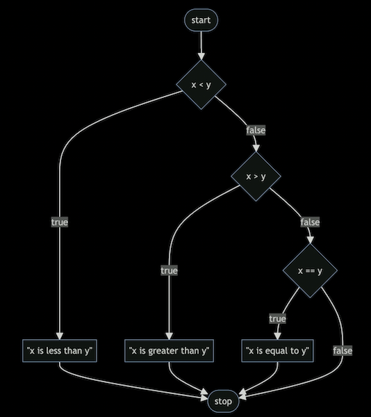

# Week 1: C

```c
#include <stdio.h>

int main(void)
{
    printf("Hello, world\n"); // function
}
```
---

## Source code
Computer understands only machine code.

*source code* -> [ **compiler** ] -> *machine code*

Compiler - is a program that translates one language to another.

---

## Hello, world
**Visual Studio Code** - the integrated development environment (IDE)

**Terminal window** - is a command line interface, known as a CLI, command line, or terminal window where we can
send commands to the computer in the cloud

Three commands in terminal to write, compile, and run our first program:
(works in VS Code)

    $ code hello.c
    // Creates a file and allows us to type instructions for this program.

    $ make hello
    // Compiles the file from our instructions in C and creates an executable file called "hello"

    $ ./hello
    // Runs the program called "hello"

    $ - is not a part of your command, this is a common convention to represent your prompt.

Rules:
- Name your files with lower keys in most of the cases;
- Never use spaces;
- File extension is always in lower keys;

Source file: *src/week_1/hello.c*

```c
#include <stdio.h>

int main(void)
{
    printf("hello, world\n");
}
```
Run target `hello` to run example `hello.c`.

**'printf'** is a function that can output a line of text.  
**'\n'** creates a new line after the words.

*arguments* -> [ **function** ] -> *side effects*

---

## Libraries
Collections of pre-written functions that others have written in the past that we can utilize in our code.

CS50 has its own library called cs50.h

Manual pages - [manual.cs50.io](https://manual.cs50.io/)

---

## Hello, world + name
*arguments* -> [ **function** ] -> *return value*

Task: Get a name and greet the user.

Let's use the function from cs50 library:

```c
string name = get_string("What's your name? ");
```

- *get_print* - prompt a user for a string;
- *string* - data type of variable;
- *name* - is the string being passed to %s.

*Variable* is a special holding place.  
*%s* is a placeholder called a format code that tells the 'printf' function to prepare to receive a string.

```c
    #include <stdio.h>
    #include <cs50.h>

    int main(void)
    {
        string answer = get_string("What's your name? ");
        printf("Hello, %s\n", answer);
    }
```

Run target `hello_with_name` to run example `hello_with_name.c`.

Type *'clear'* in the terminal to clear all commands, just for the comfort. Or hit 'ctrl + l' on your keyboard.

> Error for not using the cs50 library:
> 
> 
>
> hello_with_name.c:6:5 = file name : line6 : character5

---

## Types of data
- bool
- char
- double
- float
- int
- long
- string
- ...

> ### Format codes
> [*'printf'*](https://manual.cs50.io/3/printf) allows for many format codes.  
> Here is a non-comprehensive list of ones you may utilize in this course:
> - %c - for char variables
> - %f - for double and float variables
> - %.0f - for double and float variables, will remove zeros after dot.
> - %.2f - for double and float variables, will show 2 numbers after dot.
> - %i - for int or integer variables
> - %d - for digital numbers variables (int, float, double)
> - %li - for long variables
> - %s - for string variables
> - and many more...

---

## Conditionals

***If*** conditional:

```c
if (x < y)
{
    printf("x is less than y\n");
}
```

***If else*** conditional:

```c
if (x < y)
{
    printf("x is less than y\n");
}
else
{
    printf("x is not less than y\n");
}
```

***If else*** with several conditions:

```c
if (x < y)
{
    printf("x is less than y\n");
}
else (x > y)
{
    printf("x is greater than y\n");
}
else
// '(x == y)' is a redundant condition, just type 'else'
{
    printf("x is equal to y\n");
}
```
---

## Variables
Declaring a variable 'counter':

```c
int counter = 0;

// All three lines below are equal to each other.
// They are incrementing the value of a variable by 1.
counter = counter + 1;
counter += 1;
counter++;
```
---

## Compare.c

**Version #1**

```c
#include <cs50.h>
#include <stdio.h>

int main(void)
{
    int x = get_int("What's x? ");
    int y = get_int("What's y? ");

    if (x < y)
    {
        printf("x is less than y\n");
    }
}
```

**Flowchart for Version #1**


**Version #2**

```c
#include <cs50.h>
#include <stdio.h>

int main(void)
{
    int x = get_int("What's x? ");
    int y = get_int("What's y? ");

    if (x < y)
    {
        printf("x is less than y\n");
    }
    else
    {
        printf("x is not less than y\n");
    }
}
```

**Flowchart for Version #2**


**Version #3**

```c
#include <cs50.h>
#include <stdio.h>

int main(void)
{
    int x = get_int("What's x? ");
    int y = get_int("What's y? ");

    if (x < y)
    {
        printf("x is less than y\n");
    }
    if (x > y)
    {
        printf("x is greater than y\n");
    }
    if (x == y)
    {
        printf("x is equal to y\n");
    }
}
```

**Flowchart for Version #3**  
Three requests will be processed separately one by one.


**Version #4**

```c
#include <cs50.h>
#include <stdio.h>

int main(void)
{
    int x = get_int("What's x? ");
    int y = get_int("What's y? ");

    if (x < y)
    {
        printf("x is less than y\n");
    }
    else if (x > y)
    {
        printf("x is greater than y\n");
    }
    else if (x == y)
    {
        printf("x is equal to y\n");
    }
}
```

**Flowchart for Version #4**  
One requests with three conditions. Process will be stopped after after suitable condition.



**Version #5**  
One request with two conditions. The best way to solve this problem.

```c
#include <cs50.h>
#include <stdio.h>

int main(void)
{
    int x = get_int("What's x? ");
    int y = get_int("What's y? ");

    if (x < y)
    {
        printf("x is less than y\n");
    }
    else if (x > y)
    {
        printf("x is greater than y\n");
    }
    else
    {
        printf("x is equal to y\n");
    }
}
```

**Flowchart for Version #5**  


Run target `compare` to run example `compare.c`.

---

## Agree.c

***char*** = always 1 character

**Version #1**

```c
#include <cs50.h>
#include <stdio.h>

int main(void)
{
    char c = get_char("Do you agree? ");

    if (c == 'y') // 'char' uses single quotes ' instead of double quotes ".
    {
        printf("Agreed.\n");
    }
    else if (c == 'Y')
    {
        printf("Agreed.\n");
    }
    else if (c == 'n');
    {
        printf("Not agreed.\n");
    }
    else if (c == 'N')
    {
        printf("Not agreed.\n");
    }
}
```
**Better version #2**

```c
#include <cs50.h>
#include <stdio.h>

int main(void)
{
    char c = get_char("Do you agree? ");

    if (c == 'y' || c == 'Y') // || - or, && - and
    {
        printf("Agreed.\n");
    }
    else if (c == 'n' || c = 'N');
    {
        printf("Not agreed.\n");
    }
}
```

Run target `agree` to run example `agree.c`.

