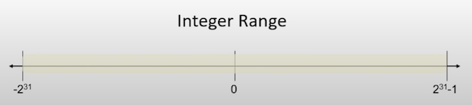
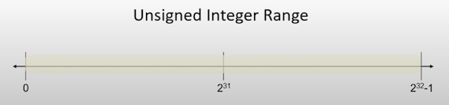
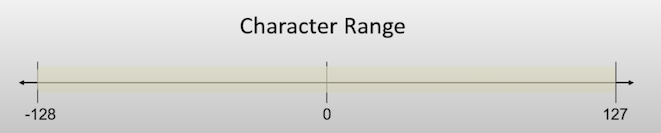

# Data types and Variables

Instructor: **[Doug Lloyd](https://github.com/dlloyd09)**

## int

> - The 'int' data type is used for variables that will store integers.
> - Integers always take up 4 bytes of memory (32 bits / 8 bits in 1 byte). This means the range of values they can store is necessarily
> limited to 32 bits worth of information.



-1 because we need a spot for '0'.

## unsigned int

> - *'Unsigned'* is not a separate data type, it's a qualifier that can be applied certain types (including int), which
> effectively doubles the positive range of variables of that type, at the cost of disallowing any negative values.
> - You'll occasionally have use for unsigned variables in CS50.

> *There are other qualifiers: short, long and const.*



> Use it if you know that your value never will be negative.

## char

> - The *'char'* data type is used for variables that will store single characters.
> - Characters always take up 1 byte of memory (8 bits). This means the range of values they can store is necessarily
> limited to 8 bits worth of information.
> - Thanks to ASCII, we've developed a mapping characters like A, B, C, etc... to numeric values in the positive side
> of this range.



## float

> - The *'float* data type is used for variables that will store floating-point values, also known as *real numbers*.
> - Floating points values always take up 4 bytes of memory (32 bits).
> - It's a little complicated to describe the range of a float, but suffice it to say with 32 bits of precision, some of
> which might be used for an integer part, we are limited in how *'precise'* we can be.

## double

> - Used for variables that will store floating-point values, also known as *real numbers*.
> - The difference is that *doubles* are *double precision*. They always take up 8 bytes of memory (64 bits).
> - Allows us to be specify much more precise float and real numbers.

## Void

> - Is a type, not a *data type*.
> - Functions can have a *void* return type, which just means they don't return a value.
> - The parameter list of a function can also be void. It simply means the function takes no parameters.
> - For now, think of *void* more as a placeholder for *"nothing"*. But it's more complex than this.

---

# CS50 data types

## bool

> - Used for variables that will store a Boolean value. More precisely, they are capable only of storing two values: 
> *true* and *false*.
> - #include <cs50.h>

## string

> - Used for variables that will store a series of characters, which programmers typically called a string.
> - Strings include things such as words, sentences, paragraphs, and the like.
> - #include <cs50.h>

---

# How to create, manipulate and work with variables

## Create

You need to do two things:
- Give it a type;
- Give it a name.

```c
int number;
char name;
```

For multiple variables:

```c
int height, width;
float sqrt2, sqrt3, pi; // sqrt2 - square root of 2
```

That way you are *declaring* the variable.

> Create a variable right when you need it.

## Use

After declaration you don't need to specify the type anymore (or it will cause redeclaring).

```c
int number; // declaration
number = 17; // assignment
char letter; // declaration
letter = 'H'; // assignment
```

You can consolidate declaration and assignment to one step:

```c
int number = 17; // initialization
char name = 'H'; // initialization
```