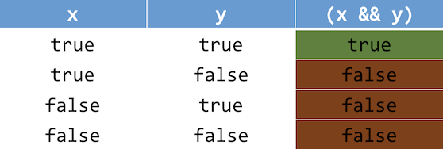
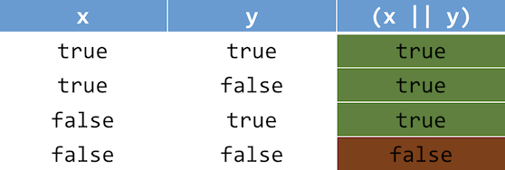
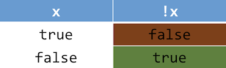

# Arithmetic Operators

Instructor: **[Doug Lloyd](https://github.com/dlloyd09)**

---

In order to manipulate and work with variables and values in C, we are have a number of operators at our disposal.

- In C we can add ( + ), subtract ( - ), multiply ( * ) and divide ( / ) numbers, as expected.

```c
int x = y + 1;
x = x * 5;
```
- We also have the modulus operator, ( % ) which gives us the remainder when the number on the left of the operator
is divided by the number on the right.

```c
int m = 13 % 4; // m is now 1
```

- C also provides a shorthand way to apply an arithmetic operator to a single variable.

```c
x = x * 5;
x *= 5;
```

This trick works with all five basic arithmetic operators. C provides a further shorthand for incrementing
or decrementing a variable by 1:

```c
x++;
x--;
```
---

# Boolean Expressions

Boolean expressions are used in C for comparing values.

- All Boolean expressions in C evaluate to one of two possible values – true or false.
- We can use the result of evaluating a Boolean expression in other programming constructs such as deciding which
branch in a conditional to take, or determining whether a loop should continue to run.
- Sometimes when working with Boolean expressions we will use variables of type bool, but we don’t have to.
- In C, every nonzero value is equivalent to true, and zero is false.
- Two main types of Boolean expressions: logical operators and relational operators.

### Logical operators

> Logical AND (&&) is true if and only if both operands are
> true, otherwise false.



> Logical OR (||) is true if and only if at least one
> operand is true, otherwise false.



> Logical NOT (!) inverts the value of its operand.



### Relational operators

These behave as you would expect them to, and appear syntactically similar to how you may recall them from elementary
arithmetic.

- Less than ***(x < y)***
- Less than or equal to ***(x <= y)***
- Greater than ***(x > y)***
- Greater than or equal to ***(x >= y)***

C also can test two variables for equality and inequality.

- Equality ***(x == y)***
- Inequality ***(x != y)***

Be careful! It’s a common mistake to use the assignment operator ( = ) when you intend to use the equality
operator ( == ).