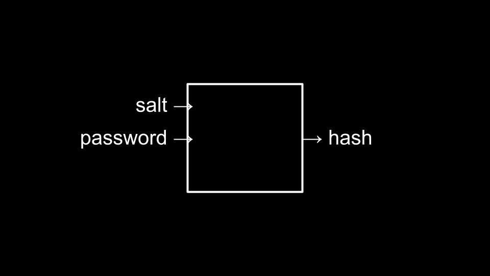
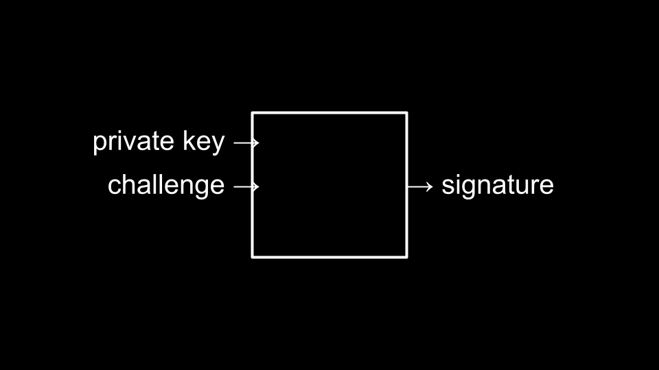
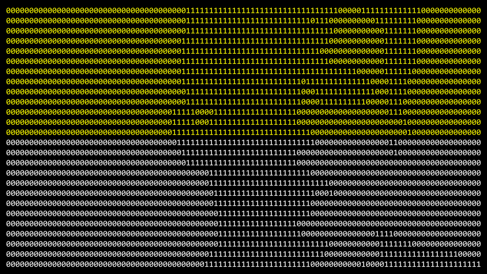

# Week 10: Cybersecurity

Instructor: **[David J. Malan](https://github.com/dmalan)**

---

## Useful links

### Install command-line tools
- https://developer.apple.com/xcode/
- https://learn.microsoft.com/en-us/windows/wsl/about

### Learn Git
- https://youtu.be/MJUJ4wbFm_A

### Download VS Code
- https://code.visualstudio.com/
- https://cs50.readthedocs.io/cs50.dev/

### Host a website (static)
- https://pages.github.com/
- https://www.netlify.com/

### Host a web app (dynamic)
- https://aws.amazon.com/education/awseducate/
- https://azure.microsoft.com/en-us/free/students/
- https://cloud.google.com/edu/students
- https://education.github.com/pack
- https://www.heroku.com/
- https://vercel.com/

### Ask questions: People
- https://www.reddit.com/r/learnprogramming/
- https://www.reddit.com/r/programming/
- https://stackoverflow.com/
- https://serverfault.com/
- https://techcrunch.com/
- https://news.ycombinator.com/

### Ask questions: AI
- https://chat.openai.com/
- https://github.com/features/copilot

### Take classes
- https://cs50.edx.org/python
- https://cs50.edx.org/sql
- https://cs50.edx.org/web
- https://cs50.edx.org/ai
- https://cs50.edx.org/games
- https://cs50.edx.org/cybersecurity
- https://cs50.edx.org/business
- https://cs50.edx.org/law
- https://cs50.edx.org/technology

### Stay in touch
- https://cs50.harvard.edu/communities

---

## Cybersecurity

### Passwords

One cybersecurity concern relates to our _passwords_. Passwords are one method used to secure data online.

There are common passwords that people use:
1. 123456
2. admin
3. 12345678
4. 123456789
5. 1234
6. 12345
7. password
8. 123
9. Aa123456
10. 1234567890

Adversaries can use brute-force attacks, using a dictionary of passwords to simply try every possible password.
Your password is likely not as secure as you think it is.

- iloveyou
- qwertyuiop
- P@ssw0rd

---

## Phone Security

Many phones are secured by a four-digit code. The most simple form of attack would be to brute-force attempt all 
possible passwords.

There are 10,000 possible passwords when using a four-digit code. If it takes one guess per second, it will take 
10,000 seconds to crack the password.

### Brute-force attack

However, if a programmer creates a program to generate all possible codes, the time required would be minimal. 
Consider the following code in Python:

```python
from string import digits
from itertools import product

for passcode in product(digits, repeat=4):
    print(passcode)
```

It should be quite disconcerting that the code above could take only a few seconds (at most!) to discover your password.

We could improve our security by switching to a four-letter password. This would result in 7,311,616 possible passwords.
Including uppercase and lowercase characters would create over 78 million possibilities.

Consider how we could modify your code to discover these passwords:

```python
from string import ascii_letters
from itertools import product

for passcode in product(ascii_letters, repeat=4):
    print(passcode)
```

We could even add the ability to look at all possible eight-digit passwords with letters, numbers, and punctuations:

```python
from string import ascii_letters, digits, punctuation
from itertools import product

for passcode in product(ascii_letters + digits + punctuation, repeat=8):
    print(passcode)
```

Expanding to eight characters, including upper and lowercase letters, numbers, and symbols, would result
in 6,095,689,385,410,816 possible combinations.

In the digital world, you simply want your password to be better than other peoples’ passwords such that 
others would be attacked far before you—as you are a much less convenient target.

A downside of using such a long password is the downside of having to remember it.

Accordingly, there are other defenses that could be employed to slow down an attacker. For example, some phone 
manufacturers lock out those who guess a password incorrectly.

Security is about finding a “sweet spot” between the trade-offs of enhanced security while maintaining convenience.

---

## Password Managers

Password managers can be used to create very challenging passwords and remember them for you. The probability of 
a password secured by a password manager being broken is very, very low.

You’d hope that such password managers are secure. However, if one gains access to your password manager, they 
would have access to all your passwords.

In the end, you are far less likely to be at risk by those you live with—and much more likely to be at risk 
by the billions of other people on the internet.

As mentioned prior, you can make a decision based on a balance between security and convenience.

---

## Two-factor Authentication

Adding another means by which you must authenticate adds further security. However, there is a human cost as you 
might not have access to your second factor.

These are implemented as one-time passwords of sorts that are sent to an email, device, or phone number. Always, 
security policies attempt to balance the needs of security and human convenience.

---

## Hashing

Your account information and other sensitive data should not be stored as raw text in an online database.

If a database becomes compromised and all credentials are stored in plain text, credentials for other services 
at other websites are likely also compromised.

Hence, hashing algorithms, as discussed earlier in this course, are used to store only hashed values of passwords.

One-way hashing allows online services to actually never store the original password typed by the user: 
Only the hashed value of these passwords. Accordingly, if there is a breach, only the hashed value will be known.

Rainbow tables are huge dictionaries that adversaries use to attempt to pre-hash possible passwords as a means 
by which to attempt to break the hash algorithm.

As an additional process to heightened security, programmers may sometimes introduce `salting` where it becomes 
unlikely that multiple users may have the same hash value to represent their passwords. You can imagine this as follows:



---

## Cryptography

Similar to hashing, a cipher algorithm can use a public key and text to create ciphertext.

In turn, a private key and the ciphertext can be fed to the algorithm to decrypt the text.

---

## Passkeys

Passkeys are a new technology only emerging in the most recent months.

Through private keys and a challenge being fed to an algorithm, websites can authenticate you through the unique 
signature created by your device.



Hence, passwords and usernames may soon become obsolete.

---

## Encryption

Encryption is a way by which data is obscured such that only the sender and intended receiver can be read.

Early in this course, we learned a very simple algorithm to “shift” the text by one or more characters as 
a rudimentary form of encryption.

End-to-end encryption is a way by which encrypting and decrypting happen on the same system without a middleman. 
This prevents the middleman or a malicious actor from being able to snoop on your data. Zoom and Apple Messages 
can both utilize end-to-end encryption.

---

## Deletion

Trashing a file on your computer or emptying the trash can does not actually delete the actual bits of the file 
on your computer.

Instead, remnants of the files are left.



Secure deletion is where the remnants of those files are turned into zeros and ones.

Still, some remnants may remain because of what is rendered inaccessible by the operating system.

Full-disk encryption allows your entire hard drive to be encrypted. Thus, your deleted files are less accessible 
to adversaries.

Considering encryption, it’s this same technology that adversaries use to create ransomware that can, quite 
literally, hold your hard drive for ransom.

---

## Summing Up

- Use a password manager.
- Use two-factor authentication.
- Use (end-to-end) encryption.