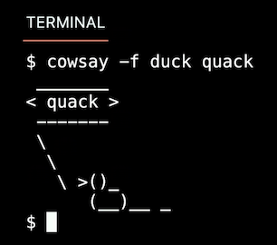

# Week 2: Arrays

Cryptography has been used to code messages for thousands of years and continues to be used in bank cards,
computer passwords, and ecommerce.

---

## Compiling

*source code* -> [ **compiler** ] -> *machine code*

Let's compile "hello, world" from the last week with *clang* command:

```c
#include <stdio.h>

int main(void)
{
    printf("hello, world\n");
}
```
Let's compile it through the terminal:

```commandline
make hello      -->      clang hello.c
./hello         -->      ./a.out
```

- ***make*** is running ***another command*** for you.
- It runs a command that executes ***clang*** to create an output file that you can run as a user.

> **Clang** (from "c language") - a compiler front end for the C, C++, Objective-C,
> and Objective-C++ programming languages.

> '**a.out**' remains the default output file name for executables created by certain compilers like Clang.
> Subsequence of dealing with *Assembly* language.

**Command Line Arguments** - additional words or a shorthand notation at your command prompt that modifies
the behaviour of a program.

```commandline
clang -o hello hello.c
./hello
```
```c
-o // assigns the name title to the output file  
// it works now!
```
clang -o hello hello.c -  assigns the name title to the output file  
./hello - it works now!

### But what if you need a prompt from the user?

```c
#include <cs50.h>
#include <stdio.h>

int main(void)
{
    string name = get_string("What's your name? ");
    printf("hello, %s\n", name);
}
```

There will be  an error if we try to compile like the last time:

```commandline
clang -o hello hello.c
...: in function 'main':
... undefied reference to 'get_string'
clang: error: linker command failed with exit code 1 (use -v to see invocation)
```

To avoid this you additionally need to tell the compiler that you use third party library:
- not only include the header file
- add a command in the terminal

```commandline
clang -o hello hello.c -lcs50
./hello
```

```c
-l // "link " enables the compiler to access the cs50.h library.
```
---

> ### Compiling
> 
> Is where your program is converted into assembly code.
> 
> It has four steps:
> 1. **Preprocessing** - find and replace
>    - Every line with hash '\#' symbol is a *preprocessor directive*.
> 2. **Compiling** - converting *'C'* in *'Assembly Language'*
>   
> 3. **Assembling** - converting *'Assembly Language'* in binary *machine code*
>   
> 4. **Linking** - links libraries .c files
>   - e.g. for 'hello, world' those files will be:
>     - hello.c
>     - cs50.c
>     - stdio.c
>   - looks like this:
>   

**Decompiling** goes in the reverse direction: from binary to source code.

---

## Debugging

Let's look at this buggy code:

```c
#include <stdio.h>

int main(void)
{
    for (int i = 0; i <= 3; i++)
    {
        printf("#\n");
    }
}

// It will compile without errors.
// But the output will content four hashes instead of three:
// #
// #
// #
// #

```

### 1. First tool: *'printf'* _(not so fast though)_

```c
#include <stdio.h>

int main(void)
{
    for (int i = 0; i <= 3; i++)
    {
        printf("i is %i\n", i);
        printf("#\n");
    }
}

// Output:
// i is 0
// #
// i is 1
// #
// i is 2
// #
// i is 3
// #
```

So the solution to get rid of this bug is 'i < 3' instead of 'i <= 3':

```c
#include <stdio.h>

int main(void)
{
    for (int i = 0; i < 3; i++)
    {
        printf("i is %i\n", i);
        printf("#\n");
    }
}

// Output:
// i is 0
// #
// i is 1
// #
// i is 2
// #
```

### 2. Second tool: 'debug 50' _(fast method)_

There is a preconfigured debugger in VS Code by CS50 team.

Assume that you have a code like this and you want to debug it:

```c
#include <cs50.h>
#include <stdio.h>

void print_column(int height);

int main(void)
{
    int n = get_int("Height: " );
    print_column(h);
}

void print_column(int height)
{
    for (int i = 0; i <= height; i++)
        {
            printf("#\n");
        }
}

// Output if height = 3:
// #
// #
// #
// #
```

1. Compile your program with command 'make'
2. Set breakpoints
3. Type 'debug50 ./compiled-file'
4. Debug: use 'step over' and 'step into' buttons to keep moving through your code.
5. Profit!

> When you are looking on the left side, you can find "Variables" tab with subsection "Locals".
> Notice that before you run your program variables often contains ***"garbage value"***.

### 3. Rubber duck debugging

> Try to explain your code step by step to an inanimate object.
> Also you're welcome to use [cs50.ai](https://cs50.ai/)

---

# Arrays

Each data type requires a certain amount of system resources:
- ```bool``` 1 byte = 8 bits
- ```int``` 4 bytes = 32 bits
- ```long``` 8 bytes = 64 bits
- ```float``` 4 bytes
- ```double``` 8 bytes
- ```char``` 1 byte
- ```string``` ? bytes

***Memory*** - Random Access Memory (RAM)


### calc_score.c

```c
#include <stdio.h>

int main(void)
{
    int score1 = 72;
    int score2 = 73;
    int score3 = 33;

    // We are using integer variables, but the calculation is rendered as a floating point value in the end
    printf("Average: %f\n", (score1 + score2 + score3) / 3.0f);
}
```

You can imagine how these variables are stored in memory:


But it's not a good way to storing things like this. In this case you are using a bunch of almost identical variables,
and maybe you will need much more of them.

> ***Arrays*** are a way of storing data back-to-back in memory such that this data is easily accessible.
> It is a sequence of values back to back in memory.

#### Version 1
Name an ```array``` in plural.

```c
#include <stdio.h>

int main(void)
{
    // Define one variable 'scores', each of whose values is going to be an int.
    // And you want three integers tucked away in that variable.
    int scores[3];
    
    // Assign values to three integers in 'scores'
    // Literally: "go into this array at location 0, or 1, or 2, and put this value there."
    scores[0] = 72;
    scores[1] = 73;
    scores[2] = 33;
}
```

> This way you are telling to the memory that you need enough room for three integers in total.

#### Version 2

```c
#include <cs50.h>
#include <stdio.h>

// You can declare a global variable that will in scope to every function in this file
//const int N = 3;

int main(void)
{
    // Common way to name constant integers is capitalized it
    const int N = 3;
    int scores[N];

//  Gives you an array with values inside
//  int scores = {72, 73, 33};

    for (int i = 0; i < N; i++)
    {
        scores[i] = get_int("Score: ");
    }

    printf("Average: %f\n", (scores[0] + scores[1] + scores[2]) / (float) N);

    return 0;
}
```

#### Version 3

```c
// Averages three numbers using an array, a constant, and a helper function

#include <cs50.h>
#include <stdio.h>

// Constant
const int N = 3;

// Prototype
float average(int length, int array[]);

int main(void)
{
    // Get scores
    int scores[N];

    for (int i = 0; i < N; i++)
    {
        scores[i] = get_int("Score: ");
    }

    // Print average
    printf("Average: %f\n", average(N, scores));

    return 0;
}

float average(int length, int array[])
{
    // Calculate average
    int sum = 0;
    for (int i = 0; i < length; i++)
    {
        sum += array[i];
    }
    return sum / (float) length;
}
```

---

## Strings

Let's start with characters:

#### Version 1

```c
#include <stdio.h>

int main(void)
{
    char c1 = 'H';
    char c2 = 'I';
    char c3 = '!';

    printf("%c%c%c\n", c1, c2, c3);

    return 0;
}

// Output:
// HI!
```

You can also type this instead, and it will work but with another output:

```c
printf("%i %i %i\n", c1, c2, c3);

// Output:
// 72 73 33
```

A ```string``` is simply an array of variables of type ```char```: an array of characters. Consider the special character
called ```NUL character``` (not NULL) - every string ends with it.


Imagining this in decimal:


```c
#include <cs50.h>
#include <stdio.h>

int main(void)
{
    string s = "HI!";
    string t = "BYE!";

    printf("%s\n", s);
    printf("%s\n", t);

    return 0;
}
```

What's going on inside the memory when you use the ```string```? Notice ```NUL``` after each string.


So, if we use this code it will also work:

```c
#include <cs50.h>
#include <stdio.h>

int main(void)
{
    string s = "HI!";
    
    // Treating string like a character
    printf("%c%c%c\n", s[0], s[1], s[2]);

    return 0;
}
```

Assume you want an array with strings:

```c
#include <cs50.h>
#include <stdio.h>

int main(void)
{
    string words[2];

    words[0] = "HI!";
    words[1] = "BYE!";
    
    printf("%s\n", words[0]);
//  printf("%c%c%c\n", words[0][0], words[0][1], words[0][2]);
    
    printf("%s\n", words[1]);
//  printf("%c%c%c\n", words[1][0], words[1][1], words[1][2]);

    return 0;
}
```
It will look like a two-dimensional array:


---

## String length

You can write your own function to get the length of the string:

```c
#include <cs50.h>
#include <stdio.h>

int string_length(string s);

int main(void)
{
    string name = get_string("Name: ");

    int length = string_length(name);
    printf("%i\n", length);

    return 0;
}

int string_length(string s)
{
    int n = 0;
    while (s[n] != '\0')
    {
        n++;
    }
    return n;
}
```

> There is a ready function to get the length of the string:  
> ```strlen```

```c
#include <cs50.h>
#include <stdio.h>
#include <string.h> // for 'strlen'

int main(void)
{
    string name = get_string("Name: ");

    int length = strlen(name);
    printf("%i\n", length);

    return 0;
}
```

#### string.c #1

Bad decision with 'strlen(s)' in the loop, because it will be checked each loop again and again.

```c
#include <cs50.h>
#include <stdio.h>
#include <string.h> // for 'strlen'

int main(void)
{
    string s = get_string("Input:  ");
    printf("Output: ");

    for (int i = 0; i < strlen(s); i++)
    {
        printf("%c", s[i]);
    }
    printf("\n");

    return 0;
}
```
#### string.c #2

```c
#include <cs50.h>
#include <stdio.h>
#include <string.h> // for 'strlen'

int main(void)
{
    string s = get_string("Input:  ");
    printf("Output: ");

    // More efficient way to store result from a function
    int length = strlen(s);

    for (int i = 0; i < length; i++)
    {
        printf("%c", s[i]);
    }
    printf("\n");

    return 0;
}
```

#### string.c - final version

```c
#include <cs50.h>
#include <stdio.h>
#include <string.h> // for 'strlen'

int main(void)
{
    string s = get_string("Input:  ");
    printf("Output: ");
    
    // In initialization, we set the function's result to int 'n'
    for (int i = 0, n = strlen(s); i < n; i++)
    {
        printf("%c", s[i]);
    }
    printf("\n");

    return 0;
}
```

---

## ctype.h

### uppercase.c #1

```c
#include <cs50.h>
#include <stdio.h>
#include <string.h>

int main(void)
{
    string s = get_string("Before:  ");
    printf("After: ");

    for (int i = 0, n = strlen(s); i < n; i++)
    {
        // If lowercase
        if (s[i] >= 'a' && s[i] <= 'z')
        {
            // Make uppercase
            printf("%c", s[i] - ('a' - 'A'));
//          printf("%c", s[i] - 32); // 32 - difference between 97 'a' and 65 'A'
        }
        else
        {
            printf("%c", s[i]);
        }
    }
    printf("\n");

    return 0;
}
```

Let's rewrite it, to use the function from ```ctype.h```

### uppercase.c #2

```c
#include <cs50.h>
#include <ctype.h>
#include <stdio.h>
#include <string.h>

int main(void)
{
    string s = get_string("Before:  ");
    printf("After: ");

    for (int i = 0, n = strlen(s); i < n; i++)
    {
        // If lowercase
        if (s[i] >= 'a' && s[i] <= 'z')
        {
            // Make uppercase with function 'toupper'
            printf("%c", toupper(s[i]));
        }
        else
        {
            printf("%c", s[i]);
        }
    }
    printf("\n");

    return 0;
}
```

> Fortunately, ```toupper``` can do the same without 'if' statement. So the code will look like this:

### uppercase.c - final version

```c
#include <cs50.h>
#include <ctype.h>
#include <stdio.h>
#include <string.h>

int main(void)
{
    string s = get_string("Before:  ");
    printf("After: ");

    for (int i = 0, n = strlen(s); i < n; i++)
    {
        printf("%c", toupper(s[i]));
    }
    printf("\n");

    return 0;
}
```

---

## Command-line arguments

Some programs like ***Clang*** include support for ```command-line arguments```.

> ```Command-line arguments``` are those arguments that are passed to your program at the command line.
> For example, all those statements you typed after clang are considered command line arguments.
> You can use these arguments in your own programs.

```c
#include <stdio.h>

int main(int argc, string argv[])
{
    ...
}
```

- ```int argc``` - integer, "argument count" - How many words did the human type at the prompt?
- ```string argv[]``` - ```argv[]``` stands for an argument vector (an array of strings in this case).

```c
#include <cs50.h>
#include <stdio.h>

int main(int argc, string argv[])
{
    printf("Hello, %s\n", argv[1]);
}
```
After successful compiling the terminal will wait for your prompt:

```commandline
make greet1
./greet1 Anna
Hello, Anna
```

### What if we write ```argv[0]``` instead of ```argv[1]```?

```c
#include <cs50.h>
#include <stdio.h>

int main(int argc, string argv[])
{
    printf("Hello, %s\n", argv[0]);
}
```
After successful compiling the terminal will wait for your prompt:

```commandline
make greet1
./greet1 Anna
Hello,  ./greet1
```

---> The name of your program will be always accessible in ```argv``` at location ```0```.

### What about write ```argv[2]```?

```c
#include <cs50.h>
#include <stdio.h>

int main(int argc, string argv[])
{
    printf("Hello, %s\n", argv[2]);
}
```

```commandline
make greet1
./greet1 Anna
Hello,  (null)
```

We can to avoid this manner of prompting with ```if``` statement:

```c
#include <cs50.h>
#include <stdio.h>

int main(int argc, string argv[])
{
    if (argc == 2)
    {
        printf("Hello, %s\n", argv[1]);
    }
    else
    {
        printf("Hello, world\n");
}
```

```commandline
make greet1
./greet1 Anna
Hello,  Anna
```

But if the user prompt the full name with a space between:

```commandline
make greet1
./greet1 John Doe
Hello,  world
```

If we do not know how many words the user will prompt, we can do this:

```c
#include <cs50.h>
#include <stdio.h>

int main(int argc, string argv[])
{
    for (int i = 0; i < argc; i++)
    {
        printf("%s\n", argv[i]);
    }
}
```

```commandline
make greet1
./greet1 John Doe
John
Doe
./greet1 John Doe Jr.
John
Doe
Jr.
```
---

## ASCII art


```cowsay``` ```argument``` - the cow can say "Hello, world" too and whatever you wish to prompt.

Commands also takes so-called _flags_ or _switches_ that starts with a dash ```-```, like a special configuration.



And etc...

---

## Exit status

When a program ends, a special exit code is provided to the computer.

When a program exits without error, a status code of 0 is provided the computer. Often, when an error occurs
that results in the program ending, a status of 1 is provided by the computer.

You could write a program that illustrates this by typing code status.c:

```c
#include <cs50.h>
#include <stdio.h>

int main(int argc, string argv[])
{
    if (argc != 2)
    {
        printf("Missing command-line argument\n");
        return 1;
    }
    printf("hello, %s\n", argv[1]);
    return 0;
}
```

Notice that if you fail to provide ```./status David```, you will get an exit status of ```1```.
However, if you do provide ```./status David```, you will get an exit status of ```0```.

> You can check what did the most recently run program secretly exit with the command ```echo $?``` in the terminal.

---

## Cryptography

**Cryptography** is the art of ciphering and deciphering a message.


- ```plaintext``` - any message you want to send;
- ```ciphertext``` - converted plaintext;
- ```cipher``` - an algorithm for encrypting or scrambling information in a reversible way;
- ```key``` - a huge number sometimes even 1'024 bits, that "opens" the "lock".

### Caesar cipher

A monoalphabetic rotation cipher used by Gaius Julius Caesar. Caesar rotated each letter of the plaintext forward
three times to encrypt, so that A became D, B became E, etc.

In this example we rotate by 1.


### ROT13

Rotates the letters f the alphabet by 13.


YES


BUT


### Decryption

If we rotated by 1 to encrypt text, then we can rotate by -1 to decrypt it, and so on.