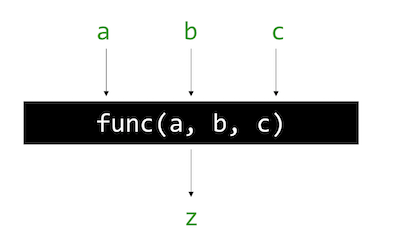

# Functions

Instructor: **[Doug Lloyd](https://github.com/dlloyd09)**

---

All the programs we’ve been writing in the course have been written inside of main().

That hasn’t been a problem yet, but it could be if our programs start to become unwieldy.

C and nearly all languages developed since allow us to write functions, sometimes also known as procedures,
methods, or subroutines.

> **Function** - a black box with a set of 0+ inputs and 1 output.
> 
> Why call it a _"black box"_?  
> If we aren't writing the functions ourselves, we don't need to know the underlying implementation.
> 
> That's why most functions have clear, obvious names and are well-documented.



- Function called 'func';
- a, b, c - three inputs that function takes;
- z - output after processing a,b,c.

---

## Why use functions?

- **Organization**
  - Functions help break up a complicated problem into more
    manageable subparts.
- **Simplification**
  - Smaller components tend to be easier to design, implement, and debug.
- **Reusability**
  - Functions can be recycled; you only need to write them once, but can use them as often as you need.

---

## Function Declarations

- The first step to creating a function is to **declare it**. This
gives the compiler a heads-up that a user-written
function appears in the code.
- Function declarations should always go **atop your code**,
before you begin writing ```main()```.

There is a standard form that every function
declaration follows:

```c
return_type name(argument-list);
```

- The ```return-type``` is what kind of variable the
function will output.
- The ```name``` is what you want to call your function.
- The ```argument-list``` is the comma-separated set of
inputs to your function, each of which has a type and a
name.

---

## Example

### Function to add two integers:

```c
int add_two_ints(int a, int b); // declaration
```

- The sum of two integers is going to be an integer as well;
- There are two inputs to this function, and we need to
  give a name to each of them for purposes of the
  function. Giving them simple names is okay.

### Functions to multiply two floating point numbers:

```c
float mult_two_reals(float x, float y);

double mult_two_reals(double x, double y); // more precise than 'float'
```

- The product of two floating point numbers is also a
  floating point number.

---

## Function definitions

The second step to creating a function is to define it.
This allows for predictable behavior when the function
is called with inputs.

A function definition looks almost identical to a
function declaration, with a small change:

```c
// Declaration (prototype)
float mult_two_reals(float x, float y);

// Main program
...

// Definition
float mult_two_reals(float x, float y)
{
float product = x * y;
return product;
}
```

We can improve this definition:

```c
// Definition
float mult_two_reals(float x, float y)
{
return x * y;
}
```

---

## Function calls

- Pass an appropriate arguments
- Assign its return value to something of the correct type.

```c
// Add the number together via a function call
int z = add_two_ints(x, y);
```

```int z``` storing the output of a function.

---

## Miscellaneous points

```void```
- Sometimes functions take no inputs, we declare that function as having a ```void argument list```.
- Sometimes they don't have an output, we declare that function as having a ```void return type.```

```c
/* Declare a write a function called valid_triangle
 * that takes three real numbers representing the lengths
 * of the three sides of a triangle as its arguments, and
 * outputs either true or false, depending on whether
 * those three lengths are capable of making a triangle. */

#include <iostream>

bool valid_triangle(float a, float b, float c);

int main() {
    // Prompt numbers
    // Check triangle

    return 0;
}

bool valid_triangle(float a, float b, float c)
{
    // Check for all positive sides
    if (a <= 0 || b <= 0 || c <= 0)
    {
        return false;
    }

    // Check that sum of any two sides greater than third
    if ((a + b <= c) || (b + c <= a) || (a + c <= b))
    {
        return false;
    }

    // if we passed both tests, we’re good!
    return true;
}
```