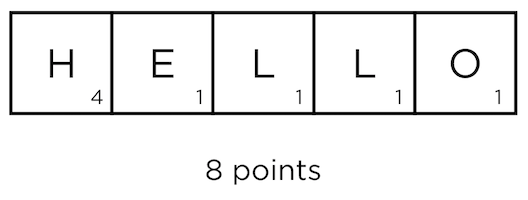

# # Week 2: Arrays / Section

Instructor: [**Carter Zenke**](https://github.com/carterzenke)

---

## Compilation

Converting the source code to binary machine code. 

Source code with a mistake in C:

```c
int main(void)
{
 print("Hello");
}
```

Source code converted to Assembly code:

```c
...
main:
# @main
 .cfi_startproc
# BB#0:
 push %rbp
.Ltmp0:
 .cfi_def_cfa_offset 16
...
```

To binary:

```c
01111111010001010100110001000110
00000010000000010000000100000000
00000000000000000000000000000000
00000000000000000000000000000000
00000001000000000011111000000000
00000001000000000000000000000000
00000000000000000000000000000000
00000000000000000000000000000000
00000000000000000000000000000000
```

---

## Arrays

The way of storing data in a computer's memory.

Imagine the game "Scrabble". Where you get individual letter pieces and each of those letters has on it a certain
point value. The goal: convert these letters to words and get points.



In the same way we are taking individual pieces of data and convert them into one long space in a computer memory.

To create an ```array``` we need to do three things:
- Choose the data type for pieces in the array, array can store only a single type of data.
- Give a name in plural;
- Choose the size of an array;

```c
int nights[5];
```

### - How to add items to the array?
With this kind of syntax, you have to specify every single element of the array.

```c
int nights[5] = {1, 2, 3, 4, 5};
```

But you can leave the size of an array empty, because the compiler can count arrays for you.

```c
int nights[] = {1, 2, 3, 4, 5};
```

### - Can we change the size of an array?

In C you cannot change the size of an array. But you can copy what you currently have in one space of memory
into a new space.

### - What about multidimensional array?

An array can contain another array inside itself.

### - What about negative grade?

> There is no such thing as a negative "one" grade ```[-1]```  
> It may work in Python, but not in C.
> 
> **In C language indexes must be positive**.

### - Doubling up program

```c
// Create an array of integers in which each integer is 2 times the value of the previous integer.
// The first element is 1.
// Print the array, integer by integer.

#include <cs50.h>
#include <stdio.h>

int main(void)
{
    int size = get_int("Enter a size: ");
    int sequence[size];
    sequence[0] = 1;
    printf("%i\n", sequence[0]);

    for (int i = 1; i < size; i++)
    {
        sequence[i] = sequence[i - 1] * 2;
        printf("%i\n", sequence[i]);
    }

    return 0;
}
```

---

## Strings

A special array that consist of characters.

### Alphabetical

```c
// Write a program to check if an array of characters is in alphabetical order.
// Assume the characters are all uppercase.

#include <cs50.h>
#include <stdio.h>
#include <string.h>

int main(void)
{
    string phrase = get_string("Enter a phrase: ");

    for (int i = 0, length = strlen(phrase); i < length - 1; i++)
    {
        // Check if characters are not alphabetical
        if (phrase[i] > phrase[i + 1])
        {
            printf("Not in alphabetical order.");

            // Quit and end my program here
            return 0;
        }

    }
    printf("In alphabetical order.");

    return 0;
}
```

---

## Command-line arguments

Before we used no arguments for ```main()``` and needed to type prompts after the certain command.

```c
int main(void)
{
    // mario
}
```

```commandline
./mario
Height: 3
  #
 ##
###
```

But with ```command-line arguments``` we can do it before running the program:

```c
int main(int argc, string argv[])
{
    // mario
}
```

```commandline
./mario 3
  #
 ##
###
```

- ```argc``` - argument count, counts how many arguments did the user entered.
- ```argv``` - argument vector, an array of entered arguments.
The first argument ```[0]``` is always name of the source file.

### argv.c

Let's write a program that prints each command-line argument given to the program.

```c
#include <cs50.h>
#include <stdio.h>

int main(int argc, string argv[])
{
    for (int i = 0; i < argc; i++)
    {
        printf("argv[%i] is %s\n", i, argv[i]);
    }
}
```

```commandline
./argv 123
argv[0] is ./argv 
argv[1] is 1
argv[2] is 2
argv[3] is 3
```

### mario.c

```c
// Prints a right-aligned pyramid with a height prompt by a user.

#include <cs50.h>
#include <stdio.h>

// Main program
int main(int argc, char *argv[])
{
    // Will not work that way, 'int' = 'char'
    int height = argv[1];

    // 'atoi' converts string (array of 'chars') to an integer
    int height = atoi(argv[1]);

    ...
}
```

If you do not put any argument, it will return an error:

```commandline
./mario
Segmentation fault (core dumped)
```

```Segmentation fault (core dumped)``` appears when you are looking beyond the bounds of your array.

We can avoid this error:

```c
// Main program
int main(int argc, char *argv[])
{
// Will not work that way, 'int' = 'char'
int height = argv[1];

    if (argc != 2)
    {
        printf("Usage: ./mario number");
        return 1;
    }
    int height = atoi(argv[1]);

    ...
}
```

You will be able to catch this error before the program astually runs.

```commandline
./mario
Usage: ./mario number
```