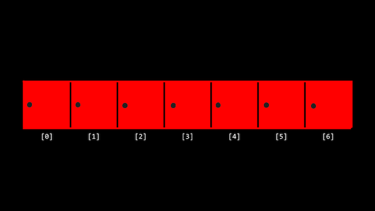
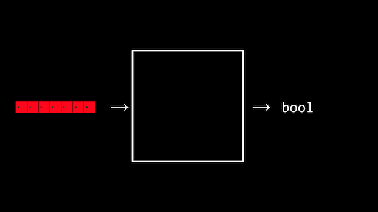
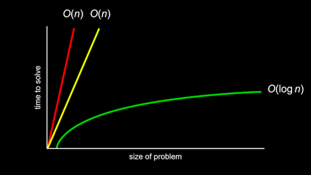
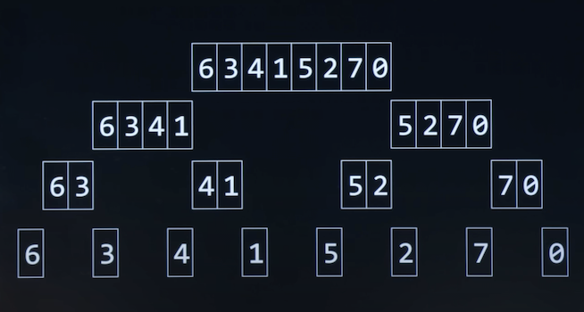

# Week 3: Algorithms

Instructor: **[David J. Malan](https://github.com/dmalan)**

---

## Linear Search

**Array** - a contiguous collection of data with the same type / consecutive blocks of memory.

Suppose there are these numbers in the array:

> **[1] [5] [10] [20] [50] [100] [500]**

We have 7 integers sorted from smallest to largest.

Imagine that you need to find the number '50' in that array.

Computer can only look at each location one at a time.

So, metaphorically, from the computer's point of view this array may look something like lockers:



All numbers are there, but the doors are closed.



In the black box is an **algorithm** that search through our lockers to see
if the number 50 is behind one of the doors: Returning the value true or false.

```commandline
For each door from left to right
    If 50 is behind door
        Return true
Return false
```

-->

```c
For i from 0 to n-1
    If 50 is behind doors[i]
        Return true
Return false
```

> **Linear search** - an algorithm that search from left to from right or right to left.

---

## Binary search

> **Binary search** - an algorithm with divide and conquer approach, starting in the middle and then going
> left / right.

Pseudocode:

```commandline
If no doors left
    Return false
If 50 is behind middle door
    Return true
Else if 50 < middle door
    Search left half
Else if 50 > middle door
    Search right half
```

-->

```c
If no doors left
    Return false
If 50 is behind doors[middle]
    Return true
Else if 50 < doors[middle]
    Search doors[0] through doors[middle - 1]
Else if 50 > doors[middle]
    Search doors[middle + 1] through doors[n - 1]
```

---

## Running time

Running time involves an analysis using **big O notation**:

**Asymptotic notation**



- O(n) - very slow: one page at a time;
- O(n) - twice faster but still slow: two page at a time;
- O(log n) - the best approach: you take 'n' and divide it in two by two again and again till the required result.

Some common running times we may see are:

- `O(n2)` - _quadratic_
- `O(n log n)` - _linearithmic_
- `O(n)` - _linear_
- `O(log n)` - _logarithmic_
- `O(1)` - _constant_

Of the running times above, ```O(n2)``` is considered the worst running time, ```O(1)``` is the fastest.

> **Linear search** was of order ```O(n)``` because it could take n steps in the worst case to run.
> **Binary search** was of order ```O(log n)``` because it would take fewer and fewer steps to run even in the worst case.

Programmers are interested in both the worst case, or _**upper bound**_, and the best case, or _**lower bound**_.

> The symbol ```Ω``` (Omega) is used to denote the best case of an algorithm, such as ```Ω(log n)```.
>
> - `Ω(n2)`, `Ω(n log n)`, `Ω(n)`, `Ω(log n)`, `Ω(1)`

> The symbol ```Θ``` (Theta) is used to denote where the upper bound and lower bound are the same, where the best case
> and the worst case running times are the same.
>
> - `Θ(n2)`, `Θ(n log n)`, `Θ(n)`, `Θ(log n)`, `Θ(1)`

---

## search.c

Implementing a linear search:

### Variant 1
In this case program will tell us "Not found." every time when the number is not the required one - bad design.

```c
#include <cs50.h>
#include <stdio.h>

int main(void)
{
    int numbers[] = {20, 500, 10, 5, 100, 1, 50};

    int n = get_int("Number: ");

    for (int i = 0; i < 7; ++i)
    {
        if (numbers[i] == n)
        {
            printf("Found.\n");
        }
        else
        {
            printf("Not found.\n"); // bad design
        }
    }

    return 0;
}
```

### Variant 2
Here is the new bug: it will print "Not found." after the search loop on each run of the program - bad design too.

```c
#include <cs50.h>
#include <stdio.h>

int main(void)
{
    int numbers[] = {20, 500, 10, 5, 100, 1, 50};

    int n = get_int("Number: ");

    for (int i = 0; i < 7; ++i)
    {
        if (numbers[i] == n)
        {
            printf("Found.\n");
        }
    }
    printf("Not found.\n"); // bad design

    return 0;
}
```

### Variant 3
Now it will exit the program after finding the number.

```c
#include <cs50.h>
#include <stdio.h>

int main(void)
{
    int numbers[] = {20, 500, 10, 5, 100, 1, 50};

    int n = get_int("Number: ");

    for (int i = 0; i < 7; ++i)
    {
        if (numbers[i] == n)
        {
            printf("Found.\n");
            return 0; // exit with success result
        }
    }
    printf("Not found.\n");
    return 1; // exit with error
}
```

### String compare #1
```if (strings[i] == s)``` will not work correctly, because equal will compare the first character of the string
and not the whole word. So the required word will never be found.

```c
#include <cs50.h>
#include <stdio.h>

int main(void)
{
    string strings[] = {"battleship", "boot", "cannon", "iron", "thimble", "top hat"};

    string s = get_string("String: ");

    for (int i = 0, length = strlen(strings); i < length; ++i)
    {
        if (strings[i] == s)
        {
            printf("Found.\n");
            return 0;
        }
    }
    printf("Not found.\n");
    return 1;
}
```

### String compare #2
```strcmp(strings[i], s) == 0)``` will compare two strings correctly.

```c
#include <cs50.h>
#include <stdio.h>
#include <string.h> // for strcmp()

int main(void)
{
    string strings[] = {"battleship", "boot", "cannon", "iron", "thimble", "top hat"};

    string s = get_string("String: ");

    for (int i = 0, length = strlen(strings); i < length; ++i)
    {
        if (strcmp(strings[i], s) == 0) // strcmp() - compares two strings
        {
            printf("Found.\n");
            return 0;
        }
    }
    printf("Not found.\n");
    return 1;
}
```

---

## Structs

### phonebook.c #1
Implementing the idea of a proper phonebook without data structures:

```c
#include <cs50.h>
#include <stdio.h>
#include <string.h>

int main(void)
{
    string names[] = {"Carter", "David", "John"};
    string numbers[] = {"+1-617-495-1000", "+1-617-495-1000", "+1-949-468-2750"};

    string name = get_string("Name: ");

    for (int i = 0; i < sizeof(names)/sizeof(names[0]); ++i)
    {
        if (strcmp(names[i], name) == 0)
        {
            printf("Found %s\n", numbers[i]);
            return 0;
        }
    }

    printf("Not found\n");
    return 1;
}
```

Let's try to create our own data structure and our own type of variable:

```c
typedef struct
{
    // All the types of variables you want to associate to this data type
    string name;
    string number;
} person; // creates a name of the struct
```

### phonebook.c #2

```c
#include <cs50.h>
#include <stdio.h>
#include <string.h>

typedef struct
{
    string name;
    string number;
} person;

int main(void)
{
    person people[3];

    people[0].name = "Carter";
    people[0].number = "+1-617-495-1000";

    people[1].name = "David";
    people[1].number = "+1-617-495-1000";

    people[2].name = "John";
    people[2].number = "+1-949-468-2750";

    string name = get_string("Name: ");

    for (int i = 0; i < sizeof(people)/sizeof(people[0]); ++i)
    {
        if (strcmp(people[i].name, name) == 0)
        {
            printf("Found %s\n", people[i].number);
            return 0;
        }
    }

    printf("Not found\n");
    return 1;
}
```

---

## Sorting

### - Selection sort

Search algorithm that selects the smallest number again and again.

> _unsorted --> [ **algorithm** ] --> sorted_

Imagine that we have unsorted numbers:

>  7, 2, 5, 4, 1, 6, 0, 3

1. Find the smallest number in the array
2. Place the smallest number to the first position in the array
3. Exclude filled position from our search area
4. Repeat

Pseudocode:

```c
For i from 0 to n–1
    Find smallest number between numbers[i] and numbers[n-1]
    Swap smallest number with numbers[i]
```

Summarizing those steps, the first time iterating through the list took n - 1 steps. The second time,
it took n - 2 steps. Carrying this logic forward, the steps required could be represented as follows:

> (n - 1) + (n - 2) + (n - 3) + ... + 1

This could be simplified to n(n-1)/2 or, more simply, `O(n2)` or `Θ(n2)`.

### - Bubble sort

Another sorting algorithm that works by repeatedly swapping elements to “bubble” larger elements
to the end.

1. Compare two elements in the array
2. Swap from smallest to largest number
3. Repeat steps 1 and 2 until the end of the array
4. Exclude the last position from the search area
5. Repeat

The pseudocode for bubble sort is:

```c
Repeat n-1 times
    For i from 0 to n–2
        If numbers[i] and numbers[i+1] out of order
            Swap them
    If no swaps
        Quit
```


Analyzing selection sort, we made only seven comparisons. Representing this mathematically, where n represents
the number of cases, it could be said that selection sort can be analyzed as `n/2` or `Ω(n)`:

> (n - 1) + (n - 2) + (n - 3) + ... + 1

---

## Recursion

**Recursion** - a concept within programming where a function calls itself:

```c
if no doors left
    Return false
if number behind middle door
    Return true
else if number < middle door
    Search left half
else if number > middle door
    Search right half
```


Similarly, in our pseudocode for Week 0, you can see where recursion was implemented:

```c
Pick up phone book
Open to middle of phone book
Look at page
If person is on page
    Call person
Else if person is earlier in book
    Open to middle of left half of book
    Go back to line 3
Else if person is later in book
    Open to middle of right half of book
    Go back to line 3
Else
    Quit
```

-->

This code could have been simplified, to highlight its recursive properties as follows:

```c
Pick up phone book
Open to middle of phone book
Look at page
If person is on page
    Call person
Else if person is earlier in book
    Search left half of book
Else if person is later in book
    Search right half of book
Else
    Quit
```

### - iteration.c #1
In iteration manner.

```c
#include <cs50.h>
#include <stdio.h>

void draw(int n);

int main(void)
{
    int height = get_int("Height: ");
    draw(height);
    return 0;
}

void draw(int n)
{
    for (int i = 0; i < n; ++i)
    {
        for(int j = 0; j < i + 1; ++j)
        {
            printf("#");
        }
        printf("\n");
    }
}

// Output:
// Height: 3

// #
// ##
// ###
```

### - recursion.c
The same but in recursion manner.

```c
#include <cs50.h>
#include <stdio.h>

void draw(int n);

int main(void)
{
    int height = get_int("Height: ");
    draw(height);
}

void draw(int n)
{
    // If nothing to draw
    if (n <= 0)
    {
        return;
    }

    // Print pyramid of height n - 1
    draw(n - 1);

    // Print one more row
    for (int i = 0; i < n; ++i)
    {
        printf("#");
    }
    printf("\n");
}

// Output:
// Height: 3

// #
// ##
// ###
```

---

## Merge sort

Better than selection and bubble sort.

> Merge sort is a very efficient sort algorithm with a worst case of `O(n log n)`. The best case is still `Ω(n log n)`
> because the algorithm still must visit each place in the list. Therefore, merge sort is also `Θ(n log n)`
> since the best case and worst case are the same.

Pseudocode:

```commandline
If only one number
    Quit
Else
    Sort left half of number
    Sort right half of number
    Merge sorted halves
```

Imagine you have to sort this numbers:

| 6 | 3 | 4 | 1 | 5 | 2 | 7 | 0 |
|---|---|---|---|---|---|---|---|

1. Let's sort the left half by allocating some memory 

|   |   |   |   | 5 | 2 | 7 | 0 |
|---|---|---|---|---|---|---|---|

| 6 | 3 | 4 | 1 |
|---|---|---|---|

1. Let's sort the left half by allocating some memory

|   |   | 4 | 1 |
|---|---|---|---|

| 6 | 3 |
|---|---|

1. Let's sort the left half by allocating some memory

|   | 3 |
|---|---|

| 6 |
|---|

2. Let's sort the right half by allocating some memory

|   |   |
|---|---|

| 6 |
|---|

| 3 |
|---|

3. Merge sorted halves

| 3 | 6 |
|---|---|

--> Finished sorting the left half of the left half

4. Let's sort the right half by allocating some memory

|   |   |   |   |
|---|---|---|---|

| 4 | 1 |
|---|---|

5. Let's sort the right half by allocating some memory

| 4 |   |
|---|---|

| 1 |
|---|

4. Let's sort the right half by allocating some memory

|   |   |   |   |
|---|---|---|---|

| 1 | 4 |
|---|---|

--> Left and right halves of the left half are sorted!

Let's merge them starting with right side than left and so on:

| 3 | 6 |
|---|---|

| 1 | 4 |
|---|---|

| 1 |   |   |   |
|---|---|---|---|

| 1 | 3 |   |   |
|---|---|---|---|

| 1 | 3 | 4 |   |
|---|---|---|---|

| 1 | 3 | 4 | 6 |
|---|---|---|---|

Let's do the same for the right half of the array and get this result:

| 0 | 2 | 5 | 7 |
|---|---|---|---|

And now we have two sorted halves of the array:

| 1 | 3 | 4 | 6 |
|---|---|---|---|

| 0 | 2 | 5 | 7 |
|---|---|---|---|

Let's merge starting from right and then left:



| 0 | 1 | 2 | 3 | 4 | 5 | 6 | 7 |
|---|---|---|---|---|---|---|---|

---

## Miscellaneous

[Sorting algorithms speed comparison](https://youtu.be/ZZuD6iUe3Pc)

- [**Quick sort**](https://www.geeksforgeeks.org/quick-sort-in-c/)
  - Recursive algorithm that follows the _divide-and-conquer_ rule like Merge Sort but unlike Merge Sort,
  this algorithm does not use any extra space for sorting (though it uses an auxiliary stack space). The basic idea
  behind **QuickSort** is to select a “pivot” element from the array and partition the other elements into two
  sub-arrays according to whether they are less than or greater than the pivot.
  - Worst case: `O(n2)`
  - Average case: `O(n log n)`


- [**Shell sort**](https://www.geeksforgeeks.org/shellsort)
  - Mainly a variation of Insertion Sort. In insertion sort, we move elements only one position ahead.
  When an element has to be moved far ahead, many movements are involved. The idea of ShellSort is to allow
  the exchange of far items. In Shell sort, we make the array h-sorted for a large value of h. We keep reducing
  the value of h until it becomes 1. An array is said to be h-sorted if all sublists of every h’th element are sorted.
  - Worst case: `O(n2)`
  - Average case: `O(n*log n)~O(n1.25)`
  - Step 1 − Start  
    Step 2 − Initialize the value of gap size, say h.  
    Step 3 − Divide the list into smaller sub-part. Each must have equal intervals to h.  
    Step 4 − Sort these sub-lists using insertion sort.  
    Step 5 – Repeat this step 2 until the list is sorted.  
    Step 6 – Print a sorted list.  
    Step 7 – Stop.

- [**Merge sort**](https://www.geeksforgeeks.org/merge-sort)
  - The process of merge sort is to divide the array into two halves, sort each half, and then merge the sorted
  halves back together. This process is repeated until the entire array is sorted.

- [**Comb sort**](https://www.geeksforgeeks.org/comb-sort)
  - Mainly an improvement over Bubble Sort. Bubble sort always compares adjacent values. So all inversions
  are removed one by one. Comb Sort improves on Bubble Sort by using a gap of the size of more than 1. The gap starts
  with a large value and shrinks by a factor of 1.3 in every iteration until it reaches the value 1. Thus Comb Sort
  removes more than one inversion count with one swap and performs better than Bubble Sort.

- [**Heap sort**](https://www.geeksforgeeks.org/heap-sort/)
  - A comparison-based sorting technique based on Binary Heap data structure. It is similar to the selection sort
  where we first find the minimum element and place the minimum element at the beginning. Repeat the same process
  for the remaining elements.

- [**Insertion sort**](https://www.geeksforgeeks.org/insertion-sort/)
  - A simple sorting algorithm that works by building a sorted array one element at a time. It is considered
  an “in-place” sorting algorithm, meaning it doesn’t require any additional memory space beyond the original array.


- [**Selection sort**](https://www.geeksforgeeks.org/selection-sort/)
  - A simple and efficient sorting algorithm that works by repeatedly selecting the smallest (or largest) element
  from the unsorted portion of the list and moving it to the sorted portion of the list.

- [**Cocktail sort**](https://www.geeksforgeeks.org/cocktail-sort/)
  - A variation of Bubble sort. But Cocktail Sort traverses through a given array in both directions alternatively.
  Cocktail sort does not go through the unnecessary iteration making it efficient for large arrays.

- [**Bubble sort**](https://www.geeksforgeeks.org/bubble-sort/)
  - The simplest sorting algorithm that works by repeatedly swapping the adjacent elements if they are in the wrong
  order. This algorithm is not suitable for large data sets as its average and worst-case time complexity is quite high.