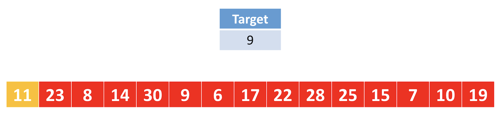
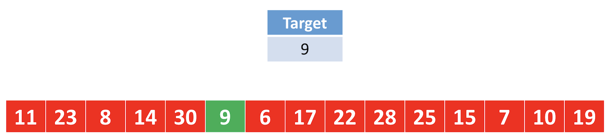

# Linear search

Instructor: **[Doug Lloyd](https://github.com/dlloyd09)**

---

An algorithm we can use to find an element in an array.

> In linear search, the idea of the algorithm is to iterate across
> the array from left to right, searching for a specified element.

Pseudocode:

```
Repeat, starting at the first element:
• If the first element is what you’re looking for (the target), stop.
• Otherwise, move to the next element.
```

Imagine we are looking for the number '9':



We started with the first element from the left side and repeat to search till the required number.



If we are looking for an element that is not in the array, we will search for each individual element and only
then stop at the end of the array.

Algorithm will succeed in any case.

> #### Worst case scenario `O(n)`
> We have to look through the entire array of `n` elements, either because the target element is the
> last element of the array or doesn’t exist in the array at all.

> #### Best case scenario `Ω(1)`
> The target element is the first element of the array, and so we can stop looking immediately after we start.

