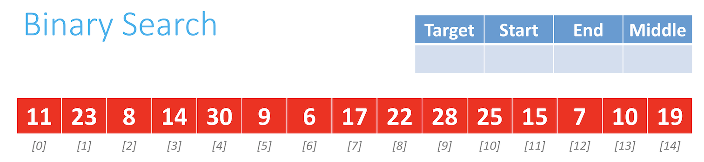
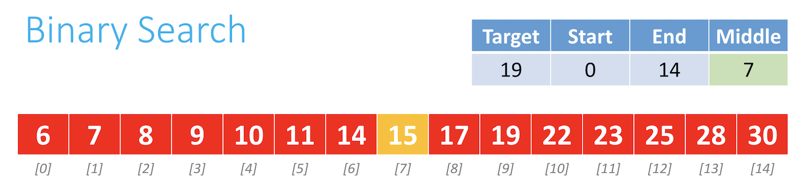
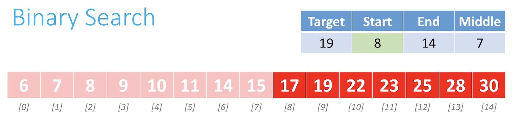
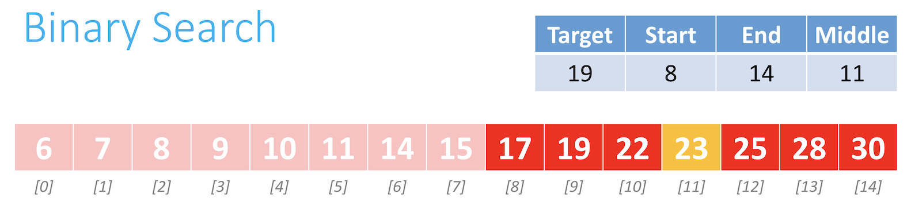
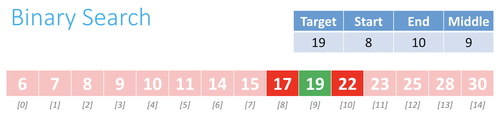
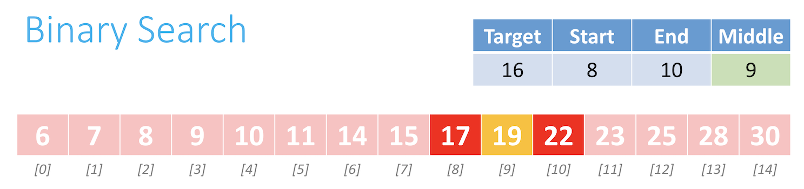
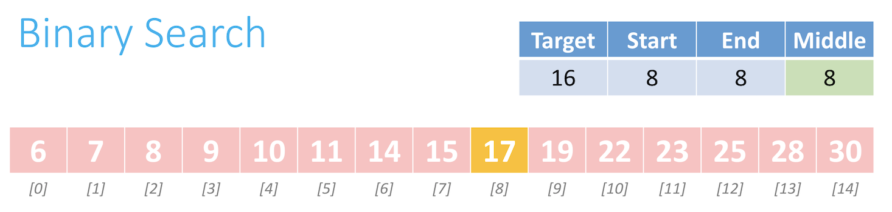
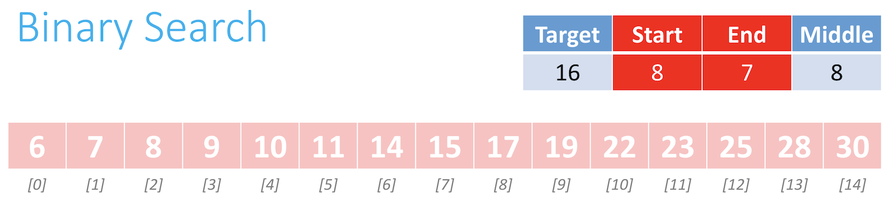

# Binary search

Instructor: **[Doug Lloyd](https://github.com/dlloyd09)**

---

The idea of the algorithm is to **_divide and conquer_**, reducing the search area by half each time, trying to find
a target number.

In order to leverage this power however, our array must first be sorted, else we cannot make assumptions about
the array’s contents.

Pseudocode

```
Repeat until the (sub)array is of size 0:
• Calculate the middle point of the current (sub)array.
• If the target is at the middle, stop.
• Otherwise, if the target is less than what’s at the middle, repeat, changing the end point to be just to the left
  of the middle.
• Otherwise, if the target is greater than what’s at the middle, repeat, changing the start point to be just to the
  right of the middle.
```
---

## Find the target which is in the array

Assume we have an unsorted array:



We need to sort elements in the array and find the middle element before starting the binary search:



`15` is not our target and we know that target `19` is greater than 15, so our next step is to search in the right half:



Search for the middle again:



`23` is greater than `19` so we go to the right and looking for the middle:



There is our target in the middle - PROFIT

---

## Find the target which is not the array

Assume that we already did all the steps with dividing and now almost done with the algorithm:



`19` ia not our target and is greater than `16`, so we go to the left:



`17` is greater our target so position 7 must become the `end point`:



But now we have start greater than end point --> (sub)array is size `0`

Thus, we can conclude that we don't have target `16` in the array.

> #### Worst case scenario `O(log n)`
> We have to divide a list of n elements in half repeatedly to find the target element, either because the target
> element will be found at the end of the last division or doesn’t exist in the array at all.

> #### Best case scenario `Ω(1)`
> The target element is at the midpoint of the full array, and so we can stop looking immediately after we start.
