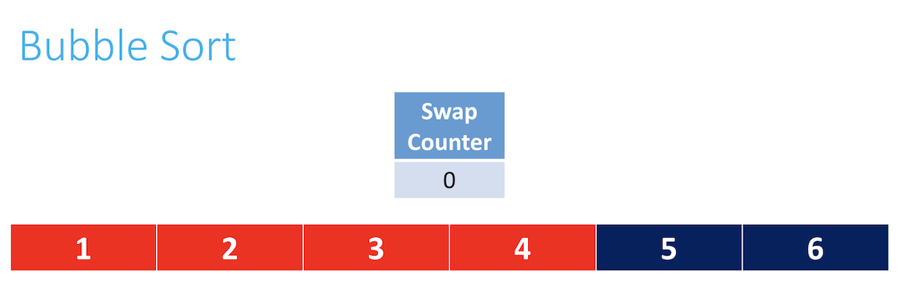

# Bubble sort

Instructor: **[Doug Lloyd](https://github.com/dlloyd09)**

---

In bubble sort, the idea of the algorithm is to move higher valued
elements generally towards the right and lower value elements
generally towards the left.

Pseudocode:

```
Set swap counter to a non-zero value
• Repeat until the swap counter is 0:
    • Reset swap counter to 0
    • Look at each adjacent pair
        • If two adjacent elements are not in order, swap them and add one to the swap
          counter
```

Set swap counter to a non-zero value:


Reset swap counter to a zero value:


Look at adjacent pair and check the order:


Swap and counter++:


Look for the next adjacent pair:


Swap and counter++:


...

Repeat till the last pair:


We can declare that the last number is the largest, and it is on the right position in the array:


Reset counter to 0:


Repeat steps with adjacent pairs but without the last element:


...




We checked all adjacent pair and do not swap anything, so the counter is `0`.
Thus, we can declare that the array was sorted successfully.


> #### Worst case scenario `O(n2)`
> The array is in reverse order; we have to “bubble” each of the n elements all the way across the array, and since
> we can only fully bubble one element into position per pass, we must do this n times.

> #### Best case scenario `Ω(n)`
> The array is already perfectly sorted, and we make no swaps on the first pass.