# Merge sort

Instructor: **[Doug Lloyd](https://github.com/dlloyd09)**

---

In merge sort, the idea of the algorithm is to sort smaller arrays
and then combine those arrays together (merge them) in sorted
order.

Pseudocode:

```
- Sort the left half of the array (assuming n > 1)
- Sort the right half of the array (assuming n > 1)
- Merge the two halves together
```

Let's sort the left half of the array:


Let's divide the left half of the array:


Let's sort it the left half of the left half of the array:

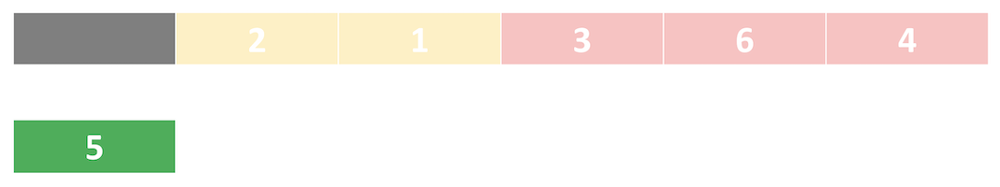

Go back to the remaining right half:

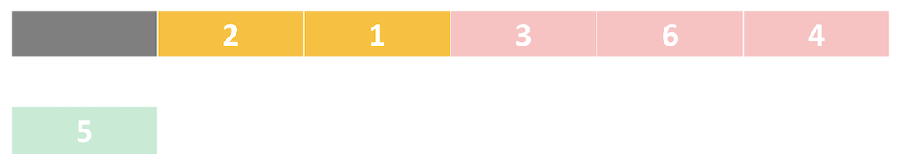

Let's divide, then go to the left half of this right half of the array and sort it:

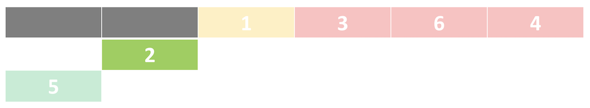

Let's sort the last element in the left half:

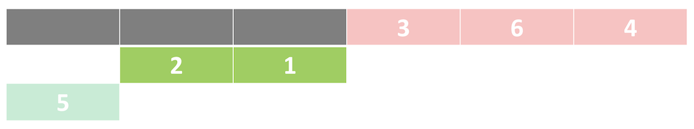

Merge two halves together by deciding which has the lower element. Place that element in a first position
of the new hypothetical 2-element array:

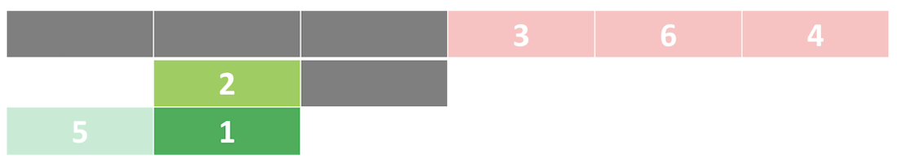

Compare `2` against `nothing` and place it in the last array:

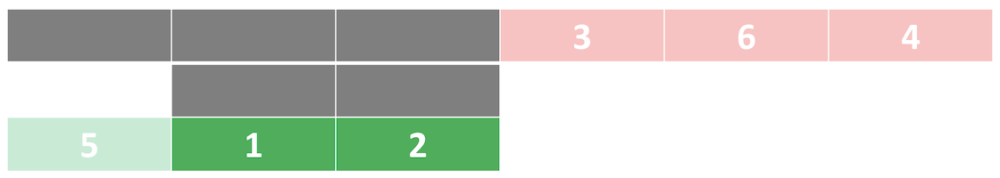

Now we need to merge all elements in the left half:

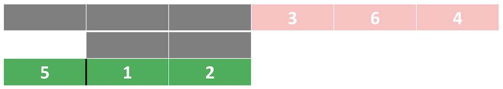

Compare first element of the left part `5` and the first element of the right part `1`.
It's `1`, so it becomes the first element of the new 3-element array:

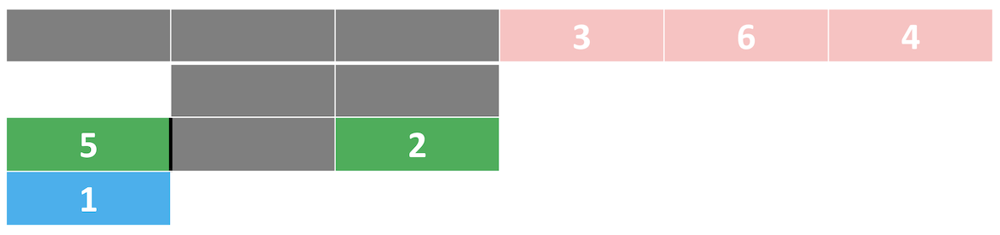

Compare first element of the left part `5` and the first element of the right part `2`.
Place this element after the first element of the new 3-element array. Do the same to the last element:

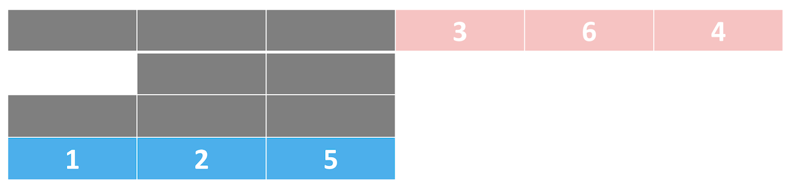

We have sorted the left part of the array.

...

Now we have to go to the right half and do the same steps:

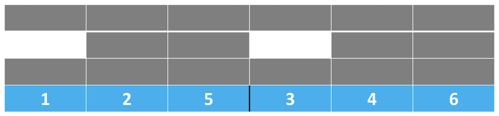

So we have sorted the right and the left half of the array.

Let's merge those halves by comparing the first element of the left part and the first element of the right part.

`1` < `3`

So the first element of the 6-element array is `1`:

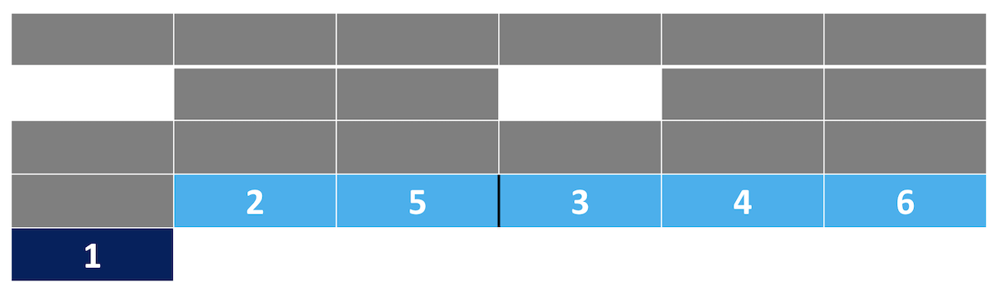

Let's compare the first element of the left part and the first element of the right part again:

`2` < `3`

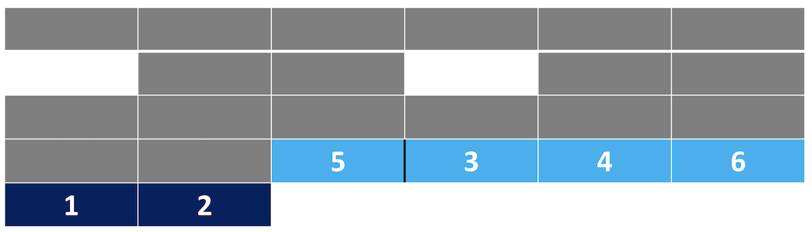

...

Do the same to other elements:

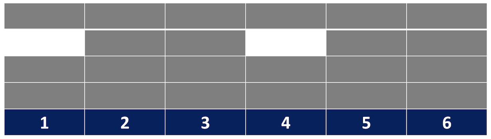

Sorted complete.

> #### Worst case scenario `O(n log n)`
> We have to split n elements up and then recombine them, effectively doubling the sorted sub-arrays as we build
> them up. (combining sorted 1-element arrays into 2-element arrays, combining sorted 2-element arrays into
> 4-element arrays…).

> #### Best case scenario `Ω(n log n)`
> The array is already perfectly sorted. But we still have to split and recombine it back together with this algorithm.

