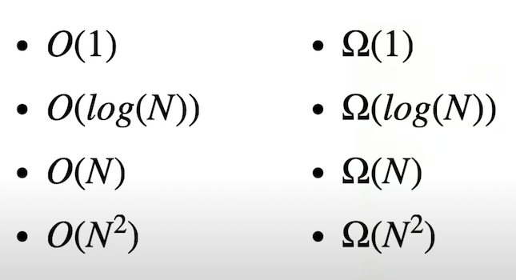

# Week 3: Algorithms / Section

Instructor: [**Carter Zenke**](https://github.com/carterzenke)

---

## Search

Assume we have an unsorted list of people:

| Matthew | Samia | Alyssa | Douglas | Cecelia | Lucas | Ramya |
|---------|-------|--------|---------|---------|-------|-------|

We need to find `Alyssa` among them.

> Let's use linear search:

Remember, that computer can look at only one piece of information at a time.

| Matthew | | | | | | |
|---------|-|-|-|-|-|-|

Not `Alissa`. Next:

|  | Samia | | | | | |
|--|-------|-|-|-|-|-|

Not `Alissa`. Next:

|  |  | Alyssa | | | | |
|--|--|--------|-|-|-|-|

---

Assume we have a sorted list of people:

| Alyssa | Cecelia | Douglas | Lucas | Matthew | Ramya | Samia |
|--------|---------|---------|-------|---------|-------|-------|

> Let's use binary search:

We need to find the middle first:

| | | | Lucas | | | |
|-|-|-|-------|-|-|-|

`Alissa` is located before `Lucas`, so we go to the left half of the array and look for the middle there:

| | Cecelia | |
|-|---------|-|

`Alissa` is located before `Cecelia`:

| Alyssa |
|--------|

Found her!

---

> Let's compare the amount of steps for each algorithm for `Alyssa`:
> 
> | Linear search | Binary search |
> |---------------|---------------|
> | 3             | 3             |

What's the greatest number of steps this algorithm will ever take with 7 people?

Worst case scenario:

| Linear search | Binary search |
|---------------|---------------|
| 7             | log2(7) ~ 3.5 |

The same with the `n` number of people:

| Linear search | Binary search |
|---------------|---------------|
| n             | log2(n)       |

> ### Big-O notation
> 
> ### Worst case scenario:
> 
> | Linear search | Binary search |
> |---------------|---------------|
> | O(n)          | O(log2(n))    |

But what if we have `Alyssa` as the first element in the linear search and exactly in the middle in binary search?

> Let's compare the amount of steps for each algorithm in this case:
>
> | Linear search | Binary search |
> |---------------|---------------|
> | 1             | 1             |

What's the fewest number of steps for each algorithm?

| Linear search | Binary search |
|---------------|---------------|
| Ω(1)          | Ω(1)          |

> ### Big-O notation
>
> ### Best case scenario:
>
> | Linear search | Binary search |
> |---------------|---------------|
> | Ω(1)          | Ω(1)          |

#### Common notations



---

## Sort

| Algorithm      | O           | Ω           |
|----------------|-------------|-------------|
| Merge sort     | O(n log(n)) | Ω(n log(n)) |
| Selection sort | O(n2)       | Ω(n2)       |
| Bubble sort    | O(n2)       | Ω(n)        |

The average fastest is **Merge sort**.
But in the best-case scenario the fastest is **Bubble sort**.

> The task in the problem set is figuring out the identities of three mystery sorts:
> 
>| Algorithm | reversed50000.txt | sorted50000.txt |
>|-----------|-------------------|-----------------|
>| Sort 1    |                   |                 |
>| Sort 2    |                   |                 |
>| Sort 3    |                   |                 |

Time them and see which algorithm each sort might be using.

The approach here is this:

- Think of it like big-O and big-Omega notation: the best and the worst cases.
- Give them those inputs and see how long it takes them to run and then compare them.

```
sort 1 uses: Merge/Selection/Bubble sort
How do you know?: Takes 0.00s to sort reversed list; Takes 0.00s to sort sorted list
```

---

## Structs

Our own data type to use in our program.

Assume we need to make a struct for the candidates to the government.

We need to do a few steps:

- Create a new `type`, which holds a collection of other basic types.
- Give the struct a `name` that can be re-used in the rest of the life.
- Set a structure's `members` inside.

```c
// Creates a struct / template
typedef struct
{
    string name;
    int votes;
} candidate;
```

Let's create a candidate:

```c
// Creates a struct
typedef struct
{
    string name;
    int votes;
} candidate;

// Creates a struct variable
candidate president;
president.name = "Samia";
president.votes = 10;
```

We can create an array of candidates:

```c
// Creates a struct
typedef struct
{
    string name;
    int votes;
} candidate;

// Creates a struct array
candidate candidates[4];
```

---

## search.c

- Create an array of candidates;
- Search the array to find the most votes awarded to any single candidate.
- Print out that candidate's name.

```c
#include <cs50.h>
#include <stdio.h>

typedef struct
{
    string name;
    int votes;
} candidate;

int main(void)
{
    const int num_candidates = 3;
    candidate candidates[num_candidates];

    candidates[0].name = "Carter";
    candidates[0].votes = 10;

    candidates[1].name = "Anna";
    candidates[1].votes = 12;

    candidates[2].name = "John";
    candidates[2].votes = 7;

    // Find the highest number of votes
    int highest_votes = 0;
    for (int i = 0; i < num_candidates; ++i)
    {
        if (candidates[i].votes > highest_votes)
        {
            highest_votes = candidates[i].votes;
        }
    }
//    printf("%i\n", highest_votes);

    // Print the name of candidate with the highest number of votes
    for (int j = 0; j < num_candidates; ++j)
    {
        if (candidates[j].votes == highest_votes)
        {
            printf("%s\n", candidates[j].name);
        }
    }

    return 0;
}
```

---

## Recursion

### - Factorial

```
1! = 1
2! = 2 * 1
3! = 3 * 2 * 1
4! = 4 * 3 * 2 * 1
...
```

```
            1! = 1
        2! = 2 * 1
    3! = 3 * 2 * 1
4! = 4 * 3 * 2 * 1
...
```

```c
...
4! = 4 * 3!     ^
3! = 3 * 2!     |
2! = 2 * 1!     | // Call stack
1! = 1          |
// Base case
```

Let's write `factorial.c`

```c
#include <cs50.h>
#include <stdio.h>

int factorial(int n);

int main(void)
{
    // Get positive value for n
    int n;
    do
    {
        n = get_int("n: ");
    }
    while (n < 0);

    // Print factorial
    printf("%i\n", factorial(n));

    return 0;
}

int factorial(int n)
{
    // Implement factorial function

    // Base case
    if (n == 1)
    {
        return 1;
    }

    // Recursive call
    return n * factorial(n - 1);
}
```

