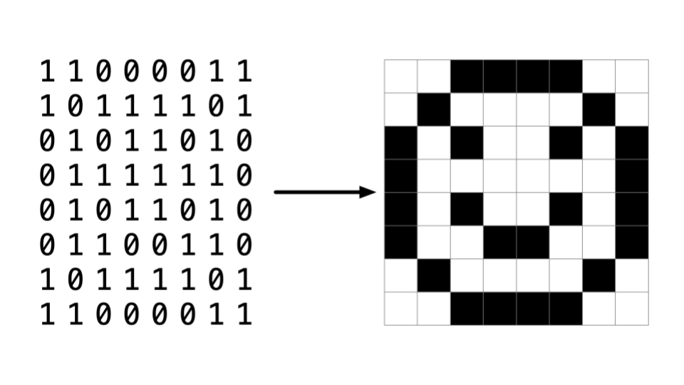

# Week 4: Memory

Instructor: **[David J. Malan](https://github.com/dmalan)**

---

## Pixel Art

**Resolution** - the number of distinct pixels in each dimension.

`0` - black color  
`1` - white color



---

## Hexadecimal

RGB represents the amount of red, green and blue colors.

- Black: `#000000` - `R:0` `G:0` `B:0`
- White: `#FFFFFF` - `R:255` `G:255` `B:255`
- Red: `#FF0000` - `R:255` `G:0` `B:0`
- Green: `#00FF00` - `R:0` `G:255` `B:0`
- Blue: `#0000FF` - `R:0` `G:0` `B:255`

> **Hexadecimal** or also known as **base-16** - a system of counting that has 16 counting values from index `0` to `15`.
>
> `0` `1` `2` `3` `4` `5` `6` `7` `8` `9` `A` `B` `C` `D` `E` `F`
> 
> _Uppercase or lowercase for letters doesn't matter._

When counting in hexadecimal, each column is a power of 16.

| _16 * 0_ | _1 * 0_ | | _16_ | _1_ | --> | _16_ | _1_ | | _16_   | _1_    | | _16_   | _1_    | --> | _16_   | _1_    |
|----------|---------|-|------|-----|-----|------|-----|-|--------|--------|-|--------|--------|-----|--------|--------|
| 0        | 0       | | 0    | 1   | --> | 0    | 9   | | 0 (~1) | A (~0) | | 0 (~1) | B (~1) | --> | 0 (~1) | F (~5) |

| _16_   | _1_    | | _16_    | _1_    | --> | _16 * 15_ | _1 * 15_ |
|--------|--------|-|---------|--------|-----|-----------|----------|
| 1 (~1) | 0 (~6) | |  1 (~1) | 1 (~7) | --> | F         | F        |

`FF` = `16 * 15` + `1 * 15` = `240` + `15` = `255`

---

## Memory

Applying hexadecimal numbering to each of these blocks of memory, we can visualize these as follows:


By convention, all hexadecimal numbers are often represented with the `0x` prefix (not a mathematical operation) to avoid the confusion:


```c++
#include <stdio.h>

int main(void)
{
    int n = 50;
    printf("%i\n", n);
    return 0;
}

// Output:
// 50
```


> **Ampersand** `&` is an address operator that gives access to the locations of variables inside the computer's memory.
>
> **Asterisks** `*` is a dereference operator which allows to taken address and go to it.

```c++
#include <stdio.h>

int main(void)
{
    int n = 50;
    
    // Format code for printing the address is `%p`
    printf("%p\n", &n);
}

// Output:
// 0x16f61b6cc
```

### `*` Pointer

**Pointer** - the address of some variable that we can store in another variable.

```c++
#include <stdio.h>

int main(void)
{
    int n = 50;

    // Creates a pointer with the address of `n`
    int *p = &n;

    printf("%p\n", p); // `%p` with `p` - prints the address

    // Prints an integer value
    printf("%i\n", *p); // `*p` - go to the address and show what's inside
}
```


The pointer seems rather large. Indeed, a pointer is usually stored as an `8-byte value` or `64 bits`. `p` is storing the address of the 50

---

## CS50's `string`

`string` is an array of chars and always have a null character at the end:

```c++
string s = "Hi!" // has 4 bytes not 3, because of the null character at the end
```

| `s[0]` | `s[1]` | `s[2]` | `s[3]` |
|--------|--------|--------|--------|
| H      | I      | !      | \0     | 
 
All these characters obviously are having addresses, for example:

| `0x123` | `0x124` | `0x125` | `0x126` |
|---------|---------|---------|---------|
| H       | I       | !       | \0      |

> The trick is that `string` is actually a `pointer`:
> ```c++
> *s = &s[0]
> ```
> 
> `s` has an address of the `s[0]` and the null character `\0` declares the end of an array.
>


```c++
#include <cs50.h>
#include <stdio.h>

int main(void)
{
    string s = "HI!";
    printf("%s\n", s); // prints the array of chars
    printf("\n");

    printf("%p\n", s); // prints an address of s[0]
    printf("\n");

    printf("%p\n", &s[0]); // prints an address of the first character
    printf("%p\n", &s[1]); // prints an address of the second character
    printf("%p\n", &s[2]); // prints an address of the third character
    printf("%p\n", &s[3]); // prints an address of the forth NULL character
}
```

So actually `string` from CS50 lib points to first `char` from array of chars:
> char *s = "HI!";

```c++
#include <stdio.h>

int main(void)
{
    char *s = "HI!";
    printf("%s", s);
}
```

The cs50 library includes a struct as follows: `typedef char *string`.  
This struct, when using the cs50 library, allows one to use a custom data type called string.

```c++
typedef uint8_t BYTE; // unsigned integer with 8 bits
```

---

## Pointer arithmetic

Let's do some math on addresses: ```addresses```

```c++
#include <stdio.h>

int main(void)
{
    char *s = "HI!";
    printf("%c", *s); // prints an address of the first character
    printf("%c", *(s + 1)); // prints an address of the first character
    printf("%c\n", *(s + 2)); // prints an address of the first character
}
```

- When you write `s[0]` compiler do `*s`
- When you write `s[1]` compiler do `*(s + 1)`
- When you write `s[2]` compiler do `*(s + 2)`

---

## String comparison

Let's write some simple comparison code:

```c++
#include <cs50.h>
#include <stdio.h>

int main(void)
{
    int i = get_int("i: ");
    int j = get_int("j: ");

    if (i == j)
    {
        printf("Same\n");
    }
    else
    {
        printf("Different\n");
    }

    return 0;
}
```

This code just takes two integers from the user and compares them.

```c++
#include <cs50.h>
#include <stdio.h>

int main(void)
{
    char *s = get_string("s: ");
    char *t = get_string("t: ");

    if (s == t) // compares the addresses of the first letters, not the letters themselves
    {
        printf("Same\n");
    }
    else
    {
        printf("Different\n");
    }

    return 0;
}
```

It looks like this:


So, addresses `*s == *t` will always be false.

> You cannot compare two strings using the `==` operator.
>
> The `==` operator will attempt to compare the memory locations of the strings instead of the characters therein.
> It is recommended to use of `strcmp` instead.

```c++
#include <cs50.h>
#include <stdio.h>
#include <string.h>

int main(void)
{
    char *s = get_string("s: ");
    char *t = get_string("t: ");
    
    if (strcmp(s, t) == 0) // `strcmp` compares chars in string
    {
        printf("Same\n");
    }
    else
    {
        printf("Different\n");
    }

    return 0;
}
```

We can print the addresses of the first letters: ```addresses```

```c++
#include <cs50.h>
#include <stdio.h>

int main(void)
{
    char *s = get_string("s: ");
    char *t = get_string("t: ");

    printf("%p\n", s); // no need for `&` before `s`
    printf("%p\n", t); // prints address of the first letter
    
    return 0;
}
```

### Let's code `copy`

`copy_1`

```c++
#include <cs50.h>
#include <ctype.h> // for `toupper`
#include <stdio.h>
#include <string.h>

int main(void)
{
    string s = get_string("s: ");
    
    string t = s; // assumably copy one string to another
    
    t[0] = toupper(t[0]); // assumably capitalizes the letter
    
    printf("%s\n", s);
    printf("%s\n", t); // expecting the word from `s` but with capitalized first letter
    
    return 0;
}
```

> It doesn't work as we expected, there are capitalized letters in both strings:
> 
> Output:  
> s: hi!  
> Hi!  
> Hi!

Let's look closer at the code:

```c++
string t = s; // takes the address of `s` over to `t`
```

So, the code looks like this:


Let's make `copy_2`

```c++
#include <cs50.h>
#include <ctype.h>
#include <stdio.h>
#include <string.h>

int main(void)
{
    char *s = get_string("s: ");
    
    char *t = s;

    if (strlen > 0)
    {
        t[0] = toupper(t[0]);
    }
    
    printf("%s\n", s);
    printf("%s\n", t);
    
    return 0;
}
```

Now it's more obvious that we are copying the first char address to the other pointer.

But there is still a bug.

Let's improve once more and write `copy_3`

```c++
#include <cs50.h>
#include <ctype.h>
#include <stdio.h>
#include <stdlib.h> // for `malloc` and `free`
#include <string.h>

int main(void)
{
    char *s = get_string("s: ");
    
    char *t = malloc(strlen(s) + 1);

    for (int i = 0, n = strlen(s); i <= n; ++i) // `i <= n` copies all four chars with the last `\0`
    {
        t[i] = s[i];
    }

    if (strlen > 0)
    {
        t[0] = toupper(t[0]);
    }
    
    printf("%s\n", s);
    printf("%s\n", t);
    
    return 0;
}
```

> Now everything is ok:
> - We created `t` separately from `s` with duplicated values; 
> - Capitalized  char only within `t`
>
> Output:  
> s: hi!  
> hi!  
> Hi!
> 
> `malloc` is returning the address of the first character.

Improve again `copy_4`.

We can get rid of this and use another function `strcpy()`

```
for (int i = 0, n = strlen(s); i <= n; ++i) // `i <= n` copies all four chars with the last `\0`
{
    t[i] = s[i];
}
```

If something goes wrong, and we are out of memory:

```c++
if (t == NULL) // if `malloc` return NULL, there is no enough memory available
        return 1;
```

`malloc()` is accompanied by another function `free()`, it's the opposite of `malloc()`.

> When you are done with your computer's memory you supposed to give it back.
>
> It is always better to use `free()` after `malloc()`.

So the code will look like this `copy_4`:

```c++
#include <cs50.h>
#include <ctype.h>
#include <stdio.h>
#include <stdlib.h> // for `malloc` and `free`
#include <string.h>

int main(void)
{
    char *s = get_string("s: ");

    
    char *t = malloc(strlen(s) + 1);

    if (t == NULL)
        return 1;

    strcpy(t, s);

    if (strlen > 0)
    {
        t[0] = toupper(t[0]);
    }
    
    printf("%s\n", s);
    printf("%s\n", t);

    free(t); // deallocates `t`
    
    return 0;
}
```

> `NULL` is just an address `0` and it signifies error. The address `0` is never used by computer's memory.

---

## `malloc` and `valgrind`

> Command `valgrind` doesn't work on macOS since Mojave, but it works on Windows and Linux.

Terminal command `valgrind` checks your memory usage for you.

```c++
#include <stdio.h>
#include <stdlib.h> // for `malloc()`

int main(void) {
    int *x = malloc(3 * sizeof(int));
    // `sizeof(int)` gets the size of an integer on any devices
    // `3 * sizeof(int)` creates an array of integers


    x[1] = 72;
    x[2] = 73;
    x[3] = 33;

    return 0;
}
```

Let's check the code above with `valgrind` command:

```
$ valgrind ./memory
==3187== Memcheck, a memory error detector
==3187== Copyright (C) 2002-2022, and GNU GPL'd, by Julian Seward et al.
==3187== Using Valgrind-3.22.0 and LibVEX; rerun with -h for copyright info
==3187== Command: ./memory
==3187== 
==3187== Invalid write of size 4
==3187==    at 0x109177: main (memory.c:11)
==3187==  Address 0x4b9f04c is 0 bytes after a block of size 12 alloc'd
==3187==    at 0x4846828: malloc (in /usr/libexec/valgrind/vgpreload_memcheck-amd64-linux.so)
==3187==    by 0x109158: main (memory.c:5)
==3187== 
==3187== 
==3187== HEAP SUMMARY:
==3187==     in use at exit: 12 bytes in 1 blocks
==3187==   total heap usage: 1 allocs, 0 frees, 12 bytes allocated
==3187== 
==3187== 12 bytes in 1 blocks are definitely lost in loss record 1 of 1
==3187==    at 0x4846828: malloc (in /usr/libexec/valgrind/vgpreload_memcheck-amd64-linux.so)
==3187==    by 0x109158: main (memory.c:5)
==3187== 
==3187== LEAK SUMMARY:
==3187==    definitely lost: 12 bytes in 1 blocks
==3187==    indirectly lost: 0 bytes in 0 blocks
==3187==      possibly lost: 0 bytes in 0 blocks
==3187==    still reachable: 0 bytes in 0 blocks
==3187==         suppressed: 0 bytes in 0 blocks
==3187== 
==3187== For lists of detected and suppressed errors, rerun with: -s
==3187== ERROR SUMMARY: 2 errors from 2 contexts (suppressed: 0 from 0)
```

- `==3187== Invalid write of size 4` - setting a value in the memory;
- `==3187==    at 0x109177: main (memory.c:11)` - (memory.c:11) / mistake is `memory.c` on line `11`;

So, x[3] doesn't exist because our array `x` is of size `x[3]` and indexes are starting from `[0]`.

Let's correct this:

```c++
#include <stdio.h>
#include <stdlib.h>

int main(void) {
    int *x = malloc(3 * sizeof(int));

    x[0] = 72;
    x[1] = 73;
    x[2] = 33;

    return 0;
}
```

Check with `valgrind` again:

```
$ valgrind ./memory
==10575== Memcheck, a memory error detector
==10575== Copyright (C) 2002-2022, and GNU GPL'd, by Julian Seward et al.
==10575== Using Valgrind-3.22.0 and LibVEX; rerun with -h for copyright info
==10575== Command: ./memory
==10575== 
==10575== 
==10575== HEAP SUMMARY:
==10575==     in use at exit: 12 bytes in 1 blocks
==10575==   total heap usage: 1 allocs, 0 frees, 12 bytes allocated
==10575== 
==10575== 12 bytes in 1 blocks are definitely lost in loss record 1 of 1
==10575==    at 0x4846828: malloc (in /usr/libexec/valgrind/vgpreload_memcheck-amd64-linux.so)
==10575==    by 0x109158: main (memory.c:5)
==10575== 
==10575== LEAK SUMMARY:
==10575==    definitely lost: 12 bytes in 1 blocks
==10575==    indirectly lost: 0 bytes in 0 blocks
==10575==      possibly lost: 0 bytes in 0 blocks
==10575==    still reachable: 0 bytes in 0 blocks
==10575==         suppressed: 0 bytes in 0 blocks
==10575== 
==10575== For lists of detected and suppressed errors, rerun with: -s
==10575== ERROR SUMMARY: 1 errors from 1 contexts (suppressed: 0 from 0)
```

- `==10575== 12 bytes in 1 blocks are definitely lost in loss record 1 of 1` - simply means that we lost some bytes, `memory leak` detected;
- `==10575==    definitely lost: 12 bytes in 1 blocks`
- `==10575==    by 0x109158: main (memory.c:5)` - we called `malloc` on line 5. `valgrind` doesn't know when we should free the memory, but it knows that we definitely need to do it somewhere.

Let's add `free()` to the program `memory`:

```c++
#include <stdio.h>
#include <stdlib.h>

int main(void) {
    int *x = malloc(3 * sizeof(int));

    x[0] = 72;
    x[1] = 73;
    x[2] = 33;

    free(x);

    return 0;
}
```

Check memory with `valgrind` once more:

```
$ valgrind ./memory
==15892== Memcheck, a memory error detector
==15892== Copyright (C) 2002-2022, and GNU GPL'd, by Julian Seward et al.
==15892== Using Valgrind-3.22.0 and LibVEX; rerun with -h for copyright info
==15892== Command: ./memory
==15892== 
==15892== 
==15892== HEAP SUMMARY:
==15892==     in use at exit: 0 bytes in 0 blocks
==15892==   total heap usage: 1 allocs, 1 frees, 12 bytes allocated
==15892== 
==15892== All heap blocks were freed -- no leaks are possible
==15892== 
==15892== For lists of detected and suppressed errors, rerun with: -s
==15892== ERROR SUMMARY: 0 errors from 0 contexts (suppressed: 0 from 0)
```

Profit!

---

## Garbage values

If you create a variable but not declare it with an equal sign and then start using it, you might be manipulating
the `garbage value`.

There is the garbage value `y`:

```c++
int main(void)
{
    int *x;
    int *y;
    
    x = malloc(sizeof(int));
    
    *x = 42;
    *y = 13; // we didn't allocated `y` as we did with `x`
    
    // Unpredicted behaviour on the next steps
    
    y = x;
    
    *y = 13;
    
    return 0;
}
```

This one will be correct:

```c++
int main(void)
{
    int *x;
    int *y;
    
    x = malloc(sizeof(int));
    
    *x = 42;
    
    y = x; // allocated `y` on the address of `x`
    
    *y = 13; // *x = 13
    
    return 0;
}
```

Watch a [fun video](https://youtu.be/5VnDaHBi8dM?feature=shared) about pointers and memory. Copyright by Nick Parlante, 1999.

---

## Swapping

### / Passing by value

Let's make some swap function:

```c++
#include <stdio.h>

void swap(int a, int b);

int main(void)
{
    int x = 1;
    int y = 2;

    printf("x is %i, y is %i\n", x, y);
    swap(x, y);
    printf("x is %i, y is %i\n", x, y);

    return 0;
}

void swap(int a, int b) {
    int tmp = a;
    a = b;
    b = tmp;
}
```

But it doesn't work as we expected.

```
Output:
x is 1, y is 2
x is 1, y is 2
```

Why? Let's talk about `scope`.

```c++
swap(x, y);
```

Here we are `passing by value` - passing `x` and `y` to the function `swap()`. It makes a copy of a passing value.

- `Machine code` - the top of your memory is the programs machine code;
- `Globals` - global variables declared outside of `main()`;
- `Heap` - reserved computer memory that stores data.
- `Stack` at the bottom - an abstract data type that serves as a collection of elements. Local variables are allocated
automatically when a function is called, and they are deallocated automatically when the function exits.


So all changes we've made happened in separate `swap()` `stack frame` and not in the `main()`.

We successfully swapped int `a` and `b`, and then it terminates `swap()` and get back to `main()`, where everything is as it was.


In conclusion, our function `swap()` didn't work properly because we used `passing by value`.

### / Passing by reference

To solve `swap()` problem we need to use `passing by reference`. Let's slightly change the code:

```c++
#include <stdio.h>

void swap(int *a, int *b);

int main(void)
{
    int x = 1;
    int y = 2;

    printf("x is %i, y is %i\n", x, y);
    swap(&x, &y); // passing by reference
    printf("x is %i, y is %i\n", x, y);

    return 0;
}

// Let's dereference `a` and `b`
void swap(int *a, int *b) { // get the addresses of integers as arguments
    int tmp = *a; // `tmp` is just a variable
    *a = *b;
    *b = tmp;
}
```

---

## Overflow

`heap overflow` - overflowing the heap

`stack overflow` - overflowing the stack

`buffer overflow` - overflowing of the chunk of memory

Let's look at the functions that we took for granted:

- `get_char`
- `get_double`
- `get_float`
- `get_int`
- `get_long`
- `get_string`

Those are not included in `C` language, they are included with `CS50.h` lib.

`C` does not make it easy to get the input from the user safely, there is always a risk to `buffer overflow`.

---

## `scanf()`

Let's try to get an integer from a user without CS50's library.

`get_int`

```c++
#include <stdio.h>

int main(void) {
    int n; // declares an integer where we want to put user's input
    printf("n: ");
    scanf("%i", &n); // passing by reference
    printf("\n");

    printf("n = %i\n", n);

    return 0;
}
```

Now let's try to get a user's string: `get_string`

```c++
#include <stdio.h>

int main(void) {
    char *s; // will store the user's string input
    printf("s: ");
    scanf("%s", s);
    printf("\n");

    printf("s = %s\n", s);

    return 0;
}
```

But there is an error:

```
Output:
Segmentation fault (core dumped)
```

Let's make an array instead:

```c++
#include <stdio.h>

int main(void) {
    char s[4];
    printf("s: ");
    scanf("%s", s);
    printf("\n");

    printf("s = %s\n", s);

    return 0;
}
```

This code will work if the user inputs only 3 chars like "Hi!" or less and dumped again if there will be more characters.

In CS50 lib `get_string` uses `malloc()` again and again on each char by a user.

---

## File I/O

`I` for `Input`, `O` for `Output`.

Common functions that are related to file:

- `fopen()` - opens a file;
- `fclose()` - closes a file;
- `fprintf()` - allows you to "write" information to the screen for the user to view;
- `fscanf()` - reads formatted data from a file and returns it as an array of values;
- `fread()` - read file;
- `fwrite()` - write file;
- `fseek()` - used for setting the file pointer at the specific position in the file.

Let's write a `phonebook`. It will save for us the needed data in the file:

```c++
#include <cs50.h>
#include <stdio.h>
#include <string.h>

int main(void) {
    // `.csv` is a file format of a lightweight spritesheet
    // we need to tell HOW we want to open a file:
    // "r" - for reading
    // "w" - for writing
    // "a" - for pending

    // `fopen()` returns a pointer to a file
    FILE *file = fopen("phonebook.csv", "a"); // we need to add data to a file, so we use "a"

    char *name = get_string("Name: ");
    char *number = get_string("Number: ");

    // fprintf(printing to `file`, data to write "%s, %s\n", which data)
    fprintf(file, "%s, %s\n", name, number);

    fclose(file); // closes file

    return 0;
}
```

It creates a file `phonebook.csv` (for example in `cmake-build-debug`). Every time we execute our program `phonebook` and write
something, it will write the data in the file `phonebook.csv`.


> **WARNING**
> 
> We need to check if file is not NULL. For example file is not found.

```c++
#include <cs50.h>
#include <stdio.h>
#include <string.h>

int main(void) {
    // `.csv` is a file format of a lightweight spritesheet
    // we need to tell HOW we want to open a file:
    // "r" - for reading
    // "w" - for writing
    // "a" - for pending

    // `fopen()` returns a pointer to a file
    FILE *file = fopen("phonebook.csv", "a"); // we need to add data to a file, so we use "a"
    if (file == NULL)
    {
        return 1;
    }

    char *name = get_string("Name: ");
    char *number = get_string("Number: ");

    // fprintf(printing to `file`, data to write "%s, %s\n", which data)
    fprintf(file, "%s, %s\n", name, number);

    fclose(file); // closes file

    return 0;
}
```

---

## `cp`

`uint8_t` - unsigned 8 bit value

```c++
#include <stdio.h>
#include <stdint.h>
#include <stdlib.h>

typedef uint8_t BYTE;

int main(int argc, char *argv[])
{
    // "r" - read mode
    // "rb" - read binary mode, only `0` and `1`, like images
    FILE *src = fopen(argv[1], "rb");
    FILE *dst = fopen(argv[2],  "wb");

    BYTE b;

    while (fread(&b, sizeof(b), 1, src) != 0)
    {
        fwrite(&b, sizeof(b), 1, dst);
    }

    fclose(dst);
    fclose(src);

    return 0;
}
```

> `fread(&b, sizeof(b), 1, src) != 0`
> 
> - `fread` - reads a file for you;
> - `fread(where to load those bytes, how big is the file, how many bytes copy at a time, from where to read)`;
> - `fread() != 0` - checks how many bytes where successfully read, for at longs as it succeeded.

> `fwrite(&b, sizeof(b), 1, dst)`
>
> - `fread(where to find the byte, how big is the file, how many bytes copy at a time, destination)`;
> - `fread() != 0` - checks how many bytes where successfully read, for at longs as it succeeded.

As a result we had copied our `cat.jpg` to a `backup.jpg`.