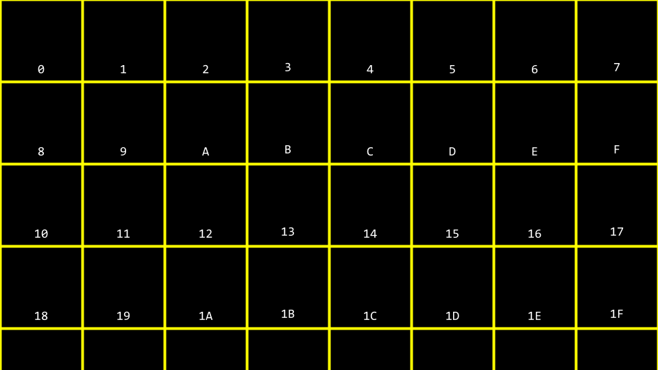

# Week 4: Memory

Instructor: **[David J. Malan](https://github.com/dmalan)**

---

## Pixel Art

**Resolution** - the number of distinct pixels in each dimension.

`0` - black color  
`1` - white color


---

## Hexadecimal

RGB represents the amount of red, green and blue colors.

- Black: `#000000` - `R:0` `G:0` `B:0`
- White: `#FFFFFF` - `R:255` `G:255` `B:255`
- Red: `#FF0000` - `R:255` `G:0` `B:0`
- Green: `#00FF00` - `R:0` `G:255` `B:0`
- Blue: `#0000FF` - `R:0` `G:0` `B:255`

> **Hexadecimal** or also known as **base-16** - a system of counting that has 16 counting values from index `0` to `15`.
>
> `0` `1` `2` `3` `4` `5` `6` `7` `8` `9` `A` `B` `C` `D` `E` `F`
> 
> _Uppercase or lowercase for letters doesn't matter._

When counting in hexadecimal, each column is a power of 16.

| _16 * 0_ | _1 * 0_ | | _16_ | _1_ | --> | _16_ | _1_ | | _16_   | _1_    | | _16_   | _1_    | --> | _16_   | _1_    |
|----------|---------|-|------|-----|-----|------|-----|-|--------|--------|-|--------|--------|-----|--------|--------|
| 0        | 0       | | 0    | 1   | --> | 0    | 9   | | 0 (~1) | A (~0) | | 0 (~1) | B (~1) | --> | 0 (~1) | F (~5) |

| _16_   | _1_    | | _16_    | _1_    | --> | _16 * 15_ | _1 * 15_ |
|--------|--------|-|---------|--------|-----|-----------|----------|
| 1 (~1) | 0 (~6) | |  1 (~1) | 1 (~7) | --> | F         | F        |

`FF` = `16 * 15` + `1 * 15` = `240` + `15` = `255`

---

## Memory

Applying hexadecimal numbering to each of these blocks of memory, we can visualize these as follows:



By convention, all hexadecimal numbers are often represented with the `0x` prefix (not a mathematical operation) to avoid the confusion:


```c++
#include <stdio.h>

int main(void)
{
    int n = 50;
    printf("%i\n", n);
    return 0;
}

// Output:
// 50
```


> **Ampersand** `&` is an address operator that gives access to the locations of variables inside the computer's memory.
>
> **Asterisks** `*` is a dereference operator which allows to taken address and go to it.

```c++
#include <stdio.h>

int main(void)
{
    int n = 50;
    
    // Format code for printing the address is `%p`
    printf("%p\n", &n);
}

// Output:
// 0x16f61b6cc
```

### `*` Pointer

**Pointer** - the address of some variable that we can store in another variable.

```c++
#include <stdio.h>

int main(void)
{
    int n = 50;

    // Creates a pointer with the address of `n`
    int *p = &n;

    printf("%p\n", p); // `%p` with `p` - prints the address

    // Prints an integer value
    printf("%i\n", *p); // `*p` - go to the address and show what's inside
}
```


The pointer seems rather large. Indeed, a pointer is usually stored as an `8-byte value` or `64 bits`. `p` is storing the address of the 50

---

## CS50's `string`

`string` is an array of chars and always have a null character at the end:

```c++
string s = "Hi!" // has 4 bytes not 3, because of the null character at the end
```

| `s[0]` | `s[1]` | `s[2]` | `s[3]` |
|--------|--------|--------|--------|
| H      | I      | !      | \0     | 
 
All these characters obviously are having addresses, for example:

| `0x123` | `0x124` | `0x125` | `0x126` |
|---------|---------|---------|---------|
| H       | I       | !       | \0      |

> The trick is that `string` is actually a `pointer`:
> ```c++
> *s = &s[0]
> ```
> 
> `s` has an address of the `s[0]` and the null character `\0` declares the end of an array.
>


```c++
#include <cs50.h>
#include <stdio.h>

int main(void)
{
    string s = "HI!";
    printf("%s\n", s); // prints the array of chars
    printf("\n");

    printf("%p\n", s); // prints an address of s[0]
    printf("\n");

    printf("%p\n", &s[0]); // prints an address of the first character
    printf("%p\n", &s[1]); // prints an address of the second character
    printf("%p\n", &s[2]); // prints an address of the third character
    printf("%p\n", &s[3]); // prints an address of the forth NULL character
}
```

So actually `string` from CS50 lib points to first `char` from array of chars:
> char *s = "HI!";

```c++
#include <stdio.h>

int main(void)
{
    char *s = "HI!";
    printf("%s", s);
}
```

The cs50 library includes a struct as follows: `typedef char *string`.  
This struct, when using the cs50 library, allows one to use a custom data type called string.

```c++
typedef uint8_t BYTE; // unsigned integer with 8 bits
```

---

## Pointer arithmetic

Let's do some math on addresses:

```c++
#include <stdio.h>

int main(void)
{
    char *s = "HI!";
    printf("%c", *s); // prints an address of the first character
    printf("%c", *(s + 1)); // prints an address of the first character
    printf("%c\n", *(s + 2)); // prints an address of the first character
}
```

- When you write `s[0]` compiler do `*s`
- When you write `s[1]` compiler do `*(s + 1)`
- When you write `s[2]` compiler do `*(s + 2)`

---

## String comparison

