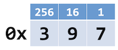
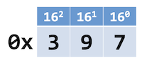
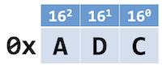
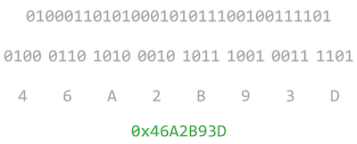

# Hexadecimal

Instructor: **[Doug Lloyd](https://github.com/dlloyd09)**

---

Most Western cultures use the `decimal` system, aka base-10, to represent numeric data:

`0` `1` `2` `3` `4` `5` `6` `7` `8` `9`

As we know, computers use the `binary` system, aka base-2, to represent numeric (and indeed all data):

`0` `1`

But trying to parse a huge chain of 0s and 1s can be quite difficult.

The `hexadecimal` system, aka base-16, is a much more concise way to express the data on a computer’s system:

`0` `1` `2` `3` `4` `5` `6` `7` `8` `9` `a` `b` `c` `d` `e` `f`

> `A` `B` `C` `D` `E` `F` is also ok, there is no case sensitivity.

16 is a power of 2

Hexadecimal makes this mapping easy because a group of four binary digits (bits) is able has 16 different combinations,
and each of those combinations maps to a single hexadecimal digit.

Each hexadecimal has a 4 unique binary digits:

Just like binary has place values (1s place, 2s place, 4th place, 8…) and decimal does too (1, 10, 100, 1000…),
so does hexadecimal:

-->

-->

To convert a binary number to hexadecimal, group four binary digits (bits) together from right to left:

- Pad the leftmost group with extra 0 bits at the front if necessary.
- Then use the chart a few slides back or your memory to convert those bits to something a bit more concise.

`1101 = 13` --> Hexadecimal 13 is `D`
`1101 = 11` --> Hexadecimal 11 is `B` and so on...

