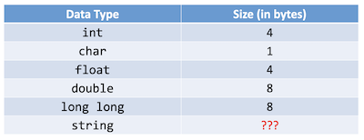
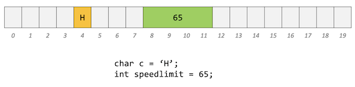
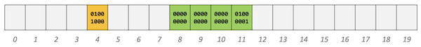
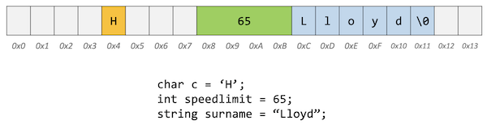
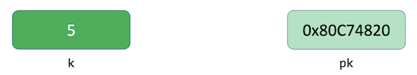
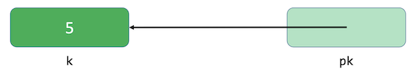
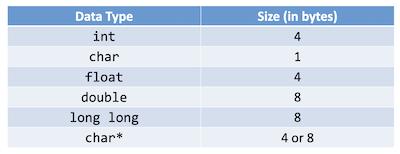

# Pointers

Instructor: **[Doug Lloyd](https://github.com/dlloyd09)**

---

Pointers provide an alternative way to pass data between functions.
- Recall that up to this point, we have passed all data by value, with one exception;
- When we pass data by value, we only pass a copy of that data.

If we use pointers instead, we have the power to pass the actual variable itself;
- That means that a change that is made in one function can impact what happens in a different function.

---

## Computer memory

Every file on your computer lives on your disk drive, be it a hard disk drive (HDD) or a solid-state drive (SSD).

Disk drives are just storage space; we can’t directly work there. Manipulation and use of data can only take place
in RAM (random-access memory), so we have to move data there. Every time computer is turned off, the RAM clears itself.

Memory is basically a huge array of 8-bit wide bytes: 512 MB, 1GB, 2GB, 4GB…



Back to this idea of memory as a big array of byte-sized cells.

Recall from our discussion of arrays that they not only are
useful for storage of information but also for so-called random
access.
- We can access individual elements of the array by indicating which
index location we want.

Similarly, each location in memory has an address.

---

Let's assume that we have:

- 20 bytes of memory;
- char c = 'H' (20 - 1 byte = 19 bytes of memory left);
- int speedlimit = 65 ( 19 - 4 bytes = 15 bytes of memory left);



But from the computer's view all data is in binary, there is no `H` or `65` for computer:



> ### Endiannes 
>
> The image above is not quite accurate, because of the [endianness](https://www.techtarget.com/searchnetworking/definition/big-endian-and-little-endian).
> 
> The term **endianness** describes the order in which computer memory stores a sequence of bytes. Endianness
> can be either big or small, and the adjectives refer to the value stored first.
> 
> `Big-endian` is an order in which the big end -- the most significant value in the sequence -- is first,
> at the lowest storage address.
> 
> `Little-endian` is an order in which the little end, the least significant value in the sequence, is first.

Assume that we want to add a string to the memory:

- string surname = "Lloyd".

Every string needs a null character at the end of an array:

`L` `l` `o` `y` `d` `\0` - 6 bytes total.

- Also let's use hexadecimal for addresses;



---

## Pointers are just addresses

> Remember: `POINTERS ARE JUST ADDRESSES`

As we start to work with pointers, just keep this image in mind:

```c++
int k; // has an address `0x80C74820`
k = 5;

int *pk; // declaring a pointer
pk = &k; // storing an address `0x80C74820` into the pointer
```




The pointer just pointing to another data like this:



> A pointer, then, is a data item whose:
> - value is a memory address;
> - type describes the data located at that memory address.

As such, pointers allow data structures and/or variables to be shared among functions.

Pointers make a computer environment more like the real world.

---

## Creating a pointer

> **_NULL pointer_** - the simplest pointer available to us in C. This pointer points to nothing (a fact which can
> actually come in handy!).
> 
> > When you create a pointer and you don’t set its value immediately, you should always set the value of the pointer
> > to NULL.
>
> You can check whether a pointer is NULL using the equality operator (==).

Another easy way to create a pointer is to simply extract the address of an already existing variable. 
We can do this with the address extraction operator (&).

- If `x` is an int-type variable, then `&x` is a pointer-to-int whose value is the address of `x`.
- If `arr` is an array of doubles, then `&arr[i]` is a pointer-to-double who value is the address of the ith element
of arr.
- An array’s name, then, is actually just a pointer to its first element.

The main purpose of a pointer is to allow us to modify or inspect the location to which it points.
- We do this by `dereferencing` the pointer.

If we have a pointer-to-char called `pc`, then `*pc` is the data that lives at the memory address stored inside 
the variable pc.

Used in this context, `*` is known as the **dereference operator**.

- It “goes to the reference” and accesses the data at that memory location, allowing you to manipulate it at will.

This is just like visiting your neighbor. Having their address isn’t enough. You need to go to the address and only
then can you interact with them.

> #### Can you guess what might happen if we try to dereference a pointer whose value is NULL?
> 
> > _**Segmentation fault**_
> 
> Surprisingly, this is actually good behavior! It defends against accidental dangerous manipulation of unknown pointers.
> - That’s why we recommend you set your pointers to NULL immediately if you aren’t setting them to a known, desired value.

Let's look closer at the syntax:

```c++
int *p;
```

- The value of `p` is an address.
- We can dereference `p` with the `*` operator.
- If we do, what we’ll find at that location is an int.

One more annoying thing with those *s. They’re an important part of both the type name and the variable name.
- Best illustrated with an example:

```c++
int* px, py, pz; // declares one pointer and two integers
```

What's wrong?

- `*px` - is a pointer indeed;
- `py` and `pz` are integers.

So if you want to declare a multiple pointers on one line, you need a separate `*` operator for each of the pointers:

```c++
int *pa, *pb, *pc; // declares three pointers
```

---

## What about `string`?


We didn't describe the size of a `string` in this table because there is no `string` data type in `C` language.

`string` is a part of `CS50.h` library.

Actually, `string` is just a pointer to a char `*char`:



#### Why 4 or 8 bytes?

It depends on the system you are using.

- in `CS50 IDE` *char is `8` bytes, system `x64` (every address in memory is 64 bits long);
- in `CS50 appliance` *char is `4` bytes, system is `x32` (every address in memory is 32 bits long).

---

## Changing the value with a pointer

```c++
int k;
k = 5;

int *pk; 
*pk = 35; // k = 35
```

- `*pk = 35;` changes the value of `k`;
- after the line above `k = 35` not to 5.

```c++
int k;
k = 5;

int *pk; 
*pk = 35;

int m = 4;
pk = &m; // points to `m` instead of `k`
```

- `&m` the address of `m`;
- `pk = &m;` Our pointer modifies the element it points from `k` to `m`.