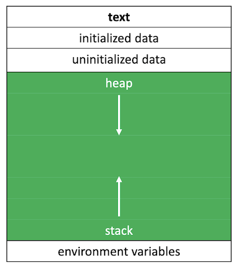

# Dynamic memory allocation

Instructor: **[Doug Lloyd](https://github.com/dlloyd09)**

---

We’ve seen one way to work with pointers, namely pointing a pointer variable at another variable that already exists
in our system. We used `Static memory allocation`.

This requires us to know exactly how much memory our system will need at the moment our program is compiled.

- What if we don’t know how much memory we’ll need at compile-time?
- How do we get access to new memory while our program is running?

> We can use pointers to get access to a block of `dynamically-allocated memory` at runtime.
> - Dynamically allocated memory comes from a pool of memory known as the `heap`.
> - Prior to this point, all memory we’ve been working with has been coming from a pool of memory known as the `stack`.



---

## `malloc()`

We get this dynamically-allocated memory by making a call to the C standard library `stdlib.h` function `malloc()`, passing
as its parameter the number of bytes requested.

After obtaining memory for you (if it can), `malloc()` will return a pointer to that memory.

What if `malloc()` can’t give you memory? It’ll hand you back `NULL`.

> Always check for `NULL` after `malloc()`!
> 
> ```c++
> char *t = malloc(strlen(s) + 1);
>
> // checks that you didn't get NULL pointer
> if (t == NULL)
> {
>   return 1;
> }
> ```

```c++
// statically obtain an integer
int x;

// dynamically obtain an integer of size 4 bytes
int *px = malloc(4);
```

But we can't be sure to have 4 bytes for an integer on every system, so instead we need to write like this:

```c++
// dynamically obtain an integer
int *px = malloc(sizeof(int));
```

Now the size of an integer will be decided by a compiler and will not cause any trouble.

### - Get input from the user with `malloc()`

```c++
// get an integer from the user
int x = GetInt();

// array of floats on the stack (works from C'99)
float stack_array[x];

// array of floats on the heap
float* heap_array = malloc(x * sizeof(float));
```

---

## Possible troubles

Here’s the trouble: 

Dynamically-allocated memory is not automatically returned to the system for later use when the function in which
it’s created finishes execution.

Failing to return memory back to the system when you’re finished with it results in a `memory leak` which can compromise
your system’s performance.

> When you finish working with dynamically-allocated memory, you must `free()` it.

```c++
char* word = malloc(50 * sizeof(char));

// do some stuff with word

// now we’re done working with that block
free(word);
```

> ### Three golden rules:
> 
> 1. Every block of memory that you `malloc()` must subsequently be `free()`.
> 2. Only memory that you `malloc()` should be `free()`.
> 3. Do not `free()` a block of memory more than once.

---

```c++
// Declaring an integer
int m;

// Statically declaring a pointer
int* a;

// Dinamically declaring a pointer that points on unnamed integer
int* b = malloc(sizeof(int));
```


```c++
int m;
int* a;
int* b = malloc(sizeof(int));

// Pointer `a` now points to address of `m`
a = &m;
```


```c++
int m;
int* a;
int* b = malloc(sizeof(int));
a = &m;

// `a` and `b` are poiting to same location now
a = b;
```


```c++
int m;
int* a;
int* b = malloc(sizeof(int));
a = &m;
a = b;

// Set the value of `m` to 10
m = 10;
```


```c++
int m;
int* a;
int* b = malloc(sizeof(int));
a = &m;
a = b;
m = 10;

// We are operating with the unnamed integer that `b` is pointing to.
// `m = 10`, so `m + 2` = 12, `the unnamed integer = 12`
*b = m + 2;
```


```c++
int m;
int* a;
int* b = malloc(sizeof(int));
a = &m;
a = b;
m = 10;
*b = m + 2;

// Deallocating the memory that `b` and `a` were pointing to.
// `a` and `b` are still points to it, but it's no longer there.
free(b);
```


```c++
int m;
int* a;
int* b = malloc(sizeof(int));
a = &m;
a = b;
m = 10;
*b = m + 2;
free(b);

// Cause an unpredictable behaviour.
// Because there are now available data that `a` points to.
*a - 11;
```

