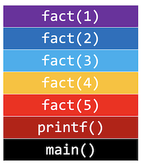

# Call stacks

Instructor: **[Doug Lloyd](https://github.com/dlloyd09)**

---

When you call a function, the system sets aside space in memory for that function to do its necessary work.
- We frequently call such chunks of memory `stack frames` or `function frames`.

More than one function’s stack frame may exist in memory at a given time.
- If `main()` calls `move()`, which then calls `direction()`, all three functions have open frames.
- But only one function is active at one time.

These frames are arranged in a `stack`. The frame for the most-recently called function is always on the top of the stack.

When a new function is called, a new frame is pushed onto the top of the stack and becomes the active frame.

When a function finishes its work, its frame is popped off of the stack, and the frame immediately below it becomes
the new, active, function on the top of the stack. This function picks up immediately where it left off.

```c++
int fact(int n)
{
    if (n == 1)
    return 1;
    else
    return n * fact(n-1);
}

int main(void)
{
    printf("%i\n", fact(5));
}
```

1. At first, we call `main()`;
2. Then we call `printf()`;
3. Inside `printf()` we call `fact()`;
4. `fact()` is a recursive function, so on each call there will be a new `stack frame`.

So the `stack` will look like this at the `calling phase`:



When `fact(1)` terminates itself, it will disappear from the `stack` and memory goes back to `fact(2)`.

Remember that all functions that we called before are in the memory, so now the process will go back
on `returning phase`, terminates all functions one by one starting from top to bottom.