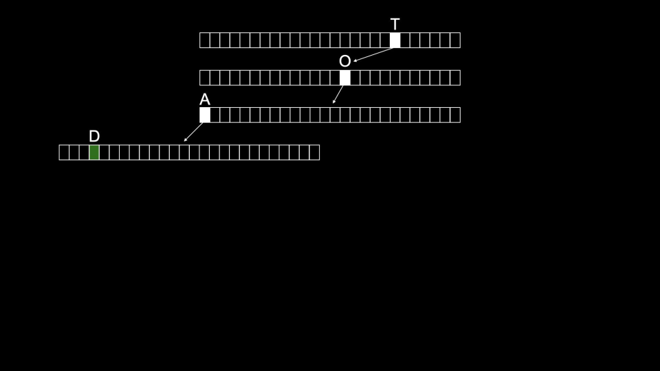

# Week 5: Data structures

Instructor: **[David J. Malan](https://github.com/dmalan)**

---

## Data Structures

> `Data structures` essentially are forms of organization in memory.

There are many ways to organize data in memory:

`Abstract data structures` are those that we can conceptually imagine.

---

## Queues

> `Queues` are one form of abstract data structure.

`Queues` have:
- **specific property**:
  - `FIFO` or “first in first out.”
- **specific actions**:
  - `enqueued`; that is, the item can join the line or queue.
  - `dequeued` or leave the queue once it reaches the front of the line.

Imagine a `queue` as follows:
```c++
const int CAPACITY = 50;

typedef struct
{
    // Stored all data one after the other contiguously
    person people[CAPACITY];
    int size;
}
queue;
```

>**Queues contrast a stack**.

## Stack

`Stack` has:
- **specific property**:
  - `LIFO` or “last in first out.”
- **specific actions**:
  - `push` places something on top of a stack.
  - `pop` is removing something from the top of the stack.

`stack` is implemented almost identically to `queue`:
```c++
typedef struct
{
    // How high the stack could be
    person people[CAPACITY];
    // How full the stack actually is, regardless of how much it could hold
    int size;
}
stack;
```

> **Array** stores the data contiguously back to back.

You might imagine that the above code has a limitation. Since the capacity of the array is always predetermined
in this code. Therefore, the `stack may always be oversized`. You might imagine only using one place in the
stack out of 5000.

It would be nice for our stack to be dynamic – able to grow as items are added to it.

---

## Resizing Arrays

Imagine an array as follows:


In memory, there are other values being stored by other programs, functions, and variables.
Many of these may be unused `garbage values` that were utilized at one point but are available now for use.


What if we want to store a fourth value `4` in our array?

What would be needed is to allocate a new area of memory and move the old array to a new one.
Initially, this new area of memory would be populated with garbage values.


As values are added to this new area of memory, old garbage values would be overwritten.


Eventually, all old garbage values would be overwritten with our new data.


One of the drawbacks of this approach is that it’s bad design: Every time we add a number,
we have to copy the array item by item.

> But wouldn’t it be nice if we were able to put the 4 somewhere else in memory?
>
> By definition, this would no longer be an array because 4 would no longer be in contiguous memory.

---

## `list` array and malloc()

Let's write code `list_1` as follows:

```c++
// Implements a list of numbers with an array of fixed size

#include <stdio.h>

int main(void)
{
    // List of size 3
    int list[3];

    // Initialize list with numbers
    list[0] = 1;
    list[1] = 2;
    list[2] = 3;

    // Print list
    for (int i = 0; i < 3; i++)
    {
        printf("%i\n", list[i]);
    }
}
```

We have memory being preallocated for three items.

```c++
// Could not be modified
int list[3];
```

> Then we can use pointers to create a better design in this code.

Modify your code as follows in `list_2`:

```c++
// Implements a list of numbers with an array of dynamic size

#include <stdio.h>
#include <stdlib.h>

int main(void)
{
// List of size 3
int *list = malloc(3 * sizeof(int));
if (list == NULL)
{
return 1;
}

    // Initialize list of size 3 with numbers
    list[0] = 1;
    list[1] = 2;
    list[2] = 3;

    // List of size 4
    int *tmp = malloc(4 * sizeof(int));
    if (tmp == NULL)
    {
        free(list);
        return 1;
    }

    // Copy list of size 3 into list of size 4
    for (int i = 0; i < 3; i++)
    {
        tmp[i] = list[i];
    }

    // Add number to list of size 4
    tmp[3] = 4;

    // Free list of size 3
    free(list);

    // Remember list of size 4
    list = tmp;

    // Print list
    for (int i = 0; i < 4; i++)
    {
        printf("%i\n", list[i]);
    }

    // Free list
    free(list);
    return 0;
}
```

1. The `list` of size three integers is created.
2. Then, three memory addresses can be assignded the values 1, 2, and 3.
3. Then, a `tmp` list of size four is created.
4. Next, the list is copied from the first to the second.
5. The value for the 4 is added to the `tmp` list.
6. Since the block of memory that list points to is no longer used, it is freed using the command `free(list)`.
7. Finally, the compiler is told to point `list` pointer now to the block of memory that `tmp` points to.
8. The contents of list are printed and then freed.

> Technically, by the end of the above code, `tmp` and `list` both pointed to the same block of memory.

---

## Linked list

The syntax that we need to make a `linked list`:

- `struct`
- `.` dot operator. Using to get inside the structure.
- `*` to dereference the pointer (on the last week we used it only to declare a pointer). 
- `->` it is the combination of `*` and `.` - goes to an address and looks inside a structure.

A `linked list` is one of the most powerful data structures within `C`:

- Allows you to include values that are located at varying areas of memory;
- Further, they allow you to dynamically grow and shrink the list as you desire.

Imagine three values stored at three different areas of memory as follows:


How could one stitch together these values in a list?

We could imagine this data pictured above as follows with `pointers`:


We could utilize more memory to keep track of where the next item is.


> Notice that `NULL` is utilized to indicate that nothing else is next in the list.

> By convention, we would keep `one more element` in memory, a `pointer`, that keeps track of the first item in the list.


Abstracting away the memory addresses, the list would appear as follows:


These boxes are called nodes. A node contains both an item and a pointer called next.

In code, you can imagine a node as follows:

```c++
typedef
{
    int number;
    // Next line will cause an error:
    // The node is not declared yet on this line of code
    node *next;
} node;
```

The good template will be:

```c++
typedef struct node 
{
    int number;
    struct node *next;
} node; // this line just shrink `struct node` to `node`
```

- Notice that the item contained within this node is an integer called number.
- Second, a pointer to a node called next is included, which will point to another node somewhere in memory.

---

## Creating a linked list

Assume that we have declared a structure already:

```c++
typedef struct node 
{
    int number;
    struct node *next;
} node;
```

Then we can create a linked list:

1. The beginning of the linked list:
   - declaring a pointer `list`;
   - it points to a garbage value right now.

```c++
node *list
```
| `list`        |
|---------------|
| garbage value |

2. Make `list` a `NULL` pointer:
   - get rid of the garbage value.
   
```c++
node *list = NULL;
```

| `list`      |
|-------------|
| NULL or `0` |

3. Allocating a space for a node:
  - `n` is a pointer to `node` data type
  - using `node` data type with the help of typedef;
  - using this `node` custom data type for a size;

```c++
node *n = malloc(sizeof(node));
```

After `node *n` we have two boxes in memory:

| `list` |
|--------|
| NULL   |

| `n`           |
|---------------|
| garbage value |

`malloc()` will cause somewhere in the memory appearing of the struct `node` data type:

  - pointer `n` is pointing to this unnamed chunk of memory now.

| `n`              |
|------------------|
| `number` address |

| `number`      | `next`        |
|---------------|---------------|
| garbage value | garbage value |

4. Storing a number:

```c++
// The first variant:
(*n).number = 1;
```

- `(*n)` - `*n` means go to the address
- `.` - if pointing to a structure, go inside of it
- `number` - find the number field inside
- `= 1` - set whatever is inside to number 1;

```c++
// The second variant:
n->number = 1;
```

The second variant is used the most these days:

- `n` - still a pointer
- `->` - go inside

6. Let's change the `next` field:
   - The thing is that we need to allocate just one chunk of memory (one node);
   - We don't want to leave a garbage value in the `next` field, otherwise this garbage value will be mistaken
   as the unknown address to the random location and cause the memory leak. 

```c++
n->next = NULL;
```

5. Put an address from `n` to `list`.
   - `list` may be a global variable that you want to keep around;
   - `n` is a temporary pointer, that will go away eventually.

```c++
list = n;
```

6. Let's repeat previous steps to add another node to the list:

```c++
node *n = malloc(sizeof(node));
```

As a result, we have a new node and a new pointer `n` that points to the node with garbage values:


7. Place the needed value into the node number field:

```c++
n->number = 2;
```


8. Get rid of the garbage value

```c++
n->next = NULL;
```


9. Our new node's next field is now pointing to the previous node:

```c++
n->next = list;
```


10. Get rid of the temporary node `n`:
    - Update `list` to point at `n`;
    - Delete temporary pointer.

```c++
list = n;
```


We now have a linked list of two items!

### Prepending

Let's update our previous code and write `list_3`

```c++
// Prepends numbers to a linked list, using while loop to print

#include <cs50.h>
#include <stdio.h>
#include <stdlib.h>

typedef struct node
{
    int number;
    struct node *next;
}
node;

int main(int argc, char *argv[])
{
    // Memory for numbers
    node *list = NULL;

    // For each command-line argument
    for (int i = 1; i < argc; i++)
    {
        // Convert ch ar argument to int
        int number = atoi(argv[i]);

        // Allocate node for number
        node *n = malloc(sizeof(node));
        if (n == NULL)
        {
            return 1;
        }
        n->number = number;
        n->next = NULL;

        // Prepend node to list
        n->next = list;
        list = n;
    }

    // Print whole list
    node *ptr = list;
    while (ptr != NULL) // while not at the end of the `list`
    {
        printf("%i\n", ptr->number);

        // Go to the next node
        ptr = ptr->next;
    }

    // Free memory
    ptr = list;
    while (ptr != NULL)
    {
        node *next = ptr->next;
        free(ptr);
        ptr = next;
    }
}
```

The result will be in reverse order:

```
./list_3 1 2 3

Output:
3
2
1
```

> - The running time of insertion into the linked list is `O(1)`.
> - Searching the linked list will be `O(n)`.
>   - Linked lists cannot be indexed into like is possible in an array because we need to pass through the first
>   `n - 1` elements to find the location of the `n`th element. Because of this, the list above must be linearly
>   searched. Binary search, therefore, is not possible in a list constructed as above.

### Appending

Let's write `list_4` and append numbers to the end of the list:

```c++
// Implements a list of numbers using a linked list

#include <cs50.h>
#include <stdio.h>
#include <stdlib.h>

typedef struct node
{
    int number;
    struct node *next;
}
node;

int main(int argc, char *argv[])
{
    // Memory for numbers
    node *list = NULL;

    // For each command-line argument
    for (int i = 1; i < argc; i++)
    {
        // Convert argument to int
        int number = atoi(argv[i]);

        // Allocate node for number
        node *n = malloc(sizeof(node));
        if (n == NULL)
        {
            return 1;
        }
        n->number = number;
        n->next = NULL;

        // If list is empty
        if (list == NULL)
        {
            // This node is the whole list
            list = n;
        }

        // If list has numbers already
        else
        {
            // Iterate over nodes in list
            for (node *ptr = list; ptr != NULL; ptr = ptr->next)
            {
                // If at end of list
                if (ptr->next == NULL)
                {
                    // Append node
                    ptr->next = n;
                    break;
                }
            }
        }
    }

    // Print numbers
    for (node *ptr = list; ptr != NULL; ptr = ptr->next)
    {
        printf("%i\n", ptr->number);
    }

    // Free memory
    node *ptr = list;
    while (ptr != NULL)
    {
        node *next = ptr->next;
        free(ptr);
        ptr = next;
    }
}
```

We are finding the end of the list on each cycle and appending the new value to the linked list.

> - Insertion running time is now `O(n)`

Finally, let's sort things before appending and rewrite this code once more:

```c++
// Implements a sorted list of numbers using a linked list

#include <cs50.h>
#include <stdio.h>
#include <stdlib.h>

typedef struct node
{
    int number;
    struct node *next;
}
node;

int main(int argc, char *argv[])
{
    // Memory for numbers
    node *list = NULL;

    // For each command-line argument
    for (int i = 1; i < argc; i++)
    {
        // Convert argument to int
        int number = atoi(argv[i]);

        // Allocate node for number
        node *n = malloc(sizeof(node));
        if (n == NULL)
        {
            return 1;
        }
        n->number = number;
        n->next = NULL;

        // If list is empty
        if (list == NULL)
        {
            list = n;
        }

        // If number belongs at beginning of list
        else if (n->number < list->number)
        {
            n->next = list;
            list = n; 
        }

        // If number belongs later in list
        else
        {
            // Iterate over nodes in list
            for (node *ptr = list; ptr != NULL; ptr = ptr->next)
            {
                // If at end of list
                if (ptr->next == NULL)
                {
                    // Append node
                    ptr->next = n;
                    break;
                }

                // If in middle of list
                if (n->number < ptr->next->number)
                {
                    n->next = ptr->next;
                    ptr->next = n;
                    break;
                }
            }
        }
    }

    // Print numbers
    for (node *ptr = list; ptr != NULL; ptr = ptr->next)
    {
        printf("%i\n", ptr->number);
    }

    // Free memory
    node *ptr = list;
    while (ptr != NULL)
    {
        node *next = ptr->next;
        free(ptr);
        ptr = next;
    }
}
```

> - Insertion now is still `O(n)`
> - Search is `O(n)`

---

## Trees

### - Binary search trees

`Binary search trees` are another data structure that can be used to store data more efficiently such
that it can be searched and retrieved.

- We have an array with 7 elements;
- Let's highlight the middle of the array with yellow;
- Then highlight the middle of the middles with red;
- We now have an implicit structure.


Let's add a dimension into this:


- Green leaves are at the very bottom;
- The root node is on the very top.

Let's use the pointers to stitch them together:
 - `*left` child
 - `*right` child


> - Everything on the left of the root (`left subtree`) is smaller than the `right subtree`.
> - Each of those subtrees compose a larger root tree

Let's rewrite our template for a linked list:

```c++
typedef struct node
{
    int number;
    struct node *left; // next
    struct node *right; // previous
} node;
```

> Search will take `O(log n)` steps now with divide and conquer approach.

### - Recursive `search()` through binary tree

Suppose we need to implement a recursive function `search()`, that need to search a tree and return true or false:

- `node *tree` - pointer to our tree;
- `number` - what we are searching for.

```c++
bool search(node *tree, int number)
{
    // Return if there is no tree there
    if (tree == NULL)
    {
        return false;
    }
    else if (number < tree->number)
    {
        return search(tree->left, number);
    }
    else if (number > tree->number)
    {
        return search(tree->right, number);
    }
    else // number == tree->number
    {
        return true;
    }
}
```

### - Balanced tree

Suppose we declare `root` and define it to `2`:


We append number `1` to the right:


Let's add `3` and now we have a balanced tree:


### - Unbalanced tree

Suppose we declare `root` and this time we define it to `1`:


Then we add number `2`:


And number `3`:


We have a `linked list` now, not a tree.

We could make it a binary tree by moving every element to the left.

> By themselves, binary search tree don't necessarily  guarantee any sort of balance.

Let's write a binary tree:

```c++
// Implements a list of numbers as a binary search tree

#include <stdio.h>
#include <stdlib.h>

// Represents a node
typedef struct node
{
    int number;
    struct node *left;
    struct node *right;
}
node;

void free_tree(node *root);
void print_tree(node *root);

int main(void)
{
    // Tree of size 0
    node *tree = NULL;

    // Add number to list
    node *n = malloc(sizeof(node));
    if (n == NULL)
    {
        return 1;
    }
    n->number = 2;
    n->left = NULL;
    n->right = NULL;
    tree = n;

    // Add number to list
    n = malloc(sizeof(node));
    if (n == NULL)
    {
        free_tree(tree);
        return 1;
    }
    n->number = 1;
    n->left = NULL;
    n->right = NULL;
    tree->left = n;

    // Add number to list
    n = malloc(sizeof(node));
    if (n == NULL)
    {
        free_tree(tree);
        return 1;
    }
    n->number = 3;
    n->left = NULL;
    n->right = NULL;
    tree->right = n;

    // Print tree
    print_tree(tree);

    // Free tree
    free_tree(tree);
    return 0;
}

void free_tree(node *root)
{
    if (root == NULL)
    {
        return;
    }
    free_tree(root->left);
    free_tree(root->right);
    free(root);
}

void print_tree(node *root)
{
    if (root == NULL)
    {
        return;
    }
    print_tree(root->left);
    printf("%i\n", root->number);
    print_tree(root->right);
}
```

> - This `search()` function begins by going to the location of tree.
> - Then, it uses recursion to search for `number`.
> - The `free_tree()` function recursively frees the tree.
> - `print_tree()` recursively prints the tree.
>
> A tree like the above offers dynamism that an array does not offer. It can grow and shrink as we wish.

---

## Dictionaries

`Dictionaries` - another abstract data type like `stack` and `queue`.

Dictionaries, like actual book-form dictionaries that have a word and a definition, have:
- `key` _e.g word_;
- `value` _e.g. definition_;

> **Dictionaries** associates `keys` with `values`.

Imagine a table:

| keys | values |
|------|--------|
| ...  | ...    |

We could use an array for this table, but it wouldn't be dynamically changeable.

So, we can imagine how works `Contacts` app on iOS or Android:

- names of your contacts will be `keys`;
- phone numbers and other data will be `values`;

| name | number |
|------|--------|
| ...  | ...    |

The holy grail of algorithmic time complexity is `O(1)` or constant time.

That is, the ultimate is for access to be instantaneous.


> Dictionaries can offer this speed of access through `hashing`.

---

## Hashing

> `Hashing` - is a technique, literally a function, that takes any number of inputs
> and maps them to a finite number of outputs.
> 
> `Hashing` is the idea of taking a value and being able to output a value that becomes a shortcut to it later.

Imagine a card's deck:
- Took a random card from a deck;
- Detect the card suit;
- Place it to the needed bucket with the needed suit symbol.

As a result, we will have a stack of cards sorted by suit, and when we need to find a specific card,
we will just need to remember the suit of the card and then search only in the bucket with that symbol.

We just `hashed` the data.

We took some number of inputs (52 cards) and mapped it to a finite number of outputs (4 buckets).

---

### - Hash tables

A `hash function` is an algorithm that reduces a larger value to something small and predictable.
Generally, this function takes in an item you wish to add to your hash table, and returns an integer representing
the array index in which the item should be placed.

We use `hash function` to make `hash tables`.

> A `hash table` is a combination of both arrays and linked lists.
>
> When implemented in code, a hash table is an array of pointers to nodes.

A hash table could be imagined as follows:
- Notice that this is an `array[26]` that is assigned each value of the alphabet.
- We get the speed benefits of an array: everything is contiguous, we can do simple arithmetic, like jump to the middle,
very easily.
- Index `0` represents `A`, `1` is `B`, `25` is `Z` and so on.


Then, at each location of the `array`, a `linked list` is used to track each value being stored there:
- We have a vertical array
- And horizontal linked list

At this step we have an `array of linked list`:


> `Collisions` are when you add values to the hash table, and something already exists at the hashed location.
> In the above, collisions are simply appended to the end of the list.
> 
> The worst case now is `O(n)`, but we need `O(1)`.

`Collisions` can be reduced by better programming your hash table and hash algorithm. 
You can imagine an improvement upon the above as follows:
- Now we have even more buckets =)


> But it will consume a lot of memory.

Consider the following example of a hash algorithm:


```c++
node *table[26];

typedef struct
{
    char *name;
    char *number;
    struct node *next;
} person;
```

Let's code a hash function:

```c++
#include <ctype.h>

int hash(char *word)
{
    return toupper(word[0]) - 'A';
    
    // We will need there more error check,
    // But it will return us the needed first letter's number in array.
}
```

Even better approach is to make the `const` value, if you don't need to change this value:

```c++
int hash(const char *word)
```

Let's make the result always positive, because we don't need some negative numbers here. So the improved code
will look like this:

```c++
#include <ctype.h>

unsigned int hash(const char *word)
{
    return toupper(word[0]) - 'A';
}
```

> The running time will still be `O(n)` for mathematicians, but actually it will be `O(n/k)` (k = number od buckets)
> and from a programmer's point of view it actually better.

You, as the programmer, have to make a decision about the advantages of using more memory
to have a large hash table and potentially reducing search time or using less memory and potentially increasing search
time.

---

## Trie

`Tries` are another form of data structure, `trie` is a tree of arrays.

- Every node is an array;
- Every location in that array generally represents a letter of the alphabet.

Imagine that we need to store our friend `Toad` to the trie.

It will look like this:



> One downside to `Tries` is that they tend to take up a large amount of memory.
> Notice that we need nodes just to store `Toad`!

We can add `Toadette` and `Tom` to our trie:


```c++
typedef struct node
{
    struct node *children[26];
    char *number;
} node;
```

- `struct node *children[26]` - every node in a trie is a size of 26;
- `char *number` - in each of those nodes there is a room for a person's phone number. If there is a non-null number here,
that's equivalent to there being a green box or the end of a node.

> - `Tries` are always searchable in constant time or `O(1)`.
> - But many resources are required to use it.

Most computers nowadays use hash tables, not tries, to implement dictionaries.