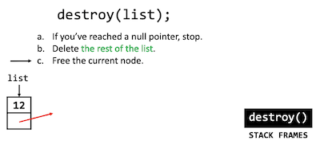

# Singly-linked lists

Instructor: **[Doug Lloyd](https://github.com/dlloyd09)**

---

So far in the course, we’ve only had one kind of data structure for representing collections of like values.
- Structs give us “containers” for holding variables of different data types, typically.
- Arrays are great for element lookup, but unless we want to insert at the very end of the array,
inserting elements is quite costly (remember insertion sort).

Arrays also suffer from a great inflexibility – what happens if we need a larger array than we thought?

- Through clever use of pointers, dynamic memory allocation, and structs, we can put those two pieces together
to develop a new kind of data structure that gives us the ability to grow and shrink a collection of like values
to fit our needs.

We call this combination of elements, when used in this way, a `linked list` or a `singly-linked list` in this chapter.

> A `linked list` node is a special kind of struct with two members:
> - Data of some data type (`int`, `char`, `float`…)
> - A `pointer` to another node of the same type
> 
> In this way, a set of nodes together can be thought of as forming a `chain of elements` that we can follow from
> beginning to end.

```c++
typedef struct sllist
{
    VALUE val;
    struct sllist* next;
}
sllnode;
```

- `VALUE` - arbitrary or custom data type;
- `sllnode` - name of our structure, we cannot use this name inside the definition in `{...}`,
  because it was not declared yet at that moment;
- `struct sllist` - temporary name for accessing with a pointer from inside;
- `struct sllist*` - self-referential trick with a pointer using a temporary name;

Temporary type name is not necessary, but if you need a self-referential struct use a temporary name. 

> In order to work with linked lists effectively, there are a number of operations that we need to understand:
> 1. `Create` a linked list when it doesn’t already exist.
> 2. `Search` through a linked list to find an element.
> 3. `Insert` a new node into the linked list.
> 4. `Delete` a single element from a linked list.
> 5. `Delete` an entire linked list.

---

## 1. `Create` a linked list

We may define a function with this prototype:
- This function returns a pointer to a singly-linked list;

```c++
sllnode *create(VALUE val);
```

Steps involved:
1. Dynamically allocate space for a new `sllnode` using `malloc()`;
2. Check to make sure we did not run out of memory (check for `NULL`);
3. Initialize the node’s `val` field;
4. Initialize the node’s `next` field;
5. Return a pointer to the newly created `sllnode`.

It may look visually like this:

```c++
sllnode *new = create(6);
```


- `6` - `val` field;
- `Red box` - null pointer, end of the list;
- `create()` returns a `*new` pointer that points to the list.

---

## 2. `Search` through a linked list

Assume that we already have a large chain of elements, and we need a `search()` function to find something
and return `true` or `false`.

```c++
bool find(sllnode *head, VALUE val);
```

- `sllnode *head` - pointer to the first element in linked list:
  - You always need to track the first element; 
  - Maybe even make the first element a `global variable`;
- `VALUE val` - member of the node that we want to find.

Steps involved:
1. Create a `traversal pointer` pointing to the list’s head.
2. If the current node’s `val` field is what we’re looking for, report success.
3. If not, set the traversal pointer to the `next` pointer in the list and go back to `step 2`.
4. If you’ve reached the end of the list, report `failure`.

We just replicated a `linear search` but for linked list instead of an array.

Visualize our list like this:


- we created `trav` - a traversal pointer, we don't need to use `malloc()` in this case, all values that we need are already
here in the list;

Now we need to move to the next element until we find `val`:


When we find `6` value that equals to `val` in our case, we are done and `search()` returns `true`.

> But what if there is no needed value?


We will start from the beginning and when we get to the red box, remember that it's `NULL`, we can conclude at that
point that we reached the end of the list and we can return `false`.

---

## 3. `Insert` a new node

Let's write a prototype for function `insert()`:
- We want to have a bunch of nodes that's why we need a separate function `insert()`;
- We can't use `create()` to insert elements because it will create a bunch of lists with single node,
not a single list with  a bunch of nodes.
- `insert()` returns the `pointer` to the new head of the list;

```c++
sllnode *insert(sllnode *head, VALUE val);
```

- `sllnode *head` - pointer to the first element in linked list;
- `VALUE val` - member of the node that we want to insert.

Steps involved:
1. Dynamically allocate space for a new `sllnode` using `malloc()`.
2. Check to make sure we didn't run out of memory.
3. Populate and insert the `node` _**at the beginning**_ of the linked list.
4. Return a `pointer` to the _**new head**_ of the linked list that we just created.

> **Why we want to insert at the beginning?**
> 
> Because we can do it immediately, we already have a pointer to the beginning.
> 
> If we wanted to start from the end, it will have running time `O(n)`:
> - We still need to start from the beginning;
> - Traverse till the end of the list;
> - Tack it on.

Let's visualize it:

```c++
list = insert(list, 12);
```


1. `malloc()` space for the new node;
2. Put `12` in there;
3. A **_tricky part_** starts here:
   4. Should the `12` node be the new head of the list, since it already exist?
   5. Should we connect it to the list first?

> **Order matters!**  
> If you move things out of order you can end up accidentally orphaning the rest of the list.
> 
> Let's look at the example:
> 
> 1. `malloc()` space for the new node;
> 2. Put `12` in there;
> 3. Make `12` node the new head of the list
>    4. So where is `12` next pointer?
>    5. We don't have anything pointing to `15` anymore, we've lost any ability to refer to `15`.
>    6. We just orphaned the rest of the list, we've accidentally broken the chain.
> 
> 

Let's return to our steps.

The correct order will be:
1. `malloc()` space for the new node;
2. Put `12` in there;
3. Connect `next` pointer to the old head of the list;

    

4. Make `12` node the new head of the list.

    

> We always need to connect the `new` element into the list before we change the `head` of the list.
> 
> So everything is chained together before we moved the pointer.

---

## 5. `Delete` an entire linked list

We need a function `destroy()` to delete an entire linked list:
- free our `malloc()`ed space when we are done with the list.

```c++
void destroy(sllnode *head);
```

Steps involved:
1. If you’ve reached a `null` pointer, `stop`.
2. `Delete` the rest of the list.
3. `Free` the current node.

> What is `delete the rest of the list`?
> 
> It is a recursion, so we need a recursive function:
> - _"Delete everybody else, then you can delete me"_.
>
> `When the list is NULL` - **_base case_** of a recursive function.

The stack of destroying everybody else is on the right side of the image (**LIFO**):
- We start from the head of the list, from left to right;
- We stopped when reached a null pointer.
- We do not delete anybody yet.


We reached the `NULL` pointer.

Then the recursive `destroy()` will one by one destroy the nodes on the returning phase:


And so on till there were no one else to delete.


So it destroys itself.



> If we had just deleted the head of the list at the first step, we will have no opportunity to refer to the rest
> of the list and delete them. It will cause a `memory leak`.

---

## 4. `Delete` a single element

This is a bit tricky, so we will discuss it on the next lesson `Doubly-linked list`.