# Doubly-linked lists

Instructor: **[Doug Lloyd](https://github.com/dlloyd09)**

---

Singly-linked lists really extend our ability to collect and organize data, but they suffer from a crucial limitation:
- We can only ever **_move in one direction_** through the list.
- --> Consider the implication that would have for trying to delete a node.

A `doubly-linked list`, by contrast, allows us to **_move forward and backward_** through the list, all by simply adding
one extra pointer to our struct definition.

```c++
typedef struct dllist
{
    VALUE val;
    struct dllist *prev; // left
    struct dllist *next; // right
}
dllnode;
```

Steps to work with doubly-linked list is almost the same as it was with singly-linked list:
1. `Create` a linked list when it doesn't already exist.
2. `Search` through a linked list to find an element.
3. `Insert` a new node into the linked list.
   1. Step is different from singly-linked list;
4. `Delete` a single element from a linked list.
   2. Step is different from singly-linked list;
5. `Delete` an entire linked list.

---

## 3. `Insert` a new node

We have a function prototype for inserting:

```c++
dllnode *insert(dllnode* head, VALUE val);
```

Steps involved:
1. Dynamically allocate space for a new `dllnode`.
2. Check to make sure we didn't run out of memory.
3. Populate and insert the `node` at the beginning of the linked list.
4. **Fix the `prev` pointer of the old head of the linked list.**
5. Return a pointer to the new `head` of the linked list.

> We didn't do this step before with singly-linked list.
> This is the difference between doubly- and singly-linked lists:
> 
> _Fix the old head of the list to point backward to the new head of the linked list._

Assume that we want to insert `12` into this list:

```c++
list = insert(list, 12);
```

Check the diagram of a doubly-linked list:

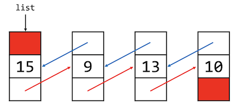 

- Each node contains 3 fields;
- `next` pointer in red and `prev` pointer in blue;
- Nothing comes before the `15` node, so it is a current head of the list, and it's `prev` pointer is `NULL` (red box);
- Nothing comes after the `10` node, and it's `next` pointer is `NULL`.

Let's add `12`.

We need to allocate a memory for this first with `malloc()`:

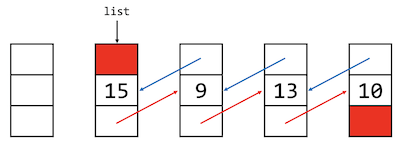

Put `12` inside of it:

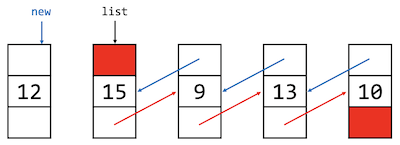

Now we need to be really careful to not break the chain:

- Remember, we can **_never break the chain_** when rearranging the pointers.
- Even if we need to have redundant pointers temporarily, that’s okay.

At first, we need to fill the `12` node's pointers:
- `12` node need `next` to point to the next node and it is `15`

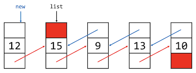

What comes before `12` node?
- Nothing, so it's `NULL`

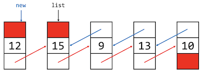

At this step we filled all fields in the `12` node.

Now we can make the `15` node's `prev` pointer point to the `12` node.

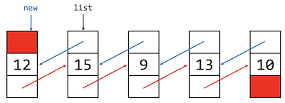

Only after all of these steps we can move the `head` of the list to 12 node:

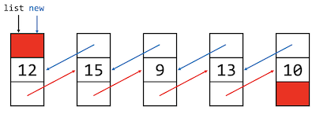

Now we are ready to delete a single node from the list.

---

4. `Delete` a single element

The function prototype will be like this:

```c++
void delete(dllnode* target);
```

Steps involved:
1. Fix the pointers of the surrounding nodes to “skip over” target.
2. Free target.

These steps work for deleting something from the middle of the list, for the `head` and the `end`
there is a little bit of different approach.

Assume that we need to delete `x` element, `x = 13`:

```c++
delete(x);
```

So we have our doubly-linked list:

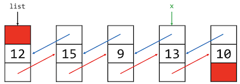

We need to make previous `9` node's `next` pointer to skip the `13` node and point to whatever the `13` node's
`next` pointer is points to.

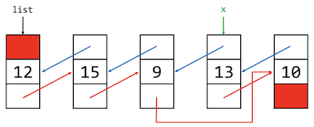

Then do something similar to the `10` node's prev pointer:

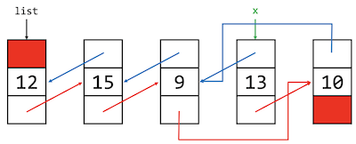

Now we can free `13` node.

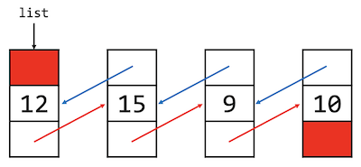

---

Linked lists, of both the singly- and doubly-linked varieties, support extremely efficient insertion and deletion of elements.
- Insertion and deletion can be done in constant time - `O(1)`.

What’s the downside? Remember how we had to find an element? We’ve lost the ability to randomly-access list elements.
- Accessing a desired element may now take linear time - `O(n)`.