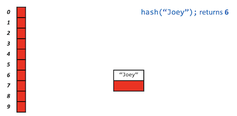
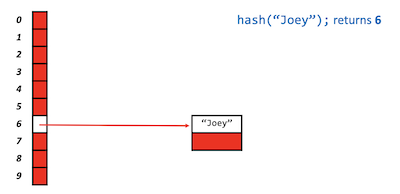
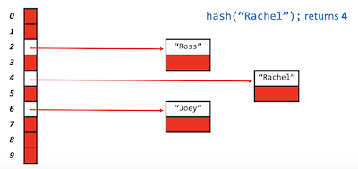
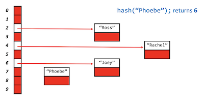
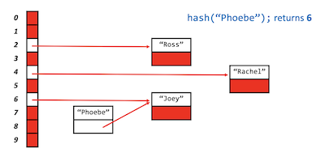
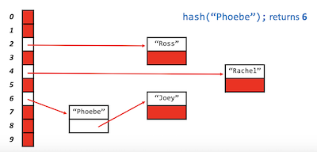

# Hash tables

Instructor: **[Doug Lloyd](https://github.com/dlloyd09)**

---

`Hash tables` combine the random access ability of an **array** with the dynamism of a **linked list**:

✅ **Pros**:
- `Insertion` can start to tend toward `O(1)`
- `Deletion` can start to tend toward `O(1)`
- `Lookup` can start to tend toward `O(1)`

We’re gaining the advantages of both types of data structure, while mitigating the disadvantages.

To get this performance upgrade, we create a new structure whereby when we insert data into the structure,
the data itself gives us a clue about where we will find the data, should we need to later look it up.

❌ **Cons**:
- `Sorting` is terrible.

But if we don't care about sorting, the hash tables are a good choice.

---

## Hash tables

A hash table amounts to a combination of two things with which we’re quite familiar:
- First, a `hash()` function, which returns a non-negative integer value called a `hash code`.
- Second, an `array` capable of storing data of the type we wish to place into the data structure.

The idea is that we run our data through the hash function, and then store the data in the element of the array
represented by the returned hash code.

Assume that we have some hash table with empty strings:

```c++
string hashtable[10];
```

| 0 | ... |
|---|-----|
| 1 | ... |
| 2 | ... |
| 3 | ... |
| 4 | ... |
| 5 | ... |
| 6 | ... |
| 7 | ... |
| 8 | ... |
| 9 | ... |

```c++
int x = hash("John");

// x is now 4

hashtable[x] = "John";
```

| 0 | ...     |
|---|---------|
| 1 | ...     |
| 2 | ...     |
| 3 | ...     |
| 4 | "John"  |
| 5 | ...     |
| 6 | ...     |
| 7 | ...     |
| 8 | ...     |
| 9 | ...     |

```c++
int y = hash("Paul");

// y is now 6

hashtable[y] = "Paul";
```

| 0 | ...    |
|---|--------|
| 1 | ...    |
| 2 | ...    |
| 3 | ...    |
| 4 | "John" |
| 5 | ...    |
| 6 | "Paul" |
| 7 | ...    |
| 8 | ...    |
| 9 | ...    |

---

## Define a hash function

Really no limit to the number of possible hash functions.

A good `hash function` should:
- Use **only the data** being hashed;
- Use **all the data** being hashed;
- Be **deterministic**:
  - Every time we pass the exact same piece of data into the `hash()`, we always has the **same hash code** out;
  - No random numbers can be involved into hash tables;
- Uniformly distribute data:
  - Every time you run data through the `hash()` you want to have a big range of hash codes;
- Generate very different hash codes for very similar data:
  - Great if really similar data (like `"John"` or `"Jonathan"`) were spread out to weigh different locations
  in the hash table;

Let's look at the example of `hash()`.
- It's not a particularly good hash function, but we need to look what's going on here:

```c++
unsigned int hash(char* str)
{
    int sum = 0;
    for (int j = 0; str[j] != '\0'; j++)
    {
        sum += str[j];
    }
    return sum % HASH_MAX;
}
```

- `int sum = 0;` - declaring a variable;
- `str[j] != '\0'` - loop till the end of the string
  - this is another way to implement `strlen()`, so you don't need to calculate the length of the string each time;
- `sum += str[j]` - `str[j]` is an element of a string;
- `HASH_MAX` - the size of the array;
  - We don't want getting hash codes `11` or `12` if the array is of size `10` --> `segmentation fault`.

So we are adding all the `ASCII` values of the string and then returning some hashcode `hash` modded by `HASHMAX`.

> There are a lot of good hash functions on the internet, don't hesitate to use them, just be sure to site your sources.

---

## Collisions

Let's revisit our hashtable:

| 0 | ...    |
|---|--------|
| 1 | ...    |
| 2 | ...    |
| 3 | ...    |
| 4 | "John" |
| 5 | ...    |
| 6 | "Paul" |
| 7 | ...    |
| 8 | ...    |
| 9 | ...    |

```c++
int z = hash("Ringo");

// z is now 6
```

What if we hashed `"Ringo"` and at the end of a processing we get the index that is already taken?

A `collision` occurs when two pieces of data, when run through the hash function, yield the **_same hash code_**.

Presumably we want to store both pieces of data in the hash table, so we shouldn’t simply overwrite the data
that happened to be placed in there first.

We need to find a way to get both elements into the hash table while trying to preserve `quick insertion` and `lookup`.

---

## Linear probing

We can resolve collisions with `Linear probing`. In this method, if we have a collision:
- try to place the data in the next consecutive element in the array (wrapping around to the beginning if necessary)
- until we find a vacancy.

That way, if we don’t find what we’re looking for in the first location, at least hopefully the element
is somewhere nearby.

Let's look at the hash table:

```c++
hash("Bart"); // returns 6
```

| 0 | ...    |
|---|--------|
| 1 | ...    |
| 2 | ...    |
| 3 | ...    |
| 4 | ...    |
| 5 | ...    |
| 6 | "Bart" |
| 7 | ...    |
| 8 | ...    |
| 9 | ...    |

```c++
hash("Lisa"); // returns 6
```

Since the index `6` is taken by `"Bart"`, `"Lisa"` will take the index `hashcode + 1 = 7`:

| 0 | ...    |
|---|--------|
| 1 | ...    |
| 2 | ...    |
| 3 | ...    |
| 4 | ...    |
| 5 | ...    |
| 6 | "Bart" |
| 7 | "Lisa" |
| 8 | ...    |
| 9 | ...    |

```c++
hash("Homer"); // returns 7
```

Since the index `7` is taken by `"Lisa"`, `"Homer"` will take the index `hashcode + 1 = 8`:

| 0 | ...     |
|---|---------|
| 1 | ...     |
| 2 | ...     |
| 3 | ...     |
| 4 | ...     |
| 5 | ...     |
| 6 | "Bart"  |
| 7 | "Lisa"  |
| 8 | "Homer" |
| 9 | ...     |

```c++
hash("Maggie"); // returns 3
```

| 0 | ...      |
|---|----------|
| 1 | ...      |
| 2 | ...      |
| 3 | "Maggie" |
| 4 | ...      |
| 5 | ...      |
| 6 | "Bart"   |
| 7 | "Lisa"   |
| 8 | "Homer"  |
| 9 | ...      |

```c++
hash("Marge"); // returns 6
```

Since the index `6` is taken by `"Bart"` and `7`, `8` is also taken, so `"Marge"` will take the index
`hashcode + 1 + 1 + 1 = 9`:

| 0 | ...      |
|---|----------|
| 1 | ...      |
| 2 | ...      |
| 3 | "Maggie" |
| 4 | ...      |
| 5 | ...      |
| 6 | "Bart"   |
| 7 | "Lisa"   |
| 8 | "Homer"  |
| 9 | "Marge"  |

Let's look again at our hash result and compare with the final table:

```c++
hash("Bart"); // returns 6
hash("Lisa"); // returns 6
hash("Homer"); // returns 7
hash("Maggie"); // returns 3
hash("Marge"); // returns 6
```

Resolving collisions: `Linear probing`

> Linear probing is subject to a **_problem_** called `clustering`. Once there’s a miss, two adjacent cells will contain data,
> making it more likely in the future that the cluster will grow.

Even if we switch to another probing technique, we’re still limited. We can only store as much data as we have
locations in our array.

---

## Chaining

Let’s start to pull it all together.

Resolving collisions: `Chaining`

What if instead of each element of the array holding just one piece of data, it held multiple pieces of data?

If each element of the `array` is a pointer to the head of a `linked list`, then multiple pieces of data can yield
the same hash code, and we’ll be able to store it all!

We’ve **_eliminated clustering_**.

We know from experience with linked lists that `insertion` (and `creation`, if necessary) into a linked list is
an `O(1)` operation.

For lookup, we only need to search through what is hopefully a small list, since we’re distributing what would
otherwise be one huge list across n lists.

❌ `string hashtable[10];` - we don't use this earlier approach, because we don't need an array of strings.

```c++
// Now we have a table of 10 nodes
node* hashtable[10];

hash("Joey"); // returns 6
```

All nodes is `NULL` at first.

First we need to allocate the memory for `"Joey"`:



Then point index `6` to `Joey`'s location:



```c++
hash("Rachel"); // returns 4
hash("Ross"); // returns 2
```



#### Let's handle collision:

```c++
hash("Phoebe"); // returns 6
```

First we need to allocate `"Phoebe"`:



Point Phoebe's `next` pointer to `Joey`'s:



Finally, point index `6` to `"Phoebe"`:



> `Chaining` is the most effective method when you work with `hash tables`.
> 
> But `tries` is even more effective. Look at the next chapter.