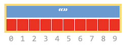
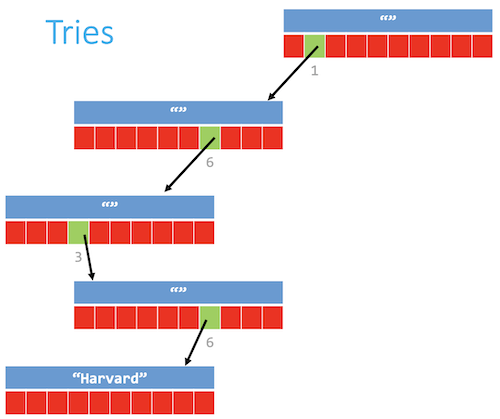
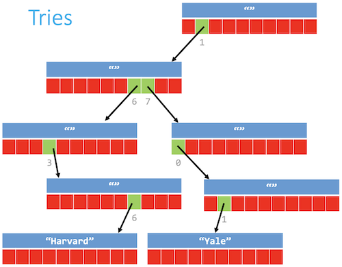
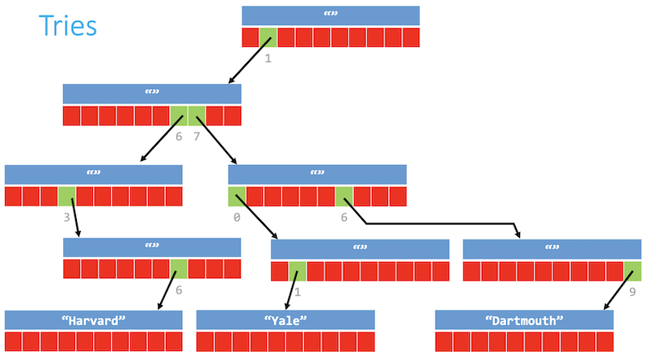
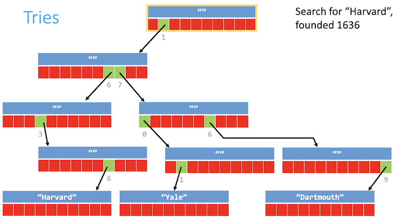
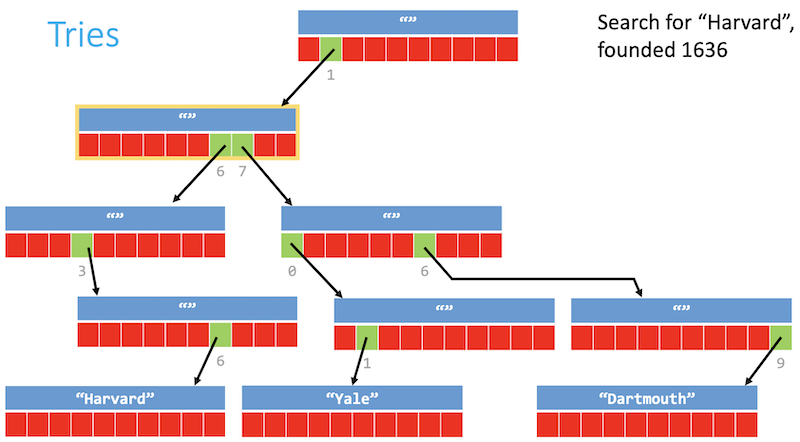
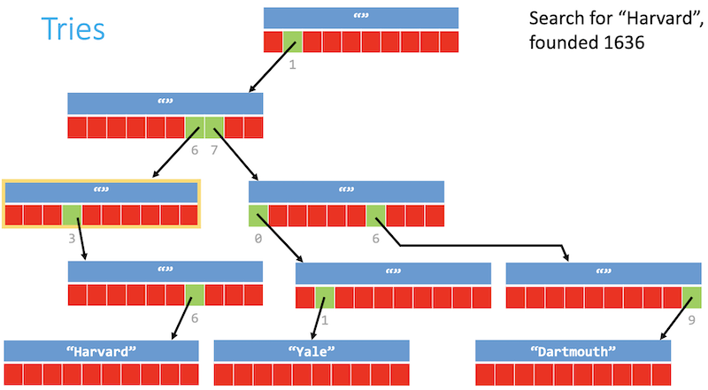
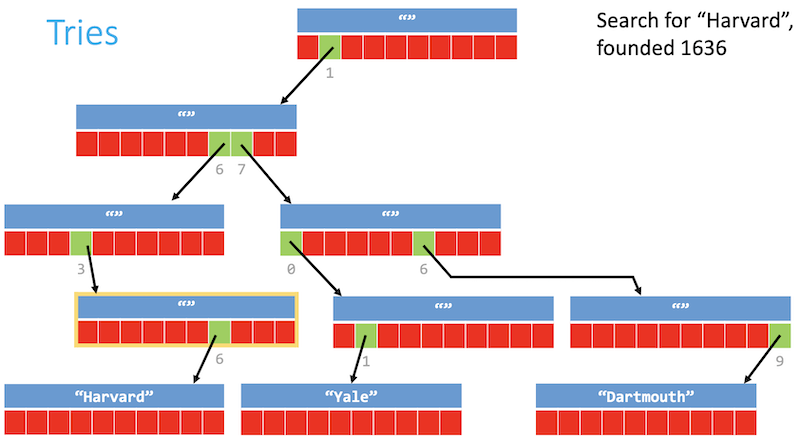
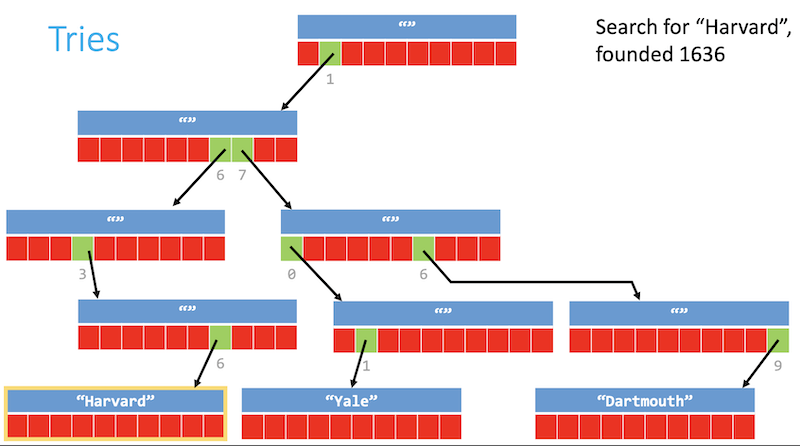

# Tries

Instructor: **[Doug Lloyd](https://github.com/dlloyd09)**

---

We have seen a few data structures that handle the mapping of key-value pairs:
- `Arrays`
  - _Key_ is the **_element index_**;
  - _Value_ is the **_data_** at that location.
- `Hash tables`:
  - _Key_ is the **_hash code_** of the data;
  - _Value_ is a **_linked list_** of data hashing to that hash code.

What about a slightly different kind of data structure `trie` where:
- _Key_ is guaranteed to be **_unique_**
- _Value_ could be as simple as a **_Boolean_**

`Tries` combine `structures` and `pointers` together to store data in an interesting way.

The data to be searched for in the trie is now a roadmap:
- If you can follow the map from beginning to end, the data exists in the trie;
- If you can’t, it doesn't.

Unlike with a hash table, there are **_no collisions_**, and no two pieces of data (unless they are identical)
have the same path.

---

## Trie example

Let’s map key-value pairs where the keys are four-digit years (YYYY) and the values are names of universities
founded during those years.

In a `trie`, the paths from a central `root` node to a `leaf` node (where the school names would be),
would be labeled with digits of the year;

Each node on the path from root to leaf could have `10 pointers` emanating from it, one for each digit;

To insert an element into the trie, simply build the correct path from the root to the leaf.

- `Key` - year of foundation - 4 digits will be used to navigate to the value;
- `Value` - name of the university.

```c++
typedef struct _trie
{
    char university[20];
    struct _trie* paths[10];
}
trie;
```

At first, we need to globally declare the root of the trie with `malloc()`.

`struct _trie* paths[10];` look like this:
  - `Blue` is a string member;
  - `Red` is an array of 10 pointers (from 0 to 9).



```c++
// Insert "Harvard", founded 1636
```

There is two ways of doing insertion: _left to right_ and _right to left_.

1. We start from `1` in this case, so `left ro right` approach;
2. Then we create with `malloc()` a new node and point `1` there, so `1` is no longer `NULL`;
3. In the new node we need to decide where to go: we need `6`;
4. So with `6` and other nodes we are doing the same steps.
5. Until we get to the end of the 4 digits to the second `6`;
6. Again we need to allocate a new node, but this time there are nowhere to point to;
7. Thus, we fill the string member with the name of a university.



```c++
// Insert "Yale", founded 1701
```

We are using the same approach step by step.:



```c++
// Insert "Dartmouth", founded 1769
```



---

## Searching

To search for an element in the trie, use successive digits to navigate from the root, and if you can make it
to the end without hitting a dead end (a NULL pointer), you’ve found it.

```c++
// Search for "Harvard", founded 1636
```

1. Searching for `1`:



2. Searching for `6`:



3. Searching for `3`:



4. Searching for `6`:



4. The `6` node led us to the node with the string, but the computer doesn't know about it yet
5. We need to check the string here and then say `true`.



```c++
// Search for "Princeton", founded 1746
```

- We go down till the second node and `7`th pointer;
- We don't see that `4` pointer is pointing anywhere, it is `NULL`;
- We reached a "dead end" and can say `false`.

> - ✅ Insertion and lookup take `O(1)`.
> - ❌ Each of those nodes takes a lot of space.