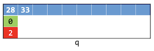
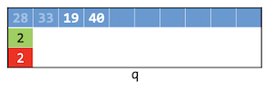

# Queues

Instructor: **[Doug Lloyd](https://github.com/dlloyd09)**

---

`Stack` have a very similar concept as `queues`.

A `queue` is a special type of structure that can be used to maintain data in an organized way.

This data structure is commonly implemented in one of two ways:
- as an array;
- or as a linked list.

Remember, that `stack` rule is `LIFO` (Last in, first out).

In either case, the important rule is that when data is added to the queue, it is tacked onto the end,
and so if an element needs to be removed, the element at the front is the only element that can legally be removed.
- First in, first out (`FIFO`)

There are only two operations that may legally be performed on a queue:
- `Enqueue`: **Add** a new element to the end of the queue;
- `Dequeue`: **Remove** the oldest element from the front of the queue.

> **Add to the end** of the queue, **remove from the front** of the queue.
> 
> The oldest thing in the queue is always the next thing to come out, if we try to dequeue somthing.

---

## Array-based implementation 

```c++
typedef struct _queue
{
    VALUE array[CAPACITY];
    int front;
    int size;
}
queue;
```

- `CAPACITY` - because we use an array, we need to define a constant size of an array;
- `front` - we need to keep front of the queue, so we knew which element we want to dequeue;
- `size` - number of elements that we have in our queue;

> #### Why we don't track the end of the queue?
> We will see later.

Assume that we defined const `CAPACITY` of 10.

Then we have declared a queue `q` with 3 fields:
- blue `array`;
- green `front` (the next element to be removed);
- red `size` (how many elements are currently existing in the `q`).

```c++
queue q;
```


```c++
q.front = 0;
q.size = 0;
```


After that we pretty much ready to work with our `q`.

### - Enqueue to array-based queue

> Array-based implementation:
> - `Enqueue`: Add a new element to the end of the queue.
>
> In the general case, `enqueue()` needs to:
> 1. Accept a pointer to the queue;
> 2. Accept data of type VALUE to be added to the queue;
> 3. Add that data to the queue at the end of the queue;
> 4. Change the size of the queue.

```c++
enqueue(&q, 28);
```

- The `front` (green) of our queue is `0`;
- The `size` (red) of our queue is `0`;
- So we put `28` at `0` index of our queue.


- `front` number `0` stays the same, because the oldest element and only element is `28` now at `0` index;
- But we can change `size` to `1`.


We just finished enqueue an element to the queue.

Let's enqueue another one.

```c++
enqueue(&q, 33);
```

> **General idea**: add `front` and `size` to know where the next element going to go.

- So the location of `33` is `front 0 + size 1`;
- And `size` is now `2`;
- `front` stays `0`, because it is just an indicator of the queue beginning.



Let's enqueue another one.

```c++
enqueue(&q, 19);
```

- So the location of `19` is `front 0 + size 2`;
- And `size` is now `3`;


And so on.

### - Dequeue from array-based queue

> Array-based implementation
> - `Dequeue`: Remove the most recent element from the front of the queue.
>
> In the general case, `dequeue()` needs to:
> - Accept a pointer to the queue.
> - Change the location of the front of the queue.
> - Decrease the size of the queue.
> - Return the value that was removed from the queue

```c++
// Function prototype
VALUE dequeue(queue* q);

// Dequeue
int x = dequeue(&q)
```

It will delete the first element `28` of the queue:


Actually, we don't exactly delete `28`, we are just ignoring its position in the queue:
- `front` is now `1` (`33` is now the oldest element);
- `size` is now `2`;

Let's dequeue again:

```c++
int x = dequeue(&q);
```

`x` will become `33` now (become an oldest element).


- `front` is now `2`;
- `size` is now `1`;

> Let's add something:
> 
> ```c++
> enqueue(&q, 40);
> ```

Where is `40` going to go?

`Location` = `front` + `size`;

> If we reach the end of the location, we need to mod our result by `CAPACITY`, so we will be able to wrap around
> the queue.



- `front` stays `2`;
- `size` is now `2`;

---

## Linked-list-based implementation

In our example we have a `doubly-linked list`, but it's possible to do the same with the singly-linked list.

```c++
typedef struct _queue
{
    VALUE val;
    struct _queue *prev;
    struct _queue *next;
}
queue;
```

> Just make sure to always maintain pointers to the head and tail of the linked list! _(probably global)_

### - Enqueue to linked-list-based queue

To `enqueue`:
- Dynamically allocate a new node;
- Set its next pointer to NULL, set its prev pointer to the tail;
- Set the tail’s next pointer to the new node;
- Move the tail pointer to the newly-created node.

```c++
enqueue(tail, 10);
```

At first, we allocate memory to the new node with `malloc()`, then check for `NULL`:


Set `val` of a new node to `10`:


> Now we need to be careful to not break the chain.

- Set 10's `prev` to point back to the old tail;
- Set 10's `next` to `NULL`;


- Set old tail's `next` from `NULL` to the new tail `10`;


- Move `tail` to point to `10`.


### - Dequeue from linked-list-based queue

> To `dequeue()` we need to:
> - Traverse the linked list to its second element (if it exists);
> - Free the head of the list;
> - Move the head pointer to the (former) second element;
> - Make that node’s prev pointer point to NULL.

```c++
dequeue(head);
```

- Set traverse pointer `trav` to the head of the queue;
- `12` is the oldest element in the queue, so we want to delete it;


- Move `trav` to the next node: `trav = trav->next`;


- Free `head`;
- Set 15's `prev` to `NULL`.
- Move `head` over;


