# Stacks

Instructor: **[Doug Lloyd](https://github.com/dlloyd09)**

---

A `stack` is a **special type of structure** that can be used to maintain data in an organized way. In previous chapters we talk about
stack as the name for a segment of memory.

This data structure is commonly implemented in one of two ways:
- as an `array`;
- as a `linked list`;

In either case, the important rule is that when data is added to the stack, it sits “on top,” and so if an element
needs to be removed, the most recently added element is the only element that can legally be removed.
- Last in, first out (`LIFO`)

There are only two operations that may legally be performed on a stack.
- `Push`: Add a new element to the top of the stack;
- `Pop`: Remove the most recently-added element from the top of the stack.

---

## Array-based implementation

```c++
typedef struct _stack
{
    VALUE array[CAPACITY];
    int top;
}
stack;
```

- `top` - we need to track the top of a stack, what element is the most recently added;
- const `CAPACITY` = 10;

```c++
// Declare stack `s`
stack s;
```

Let's visualise it:

- blue - `array[10]`;
- green - int `top`;

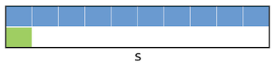

Now we need to set the top of a stack:

```c++
s.top = 0;
```

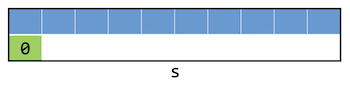  

## - `Push` to array-based stack

Array-based implementation:
- `Push`: **Add** a new element to the top of the stack.

In the general case, `push()` needs to:
1. Accept a pointer to the stack.
2. Accept data of type VALUE to be added to the stack.
3. Add that data to the stack at the top of the stack.
4. Change the location of the top of the stack.

> Why do we want to "Accept a pointer to the stack"?
>
> Function `push()` needs to accept the pointer to the stack, so that we're actually changing the stack we intend to change.
> Type VALUE is an integer that we are going to add to the top of stack.

```c++
// Function prototype
void push(stack* s, VALUE data);
```

Let's push something:

```c++
stack s;
s.top = 0;
push(&s, 28);
```

- The `top` of the stack is `0`, so we will put `28` to index `array[0]`;
- We need to change the top of the stack to `1`, so the next time we `push()` the element will be added
to the next index.

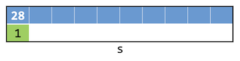  

```c++
push(&s, 33);
```

- `33` is going to the current `top` of the stack, which is `1`;
- new `top` is `2`;

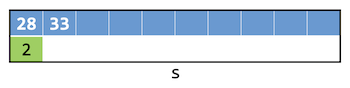  

```c++
push(&s, 19);
```

- `19` is going to the current `top` of the stack, which is `2`;
- new `top` is `3`;

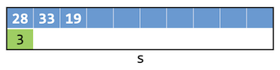

## - `Pop` from array-based stack

Array-based implementation
- `Pop`: **Remove** the most recent element from the top of the stack.

In the general case, `pop()` needs to:
1. Accept a pointer to the stack.
2. Change the location of the top of the stack.
3. Return the value that was removed from the stack.

```c++
// Function prototype
VALUE pop(stack* s);
```

```c++
int x = pop(&s);
```

- The top of the stack is now `3`;
- We need to decrement the `top`, so now it `2`;
- And now we are now deleting, but just successfully ignoring the third element.

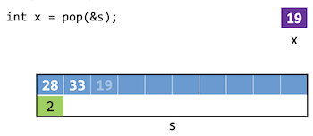

Let's do it again

```c++
int x = pop(&s);
```

- The top of the stack is now `2`;
- We need to decrement the `top`, so now it `1`;
- And now we are pretending, that we are having just one element in the stack.

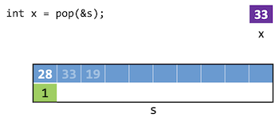

Let's `push()` something after `pop()`:

```c++
push(&s, 40);
```

- `40` is going to the current `top` of the stack, which is `1`;
- so the `array[1]` is now `40` instead of `33`;
- new `top` is `2`;

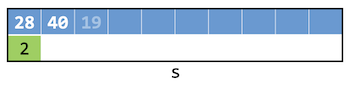

---

## Linked list-based implementation

```c++
typedef struct _stack
{
    VALUE val;
    struct _stack *next;
}
stack;
```

Just make sure to always maintain a pointer to the `head` of the linked list!

- To `push`, dynamically allocate a new node, set its next pointer to point to the current head of the list,
then move the head pointer to the newly-created node.

```c++
list = push(list, 12);
```

At first, we allocate the memory for the new node as usual. Then always check for `NULL`.

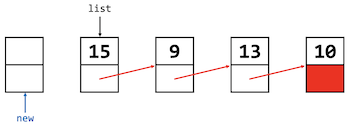

Then set the value of a new node to `12`.

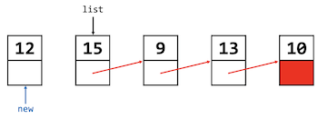

Set `next` pointer of a new element to the `head` of the list.

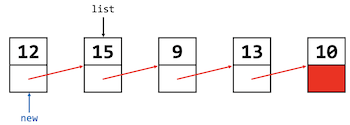

Set the new `head`.

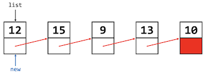

### - Pop from linked list-based stack

To `pop`, traverse the linked list to its second element (if it exists), free the head of the list,
then move the head pointer to the (former) second element.

```c++
pop(list);
```

At first, we need to set the `trav` pointer to the `head` of the list:

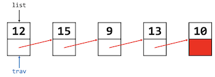

Set `trav` to the next element:

```
trav = trav.next;
```

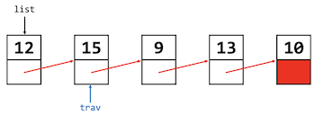

Now we are freeing the memory from `12` with `free(list)`.

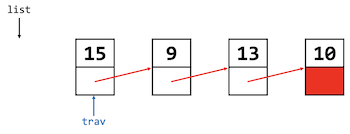

Set the new `head` of the list. `head = trav;`

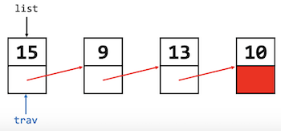