# Week 5: Data structures / Section

Preceptor: **Julia**  
Head teaching assistant for CS50 at Yale: **Charlie**

---

### Agenda:
1. Data structures and trade-offs
2. Linked lists
   1. Review
   2. Exercise
3. Hash tables
    1. Review
    2. Exercise
4. Inheritance

---

## Data structures and trade-offs

Different operations we can with data structures:
- Search
- Insertion
- Deletion

The order may vary depending on your goals.

> Trade-offs between memory and time.
> 
> 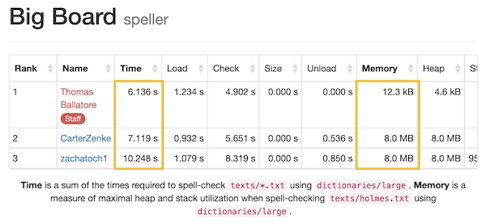
>
> Thomas's solution seemed the best:
> - Time: faster by 1 second
> 
> But look at the memory consumption:
> - Memory: twice consuming

---

## Linked lists

It is a chain of nodes.

### - Review

#### -- Nodes

```c++
typedef struct node
{
   string phrase;
   struct node *next;
}
node;
```

- `struct node` - we are going to create a custom structure, and we are going to call it a `node`;
- `string phrase` - define what's contained inside our struct node;
- `node *next` - we'll be using this node to link it to the rest of our nodes (a pointer pointing to the next node
of our linked list);
- `typedef ... {} node;` - now we can simply refer to this data structure with word `node`.

Our structure `node` may look like this:

| `phrase` | "Hi"  |
|----------|-------|
| `next`   | 0x123 |

#### -- Creating a linked list

1. At first, we want to define our list as a pointer to a node and start off with `NULL`.
- Linked list is just empty at the moment.

```c++
node *list = NULL;
```
2. Now we can create our very first node:

```c++
node *list = NULL;

node *n = malloc(sizeof(node));
```

- `n` - representing our new node;
- `sizeof(node)` - set enough memory to allocate our node struct;

Now we have two elements in our code:

- an empty list;
- an empty node;

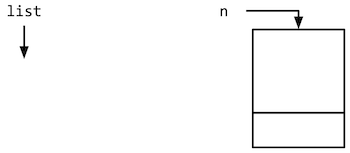

```c++
node *list = NULL;
node *n = malloc(sizeof(node));

n->phrase = "Hi!";
```

We just stored some data in a node:

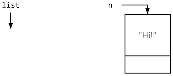

```c++
node *list = NULL;
node *n = malloc(sizeof(node));
n->phrase = "Hi!";

n->next = NULL;
```

Now we set node's `n` pointer `next` to `NULL`.
- Thus, this will be the end of the linked list for now.

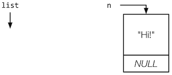

```c++
node *list = NULL;
node *n = malloc(sizeof(node));
n->phrase = "Hi!";
n->next = NULL;

list = n;
```

Now we want to make sure that we also point our list towards this `n` node:

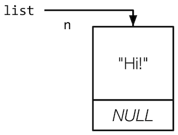

### -- Inserting nodes

Let's create another node and put a phrase in it:

```c++
n = malloc(sizeof(node));
n->phrase = "Hey!";
```

And now we have two nodes in computer's memory:

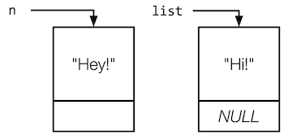

Now let's point `n` to `list` instead of `NULL`:

```c++
n = malloc(sizeof(node));
n->phrase = "Hey!";

n->next = list;
```

Now we have linked our new node to the first node:

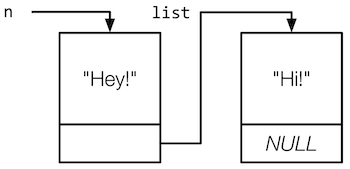

But there is still one more important thing to do:

```c++
n = malloc(sizeof(node));
n->phrase = "Hey!";
n->next = list;

list = n;
```

We just set the new head of the list:

> The **linked list** is tracked by its `head` value.

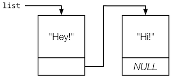

### -- Free memory

> Every time you `malloc()` something, you must `free()` it.

Let's start to cleaning up:

```c++
free(list);
```

❌ By doing this we just lost our first element and all the nodes connected to it.

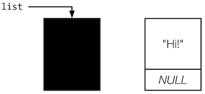

✅ Let's try to do it correctly:

At first, we need to create a temporary pointer that points to the next element in linked list.

```c++
node *ptr = list->next;
```

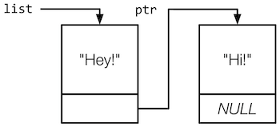

Now we can free the list and set the new head:

```c++
free(list);
list = ptr;
```

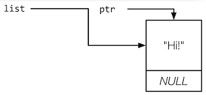

After that we need to move target of `ptr` to the nxt element:

```c++
ptr = list->next;
```

But because we are having just one element, it will become `NULL`.
- `NULL` means the end of the list.

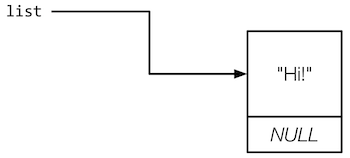

Because there are now other elements, now we can free our list:

```c++
free(list);
```

But then we need to be sure that there are no one pointing to an old address of the list:

```c++
list = ptr;
```

### - Exercise "Inserting and Unloading a linked list"

1. **TODO**: implement code to add a node to the linked list:
   - Ensure that list always points to the head of the linked list;
   - Also ensure your new node contains a phrase.
2. **TODO**: implement unload:
   - All nodes in the linked list are freed when the function is called;
   - Return true when successful.

`section_list`

```c++
#include <cs50.h>
#include <stdio.h>
#include <stdlib.h>

typedef struct node
{
    string phrase;
    struct node *next;
}
node;

#define LIST_SIZE 2

bool unload(node *list);
void visualizer(node *list);

int main(void)
{
    node *list = NULL;

    // Add items to list
    for (int i = 0; i < LIST_SIZE; ++i)
    {
        string phrase = get_string("Enter a new phrase: ");

        // TODO: add phrase to new node in list.
        node *n = malloc(sizeof(node));
        if (n == NULL)
        {
            return 2;
        }

        // Store the phrase from user
        n->phrase = phrase;

        // Nothing to store in the pointer yet
        n->next = NULL;

        // Connect in one linked list
        n->next = list;

        // Reset
        list = n;

        // Visualize list after adding a node.
        visualizer(list);
    }

    // Free all memory used
    if (!unload(list))
    {
        printf("Error freeing the list.\n");
        return 1;
    }

    printf("Freed the list.\n");
    return 0;
}

bool unload(node *list)
{
    // TODO: Free all allocated nodes

    // Temporary pointer to keep track of nodes
    node *ptr = list;

    while (ptr != NULL)
    {
        ptr = list->next;
        free(list);
        list = ptr;
    }

    return true;
}

void visualizer(node *list)
{
    printf("\n+-- List Visualizer --+\n\n");
    while (list != NULL)
    {
        printf("Location: %p\n", list);
        printf("Phrase: %s\n", list->phrase);
        printf("Next: %p\n\n", list->next);
        list = list->next;
    }
    printf("\n+---------------------+\n\n");
}
```

> Run `valgrind` for being sure that there are no memory leaks.

---

## Hash tables

### - Review

Let's have a look at a `linked list` first:

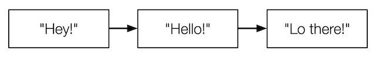

- If we need to find "Hey!" in this list, it will be very easy, because the head of the list contains "Hey!".
- Let's find "Lo there!":
  - we need to traverse through the list and going to the next element;
  - till we find our phrase.
- Imagine that we have a thousands of elements in such a linked list, it will be difficult to find something.

Remember, that within array we have instant access to each element.

> Hash table is an `array` of `linked list`.

Let's look at example of a hash table within zoom to our elements:
- Array contains 26 alphabet characters.

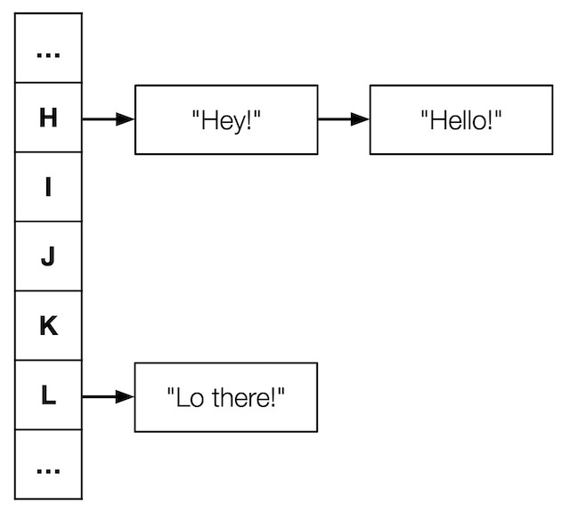

> We sorted this elements in `dictionary`, that have:
> - a key (e.g. alphabet characters)
> - a value (e.g. phrases)

- Each alphabet character located inside indexes from 0 to 25.

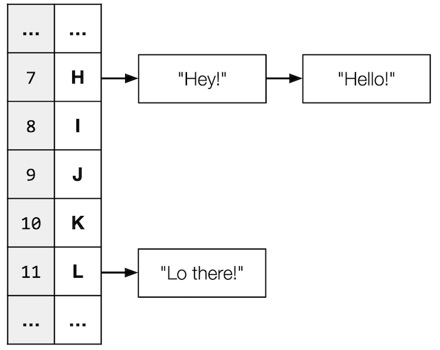

> We are going to have a `hash()` function, that will give us a number representing the index of where we should
> place our new element in the hash table.
>
> 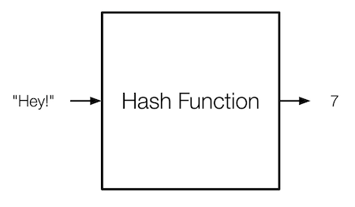

### - Exercise

**TODO**: complete hash:
- return a number, 0–25;
- depending on the first character in the word.

`section_table`

```c++
#include <cs50.h>
#include <ctype.h>
#include <stdio.h>
#include <stdlib.h>
#include <string.h>

// Define linked list
typedef struct node
{
    string phrase;
    struct node *next;
}
node;

// Array of alphabet characters
node *table[26];

int hash(string phrase);

int main(void)
{
    // Add items
    for (int i = 0; i < 3; ++i)
    {
        string phrase = get_string("Enter a new phrase: ");

        // Find phrase bucket
        int bucket = hash(phrase);
        printf("%s hashes to %i\n", phrase, bucket);
    }

    return 0;
}

// TODO: return the correct bucket for a given phrase
int hash(string phrase)
{
    return toupper(phrase[0]) - 'A';

    // `tolower` will be similar to `toupper`
    // return tolower(phrase[0]) - 'a';
}
```

> The good `hash()` function do:
> - Always gives you the same value for the same input
> - Produces an even distribution across buckets
> - Uses all buckets

---

## Inheritance

