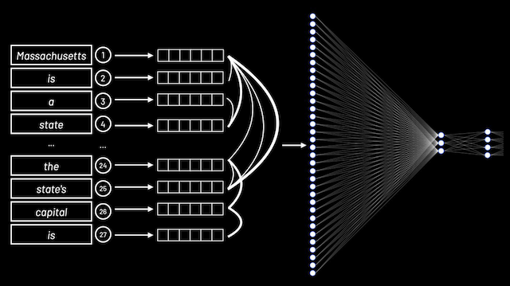

# Week 6.5: Artificial Intelligence

Instructor: **[David J. Malan](https://github.com/dmalan)**

---

CS50 created debugger at [cs50.ai](https://cs50.ai/), which uses artificial intelligence as a way by which
to interact with students to help them with their own challenging problems.

## Image generation

Numerous AI tools have created the potential for artificially generated images to enter the world:
- [DALL-E 2](https://labs.openai.com/)
- [Midjourney](https://www.midjourney.com/)

As technology improves, it will soon be almost, if not entirely, impossible for such images to be detected
with the naked eye.

Software has also gained the ability to mutate individual images within video, for a deepfakes for example.

---

## Text generation

A very well-known bleeding-edge tool is the text generation tool **chatGPT**.

> In CS50, we do not allow the use of ChatGPT. However, we do allow the use of our own rubber duck AI-debugger
> at [cs50.ai](https://cs50.ai/).

In CS50, we leverage the tools of Azure and OpenAI, along with our own `vector database` that holds very recent
information from our most recent lectures and offerings, to provide our rubber duck debugger toll.


### Prompt engineering

Prompt generation is the way by which an individual can communicate with an AI platform.

We use a `system prompt` to teach the AI how to interact with users. We teach the AI how to work with students.
Example:

```
You are a friendly and supportive teaching assistant for CS50.
You are also a rubber duck. Answer student questions only
about CS50 and the field of computer science; do not answer
questions about unrelated topics… Do not provide full answers
to problem sets, as this would violate academic honesty…
```

`User prompts` are those provided by users to interact with the AI. With these prompts, students interact
with the AI. Example:

```
What is the size of an integer?
```

---

## Visual Studio Code for CS50

**VS Code** is an open-source free product.


[cs50.dev](https://cs50.dev/) - we add to it more course specific features:
- Explain highlighted code;
- Advises students on how to improve their code's style;
- Answers (most of the) questions asked online by students;
- Explains arcane error messages, hints how to solve;
- Provides students with virtual office hours 24/7.

---

## Generative artificial intelligence

Software has long adapted to users. Algorithms look for patterns in junk mail, images saved on your phone,
and to play games.
- You are merely seeing spam at your mail, because of spam-detection in Gmail, Outlook, etc;
- Hand-writing recognition is working better and better;
- Recommendations are super-personalized nowadays;
- AI-assistant like Siri, Alexa and etc;

Ai is looking for `patterns`, no hard-coding like "if the user likes this movie, user will like that movie exactly".

In games, for example, step-by-step instructions may allow a computerized adversary play a game of Breakout.

---

## Decision trees


Decision trees are used by an algorithm to decide what decision to make.

For example, in `Breakout`, an algorithm may consider what choice to make based on the instructions in the code:


```
While game is ongoing:
    If ball is left of paddle:
      Move paddle left
    Else if ball is right of padding:
      Move paddle right
    Else:
      Don't move paddle
```

With most games, they attempt to minimize the number of calculations required to compete with the player.

Let's try to play `Tic-tac-toe`:


> ### Why AI is good in games?
> - Inputs and outputs that can be represented **mathematically**;
> - A goal in the form of a function to `maximize/minimize`.

---

## Minimax

Minimax - an algorithm to minimize/maximize something to achieve some goal.

You can imagine where an algorithm may score outcomes as positive, negative, and neutral.

In `tic-tac-toe`, the AI may consider a board where the computer wins as 1 and one where the computer loses as -1.


- Max(X) aims to maximize score;
- Min(O) aims to minimize score.


_If the AI cannot get the maximum score and the opponent can still win, the AI will decide to switch
to the option where no one wins, it means to '0' zero._

You can imagine how a computer may look at a decision tree of potential outcomes and assign scores
to each potential move.


The computer will attempt to win by **maximizing** its own score.

In the context of tic-tac-toe, the algorithm may conceptualize this as follows:

```
If player is X:
For each possible move:
  Calculate score for board
Choose move with highest score

Else if player is O:
  For each possible move:
    Calculate score for board
  Choose move with lowest score
```

How many possible ways there are to play tic-tac-toe?


Because computers are so powerful, they can crunch massive potential outcomes. However, the computers in our pockets
or on our desks may not be able to calculate trillions of options. This is where `machine learning` can help.

---

## Machine Learning

> In reinforcement learning, you wait for the computer to just get better and better at things. As is does, you reward
> it with a reward() function.

Machine learning is a way by which a computer can learn through `reinforcement`, it's finding patterns
more dynamically and learning from data.

- A computer can learn how to flip a pancake.
- A computer can learn how to play Mario.
- A computer can learn how to play The Floor is Lava.

The computer repeats trial after trial after trial to discover what behaviors to repeat and those not to repeat.

Within much of AI-based algorithms, there are concepts of explore vs. exploit, where the AI may randomly
try something that may not be considered optimal. Randomness can yield better outcomes.

### explore vs. exploit

Imagine a maze, where the yellow circle must get to the green box. Through numerous tries AI will memorize where
are the red boxes with 'lava' and the final safe path. But the way to get this path may took very long time or the path
itself may not be the shortest one.


- You should occasionally `exploit` the knowledge you already have. In fact, frequently `exploit` that knowledge.
- But occasionally you should probably just `explore` a little bit. May that way you find a better solution.

```
epsilon = 0.10

If random() < epsilon:
    Make a random move
Else:
    Make the move with the highest value
```

> **Randomness can yield better outcomes.**

---

## Deep Learning

**Deep learning** uses `neural networks` whereby problems and solutions are explored.

For example, consider the following image:
- Attempt to predict whether a blue or red dot will appear somewhere on a graph.
- At first, AI will probably assume that the border between those red and blue dots are in the middle;


- Then it gets a real data and the next blue dot are not where Ai assumes it to be;
- So, AI will change the border:


- Soon the graph will look like this.


- White nodes are "neurons";
- Two inputs `x`, `y`;
- AI is trying to configure what the weight of arrows/edge `a` and `b` should be.
- Variable `c` just tweaks the prediction of - or +c;

Existing training data is used to predict an outcome. Further, more training data may be created by the AI
to discover further patterns.

```
// When AI gets positive result there is `red`, negative when `blue`
ax + by + c > 0
```

Deep learning creates nodes (pictured below), which associate inputs and outputs.


You can apply this approach on anything:


- Giving today's `humidity`;
- Giving today's `pressure`;
- `Yes` or `No` - Should there be rainfall?


- Giving this amount of `advertising`;
- Giving this `month`;
- `Up` or `Down` - What should our sales be that year?

---

## Generative Artificial Intelligence

It's not about solving problems literally, but about generating something, increasingly resemble what we, humans,
might otherwise output ourselves.

For example, ChatGPT is a `Large Language Model`.

**_Large language models_** are massive models that make predictions based on huge amounts of training.

LLM haven't been told how to behave, they're really inferring from all of these examples, for better or for worse, how
to make predictions.

Just a few years ago, AI was not very good at completing and generating sentences.

`Transformer architecture` uses what's called self-attention mechanism to process input data. It is a deep learning
architecture developed by researchers at Google and based on the multi-head attention mechanism.

---

Up until a few years ago, completing this sentence was pretty hard for a lot of AI:

> "Massachusetts is a state in the New England region of the Northeastern United States.
> It borders on the Atlantic Ocean to the east. The state's capital is…"

What's going on underneath the hood:


- AI breaks down the user's input (on the left);
- Counts the order of those words;
- Encodes each of those words using a standard way, look at the word "Massachusetts":


This is a mathematical representations of the input that can be compared against the mathematical representation
of other input. AI needs to find relationships or correlations with those words, it will help AI ultimately predict
what should the next word output.



- So, we found correlation between words;
- Then all data ultimately fed into a LLM (inputs on the left, output on the right).

After all of those steps, the AI will be able to conclude that the end of a sentence will be:

```
Boston
```

---

The AI encodes words into embeddings to find relationships between words. Thus, through a huge amount of training,
a massive neural network can predict the association between words - resulting in the ability for generative AI
to generate content and even have conversations with users.

These technologies are what is behind our [rubber duck debugger](https://cs50.ai/).

> AI are not perfect. They may have so-called `"hallucinations"` and just make stuff up, which may sound very confident.
> But this type of problem is going less and less frequent.