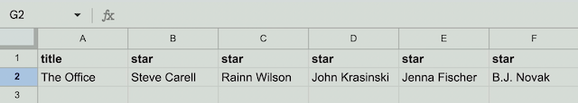
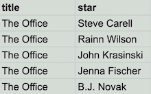
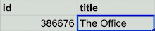
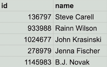
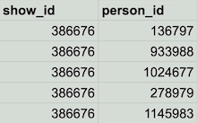
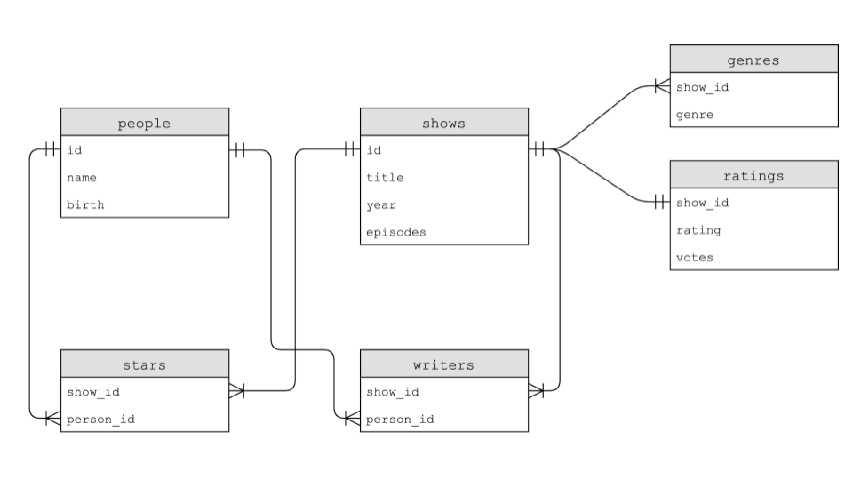
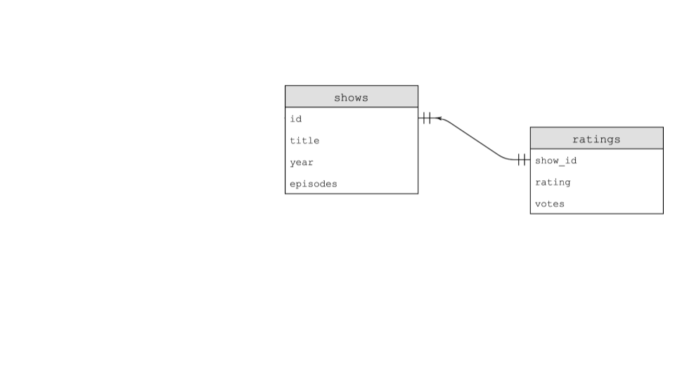

# Week 7: SQL

Instructor: **[David J. Malan](https://github.com/dmalan)**

---

- This week, we will be continuing more syntax related to Python.
- Further, we will be integrating this knowledge with data.
- Finally, we will be discussing SQL or Structured Query Language.
- Overall, one of the goals of this course is to learn to program generally – not simply how to program in the languages described in this course.

---

Imagine a survey that questions you some topics. All the input that were given to this survey can often be described
in patterns of columns and rows.

> A simplest way to store a bunch of data is to save as `flat-file database`. 

**Spreadsheets** like those created in _Microsoft Excel_ and _Google Sheets_ can be outputted to a `csv`
or `Comma-Separated Values` file.

If you look at a `csv` file, you’ll notice that the file is flat in that all of our data is stored
in a single table represented by a text file. We call this form of data a `flat-file database`.

> Python comes with native support for csv files.

- First, download `favorites.csv` and upload it to your file explorer inside `cs50.dev`.

The `favorites.csv` will look like this:
- The first line is a `Header row`, which describes what each of those columns means.

```
Timestamp,language,problem
10/30/2023 13:38:01,Python,"Hello, World"
10/30/2023 13:38:03,Python,DNA
10/30/2023 13:38:03,Python,"Hello, World"
10/30/2023 13:38:05,Scratch,Scratch
10/30/2023 13:38:08,Python,Speller
10/30/2023 13:38:09,Python,"Hello, World"
10/30/2023 13:38:10,Python,Cash
10/30/2023 13:38:10,Python,Readability
and so on...
```

- Second, in your terminal window, type code favorites.py and write code as follows:

We could write code this way, more similar to C way:

```python
import csv

file = open("favorites.csv", "r")
# Do comething
close(file)
```

### - `favorites_1.py`

But let's write it in more `pythonic` way:
- `with` will close the opened file for you, when program will be out of this block of code;

```python
# Prints all favorites in CSV using csv.reader

import csv

# Open CSV file
with open("favorites.csv", "r") as file:

    # Create reader
    reader = csv.reader(file)

    # Skip header row
    next(reader)

    # Iterate over CSV file, printing each favorite
    for row in reader:
        print(row[1])
```

Notice that the `csv` library is imported. Further, we created a reader that will hold the result
of `csv.reader(file)`. The `csv.reader` function reads each row from the file, and in our code we store
the results in `reader`. `print(row[1])`, therefore, will print the language from the `favorites.csv` file.

```python
# We may assign a variable to a specific row, but there is a big issue:
# What if they were changed or swapped in the original file?
favorite = row[1]
```

The better approach is to dance over Header row instead.

Let's make our code better `favorites_2.py`:
- The difference between `DictReader` and `reader` is that it automatically analyzes that first line in the file,
figures out what are all of your columns called and, thereafter, when you iterate over `reader` it's no longer
a `list[3]`. Each row in this loop is now a `dictionary` instead. The `keys` are getting from the `Header`, the values
are all rows beneath.

```python
import csv

# Open CSV file
with open("favorites.csv", "r") as file:
    reader = csv.DictReader(file)
    for row in reader:
        print(row["language"])
```

This way we don't lose our columns, well, if they weren't renamed in the file.

### - `favorites_2.py`

Let's analyze how many people prefer Python over C or Scratch, or visa-versa.

We could create counters like this:

```python
# Votes counters
scratch = 0
c = 0
python = 0
```

But let's write it in another way:

```python
import csv

# Open the file
with open("favorites.csv", "r") as file:
    # Read data and import into reader
    reader = csv.DictReader(file)

    # Votes counters
    scratch, c, python = 0, 0 ,0

    for row in reader:
        favorite = row["language"]
        if favorite == 'C':
            c += 1
        elif favorite == 'Python':
            python += 1
        elif favorite == 'Scratch':
            scratch += 1

# Printing is outside the loop, because at this step
# we don't need an opened file anymore.          
print(f"C: {c}")
print(f"Python: {python}")
print(f"Scratch: {scratch}")
```

### - `favorites_3.py`

Let's remember that Dictionary contains keys and values. So, we can try to keep track of the values instead
of creating a redundant counters.

```python
import csv

# Open the file
with open("favorites.csv", "r") as file:
    # Read data and import into reader
    reader = csv.DictReader(file)

    # Create an empty dictionary
    counts = {}

    for row in reader:
        favorite = row["language"]
        if favorite in counts:
            counts[favorite] += 1
        else:
            counts[favorite] = 1

for favorite in counts:
    print(f"{favorite}: {counts[favorite]}")
```

- We used 1 dictionary instead of 3 variables.

### - `favorites_4.py`

Let's sort our data by `key`(left column): C, Python, Scratch.

The easiest way to sort something in Python is to use `sorted()` function.

```python
for favorite in sorted(counts):
    print(f"{favorite}: {counts[favorite]}")
```

### - `favorites_5.py`

Sort by `value`(right column) or sort by rank from the highest score to the lowest:

```python
for favorite in sorted(counts, key=counts.get):
    print(f"{favorite}: {counts[favorite]}")
```

- `get()` - a function to use within Dictionary, it gets the value for the key. So we sort by the right column
instead of the left.

```
-- Output --

Scratch: 40
C: 78
Python: 280
```

Well, it is indeed sorted, but we need to reverse it:

```python
for favorite in sorted(counts, key=counts.get, reverse=True):
    print(f"{favorite}: {counts[favorite]}")
```

Python have not only positional arguments, it also has named parameters (like `key`, `reverse`, etc.)

```
-- Output --

Python: 280
C: 78
Scratch: 40
```

### - `favorites_6.py`

We can make much better, Python is rich with ecosystem of libraries.

We can use `collections` module.

```python
import csv

from collections import Counter

# Open the file
with open("favorites.csv", "r") as file:
    # Read data and import into reader
    reader = csv.DictReader(file)

    # Create a collection
    counts = Counter()

    for row in reader:
        favorite = row["language"]
        counts[favorite] += 1

for favorite in sorted(counts, key=counts.get, reverse=True):
    print(f"{favorite}: {counts[favorite]}")
```

- `Counter()` has built-in counting capabilities
- `+= 1` Counter() automatically initialize everything to zero `0`

### - `favorites_7.py`

Let's simplify sorting.

```python
import csv

from collections import Counter

# Open the file
with open("favorites.csv", "r") as file:
    # Read data and import into reader
    reader = csv.DictReader(file)

    # Create a collection
    counts = Counter()

    for row in reader:
        favorite = row["language"]
        counts[favorite] += 1

for favorite, count in counts.most_common():
    print(f"{favorite}: {count}")
```

- `most_common` returns a pair of key:value

### - `favorites_8.py`

Find specific counts.

```python
import csv

from collections import Counter

with open("favorites.csv", "r") as file:
    # Read data and import into reader
    reader = csv.DictReader(file)
    
    counts = Counter()

    for row in reader:
        favorite = row["problem"]
        counts[favorite] += 1

# Find specific counts
favorite = input("Favorite: ")
print(f"{favorite}: {counts[favorite]}")
```

---

## Relational database

Instead of endlessly iterating with specific csv files, we can use database.

`SQL` or `sequel` is a database specific declarative language (Structured Query Language), where you `describe`
the data you want to work with.

SQL follows `CRUD` paradigm, in which we can do four things:
- **C**reate
- **R**ead
- **U**pdate
- **D**elete

 Specifically in SQL there are more keywords to follow this idea:
- `CREATE`, `INSERT`
- `SELECT`
- `UPDATE`
- `DELETE`, `DROP`
- ...

```sql
-- Create a table called `table`
CREATE TABLE table (column type, ...);
```

---

## `sqlite3`

`sqlite3` - a light version of SQL, an implementation of SQL with all core functionality, but with focus
on building blocks.

### --- Create `.db` file

It is just a command, it is already built into your code space on CS50.

```commandline
sqllite3 FILE
```

We will use SQL instead of Python and use command in our terminal:

```commandline
$ sqlite3 favorites.db
Are you sure you want to create favorites.db? [y/N] y
```

Then we need to put SQL in CSV mode.

```commandline
sqlite> .mode csv
```

Then we need to import our file in format: _command_, _file_, _name of created table_

This command will:
- open a file
- load a file
- read row by row
- make favorites.db

```commandline
sqlite> .import favorites.csv favorites
```

After that we can quit out SQLite.

```commandline
sqlite> .quit
```

As a result, we have in our folder `favorites.db` file, it is an optimised version of CSV file.

> Data within `.db` file is optimised for CRUD operations: creating, reading, updating and deleting,
> using SQL language.

### --- Open `.db` file

To open a file type in terminal `sqlite3` and the name of a database you want to work with:

```commandline
sqlite3 favorites.db
```

Now we can get a table schema, that schema we made earlier:

```sqlite
sqlite> .schema
CREATE TABLE IF NOT EXISTS "favorites"(
"Timestamp" TEXT, "language" TEXT, "problem" TEXT);
```

---

## KEYWORDS

There are a lot of keywords in SQL, let get familiar with some of them:
- `AVG` calculates average;
- `COUNT` counts the number of things;
- `DISTINCT` get unique or distinct values;
- `LIMIT` limits the output
- `LOWER` converts to lower-case;
- `MAX` finds maximum value;
- `MIN` finds minimum value;
- `UPPER` converts to upper-case;
- ...

---

## `Select`

### --- `Select` all columns

Now we can `SELECT columns FROM table`. Let's select everything:

```sqlite
sqlite> SELECT * FROM favorites;
```

- `*` has nothing common with pointers, it is just said that the user want all data from database.

It will show something like this:

```sqlite
sqlite> SELECT * FROM favorites;
+---------------------+----------+----------------+
|      Timestamp      | language |    problem     |
+---------------------+----------+----------------+
| 10/30/2023 13:38:01 | Python   | Hello, World   |
| 10/30/2023 13:38:03 | Python   | DNA            |
| 10/30/2023 13:38:03 | Python   | Hello, World   |
| 10/30/2023 13:38:05 | Scratch  | Scratch        |
| 10/30/2023 13:38:08 | Python   | Speller        |
...
sqlite> 
```

Now select just one column:

```sqlite
sqlite> SELECT language FROM favorites;
+----------+
| language |
+----------+
| Python   |
| Python   |
| Python   |
| Scratch  |
| Python   |
| Python   |
| Python   |
| Python   |
| Python   |
| Python   |
...
sqlite> 
```

### --- `SELECT` one column

Now select just one column but only 10 rows:

- `LIMIT` limits the output.

```sqlite
sqlite> SELECT language FROM favorites LIMIT 3;
+----------+
| language |
+----------+
| Python   |
| Python   |
| Python   |
```

### --- `SELECT` the total number of rows of something

Count the total number of rows in our table:

- `COUNT(*)` - * is an argument to `count()` function, count all columns (it skips the header row by default)

```sqlite
sqlite> SELECT COUNT(*) FROM favorites;
+----------+
| COUNT(*) |
+----------+
| 398      |
+----------+
```

If you try to get the number of rows of specific column, you get the same number:

```sqlite
sqlite> SELECT COUNT(language) FROM favorites;
+-----------------+
| COUNT(language) |
+-----------------+
| 398             |
+-----------------+
sqlite> 
```

### --- `SELECT` distinct column

```sqlite
sqlite> SELECT DISTINCT(language) FROM favorites ;
+----------+
| language |
+----------+
| Python   |
| Scratch  |
| C        |
+----------+
sqlite>
```

### --- `SELECT` and `COUNT` distinct column

```sqlite
sqlite> SELECT COUNT(DISTINCT(language)) FROM favorites;
+---------------------------+
| COUNT(DISTINCT(language)) |
+---------------------------+
| 3                         |
+---------------------------+
sqlite> 
```

---

## More KEYWORDS for predicates

We can use keywords to declare where to start filtering the data

- `WHERE` 
- `LIKE`
- `ORDER BY`
- `LIMIT`
- `GROUP BY`
- ...

---

## Filter with `WHERE`

Count votes for "C":

```sqlite
sqlite> SELECT COUNT(*) FROM favorites WHERE language = 'C';
+----------+
| COUNT(*) |
+----------+
| 78       |
+----------+
sqlite> 
```

Count votes that prefer "C" and "Hello, World" simultaneously:

```sqlite
sqlite> SELECT COUNT(*) FROM favorites WHERE language = 'C' AND problem = 'Hello, World';
+----------+
| COUNT(*) |
+----------+
| 7        |
+----------+
sqlite> 
```

- `AND` is working like in boolean logic;
- `=` is single, not double ==

---

## Analyze the ranking, `GROUP BY`, `ORDER BY`

- `GROUP BY` groups data by column

```sqlite
sqlite> SELECT language, COUNT(*) FROM favorites GROUP BY language;
+----------+----------+
| language | COUNT(*) |
+----------+----------+
| C        | 78       |
| Python   | 280      |
| Scratch  | 40       |
+----------+----------+
sqlite> 
```

> So, we made only one line of code in SQLite instead of dozens of lines in Python for the same result.

Let's order our result:

```sqlite
sqlite> SELECT language, COUNT(*) FROM favorites GROUP BY language ORDER BY COUNT(*);
+----------+----------+
| language | COUNT(*) |
+----------+----------+
| Scratch  | 40       |
| C        | 78       |
| Python   | 280      |
+----------+----------+
sqlite> 
```

Let's reverse the list:
- `ASC` ascending order from lowest to highest;
- `DESC` descending order from highest to lowest;

```sqlite
 sqlite> SELECT language, COUNT(*) FROM favorites GROUP BY language ORDER BY COUNT(*) DESC;
+----------+----------+
| language | COUNT(*) |
+----------+----------+
| Python   | 280      |
| C        | 78       |
| Scratch  | 40       |
+----------+----------+
sqlite> 
```

We can create `aliases` in SQL for most common commands.

For example, `COUNT(*) AS n` will make `n` an alias for COUNT() function:
- Have a look at the name of a right column, it's `n` now instead of `COUNT(*)` as was earlier.

```sqlite
sqlite> SELECT language, COUNT(*) AS n FROM favorites GROUP BY language ORDER BY n DESC;
+----------+-----+
| language |  n  |
+----------+-----+
| Python   | 280 |
| C        | 78  |
| Scratch  | 40  |
+----------+-----+
sqlite> 
```

We can get just the winner of voting with `LIMIT`:

```sqlite
sqlite> SELECT COUNT(*) AS n FROM favorites GROUP BY language ORDER BY n DESC LIMIT 1;
+-----+
|  n  |
+-----+
| 280 |
+-----+
sqlite> 
```

But there is no the name of the winner, let's fix it and add language column:

```sqlite
sqlite> SELECT language, COUNT(*) AS n FROM favorites GROUP BY language ORDER BY n DESC LIMIT 1;
+----------+-----+
| language |  n  |
+----------+-----+
| Python   | 280 |
+----------+-----+
sqlite> 
```

---

## `INSERT` into table

We can insert new data into the table.

> INSERT INTO table (column, ...) VALUES (value, ...);

### - `INSERT` one row

- The first block in () - **where** you want to insert new data;
- The second block in () - **what** values you want to insert to those columns;

```sqlite
sqlite> INSERT INTO favorites (language, problem) VALUES ('SQL', 'Fiftyville');
```

- Then you may type `SELECT * FROM favorites;` to view all the data from table and see your new row.
- You will see your table and `NULL` in the first column - means no value were provided.

```sqlite
...
| 10/30/2023 13:41:05 | C        | Inheritance    |
| 10/30/2023 13:41:09 | C        | Sort           |
| 10/30/2023 13:41:21 | C        | Sort           |
| NULL                | SQL      | Fiftyville     |
+---------------------+----------+----------------+
sqlite> 
```

---

## `DELETE` from table

We can delete data from the database table.

> DELETE FROM table WHERE condition; 

> Never hit `Enter` after this command, it will **_DELETE ALL THE DATA_** from the table:
> ```sqlite
> DELETE FROM favorites;
> ``` 

```sqlite
sqlite> DELETE FROM favorites WHERE Timestamp IS NULL;
```

You can couple this deleting command with `SELECT` and other keywords.

---

## `UPDATE` data

> UPDATE table SET column = value WHERE condition;

We didn't specify _WHERE_ we want those updates, so the next command will _change every row_:

```sqlite
sqlite> UPDATE favorites SET language = 'SQL', problem = 'Fiftyville';
sqlite> SELECT * FROM favorites;
+---------------------+----------+------------+
|      Timestamp      | language |  problem   |
+---------------------+----------+------------+
| 10/30/2023 13:38:01 | SQL      | Fiftyville |
| 10/30/2023 13:38:03 | SQL      | Fiftyville |
| 10/30/2023 13:38:03 | SQL      | Fiftyville |
...
```

> You **_CAN'T UNDO COMMANDS_** in SQL. Always **_MAKE BACKUPS_**.

---

## Shows

We can imagine a database that we might want to create to catalog various TV shows. We could create a spreadsheet
with columns like `title`, `star`, `star`, `star`, `star`, and more stars. A problem with this approach is this approach
has a lot of wasted space. Some shows may have one star. Others may have dozens.



We could unite all `star` columns to one, and it will be a little bit better, but it is not good for database.
We have a repeatable title column: what if we need to edit the title?



We could separate our database into **_multiple sheets_**. We could have a `shows sheet` and a `people sheet`.
On the people sheet, each person could have a `unique id`. On the shows sheet, each show could have a unique id too.

`shows` sheet:



`people` sheet:



On a third sheet called `stars` we could relate how each show has people for each show by having a show_id and
person_id. While this is an improvement, this is **_not an ideal database_**.



> For `id` we are using an `integers`, and they are much more efficient then `strings`.

Next let's have a look on a real movie database.

### --- IMBD

**IMDb** (Internet Movie Database) offers a database of people, shows, writers, stars, genres, and ratings. Each of these tables is related
to one another as follows:



There are 6 different tables:
- IMDB is using `tsv` format for their tables (Tab Separated Values). It is like `csv` (coma separated values)
but with tabs.

| people              | shows                          | stars                 | writers               | genres            | ratings                    |
|---------------------|--------------------------------|-----------------------|-----------------------|-------------------|----------------------------|
| `id` `name` `birth` | `id` `title` `year` `episodes` | `show_id` `person_id` | `show_id` `person_id` | `show_id` `genre` | `show_id` `rating` `votes` |

---

## `shows`

Let's have our focus on the two tables from IMDB: `shows` and `rating`.

### --- `shows_1.py`

At first, write first 10 titles from `shows` table:

```sqlite
sqlite3 shows.db
sqlite> SELECT * FROM shows LIMIT 10;
+-------+-----------------------------+------+----------+
|  id   |            title            | year | episodes |
+-------+-----------------------------+------+----------+
| 62614 | Zeg 'ns Aaa                 | 1981 | 227      |
| 63881 | Catweazle                   | 1970 | 26       |
| 63962 | UFO                         | 1970 | 26       |
| 65269 | Ace of Wands                | 1970 | 46       |
| 65270 | The Adventures of Don Quick | 1970 | 6        |
| 65271 | Albert and Victoria         | 1970 | 12       |
| 65272 | All My Children             | 1970 | 9691     |
| 65273 | Archie's Funhouse           | 1970 | 23       |
| 65274 | Arnie                       | 1970 | 48       |
| 65276 | Barefoot in the Park        | 1970 | 12       |
+-------+-----------------------------+------+----------+
sqlite> 
```

Also we can look at the table `ratings`:

```sqlite
sqlite> SELECT * FROM ratings LIMIT 10;
+---------+--------+-------+
| show_id | rating | votes |
+---------+--------+-------+
| 62614   | 6.7    | 355   |
| 63881   | 7.8    | 1096  |
| 63962   | 7.9    | 3972  |
| 65269   | 7.7    | 119   |
| 65270   | 7.7    | 28    |
| 65271   | 5.4    | 7     |
| 65272   | 6.8    | 3152  |
| 65273   | 6.8    | 196   |
| 65274   | 7.1    | 130   |
| 65276   | 7.2    | 64    |
+---------+--------+-------+
sqlite> 
```

How many rows in `shows`?

```sqlite
sqlite> SELECT COUNT(*) FROM shows;
+----------+
| COUNT(*) |
+----------+
| 217314   |
+----------+
sqlite> 
```

> We can see a standard relationship between `shows` and `ratings`, look at the arrow: `one-to-one` relationship.
>
> 
>
> _**Every show in this design has one rating.**_
> Or every row in the `shows` table has a corresponding row in the `ratings` table.

---

## SQL data types

We can look at the structure of `shows` with command `.schema`:

```sqlite
sqlite> .schema shows
CREATE TABLE shows (
    id INTEGER,
    title TEXT NOT NULL,
    year NUMERIC,
    episodes INTEGER,
    PRIMARY KEY(id)
);
sqlite> 
```

- `TEXT NOT NULL` literally means the same;
- `NUMERIC` for numbers that are formatted specially like dates; 
- `PRIMARY KEY` uniquely identifies your data, this key will be duplicated in another table.

Let's have a look at `ratings` structure now:

```sqlite
sqlite> .schema ratings
CREATE TABLE ratings (
    show_id INTEGER NOT NULL,
    rating REAL NOT NULL,
    votes INTEGER NOT NULL,
    FOREIGN KEY(show_id) REFERENCES shows(id)
);
sqlite> 
```

- `REAL` aka float number;
- `FOREIGN KEY ... REFERENCES` means that the first element `show_id` represent a key `id` from shows.db.

---

The most common data types:
- `BLOB` binary large objects that are groups of ones and zeros;
- `INTEGER` an integer;
- `NUMERIC` for numbers that are formatted specially like dates;
- `REAL` like a float;
- `TEXT` for strings and the like.
- ... there are even more types in other databases: _Oracle_, _MySQL_, _PostgreSQL_ and etc.

Additionally, columns can be set to add special constraints with keywords:
- `NOT NULL` cannot be NULL;
- `UNIQUE` means no duplicates are allowed.

---

## Multiple databases

Several databases that have some relation to each other.

Keywords:
- `PRIMARY KEY` is a show_id for shows.db and person_id for people.db;
- `FOREIGN KEY` these type of keys exist in ratings.db, they represent primary keys from other tables.

---

## Querying

Let's have a look on a list of the first 10 shows with good ratings above 6.0:
- Remember that list isn't sorted,  and we are looking for first ten shows in the table, not the top shows.

```sqlite
sqlite> SELECT * FROM ratings WHERE rating >= 6.0 LIMIT 10;
+---------+--------+-------+
| show_id | rating | votes |
+---------+--------+-------+
| 62614   | 6.7    | 355   |
| 63881   | 7.8    | 1096  |
| 63962   | 7.9    | 3972  |
| 65269   | 7.7    | 119   |
| 65270   | 7.7    | 28    |
| 65272   | 6.8    | 3152  |
| 65273   | 6.8    | 196   |
| 65274   | 7.1    | 130   |
| 65276   | 7.2    | 64    |
| 65277   | 8.1    | 29    |
+---------+--------+-------+
sqlite> 
```

With data like that we can't decide which show to see, we need to make changes:

```sqlite
sqlite> SELECT show_id FROM ratings WHERE rating >= 6.0 LIMIT 10;
+---------+
| show_id |
+---------+
| 62614   |
| 63881   |
| 63962   |
| 65269   |
| 65270   |
| 65272   |
| 65273   |
| 65274   |
| 65276   |
| 65277   |
+---------+
sqlite> 
```

We get the same result, but with fewer data, and it didn't help at all. We could try to find all the shows separately:

```sqlite
sqlite> SELECT * FROM shows WHERE id = 62614;
+-------+-------------+------+----------+
|  id   |    title    | year | episodes |
+-------+-------------+------+----------+
| 62614 | Zeg 'ns Aaa | 1981 | 227      |
+-------+-------------+------+----------+
sqlite> 
```

But it is frustrating.

### --- Nested queries

We need to see the ratings and simultaneously see the show titles which are in another table. 

```sqlite
sqlite> SELECT * FROM shows WHERE id IN
   ...> (SELECT show_id FROM ratings WHERE rating >= 6.0 LIMIT 10);
+-------+-----------------------------+------+----------+
|  id   |            title            | year | episodes |
+-------+-----------------------------+------+----------+
| 62614 | Zeg 'ns Aaa                 | 1981 | 227      |
| 63881 | Catweazle                   | 1970 | 26       |
| 63962 | UFO                         | 1970 | 26       |
| 65269 | Ace of Wands                | 1970 | 46       |
| 65270 | The Adventures of Don Quick | 1970 | 6        |
| 65272 | All My Children             | 1970 | 9691     |
| 65273 | Archie's Funhouse           | 1970 | 23       |
| 65274 | Arnie                       | 1970 | 48       |
| 65276 | Barefoot in the Park        | 1970 | 12       |
| 65277 | The Best of Everything      | 1970 | 114      |
+-------+-----------------------------+------+----------+
sqlite>
```

We can distill the data and left only titles :

```sqlite
sqlite> SELECT title FROM shows WHERE id IN
   ...> (SELECT show_id FROM ratings WHERE rating >= 6.0 LIMIT 10);
+-----------------------------+
|            title            |
+-----------------------------+
| Zeg 'ns Aaa                 |
| Catweazle                   |
| UFO                         |
| Ace of Wands                |
| The Adventures of Don Quick |
| All My Children             |
| Archie's Funhouse           |
| Arnie                       |
| Barefoot in the Park        |
| The Best of Everything      |
+-----------------------------+
sqlite> 
```

Finally, we can decide what to watch. But where are ratings?

Let's combine data to see titles and ratings side by side:
- `JOIN` means join data from the separate tables;

At first, have a look at a simplified versions of the `shows` and `ratings` tables :

| id     | title      |
|--------|------------|
| 386676 | The Office |

| show_id | rating |
|---------|--------|
| 386676  | ...    |

They have in `id` in common:
- `386676` - PRIMARY KEY `id` from `shows`;
- `386676` - FOREIGN KEY `show_id` from `ratings`.

 Let's flip `title` and `id`'s in `shows` and `JOIN` tables:

| title      | id     | show_id | rating |
|------------|--------|---------|--------|
| The Office | 386676 | 386676  | ...    |

We can leave only `id` column:

| title      | id     | rating |
|------------|--------|--------|
| The Office | 386676 | ...    |

We just created a `temporary` table that is a joined version of `shows` and `ratings`.

But we need only `title` and `rating` columns. Let's implement that idea and `JOIN` tables:
- in `shows.id` and in `ratings.show_id` we have a dot `.` separating table from column, so `table.column`.
It is not about structure like it was in C or Python.

```sqlite
sqlite> SELECT * FROM shows JOIN ratings ON shows.id = ratings.show_id WHERE rating >= 6.0 LIMIT 10;
+-------+-----------------------------+------+----------+---------+--------+-------+
|  id   |            title            | year | episodes | show_id | rating | votes |
+-------+-----------------------------+------+----------+---------+--------+-------+
| 62614 | Zeg 'ns Aaa                 | 1981 | 227      | 62614   | 6.7    | 355   |
| 63881 | Catweazle                   | 1970 | 26       | 63881   | 7.8    | 1096  |
| 63962 | UFO                         | 1970 | 26       | 63962   | 7.9    | 3972  |
| 65269 | Ace of Wands                | 1970 | 46       | 65269   | 7.7    | 119   |
| 65270 | The Adventures of Don Quick | 1970 | 6        | 65270   | 7.7    | 28    |
| 65272 | All My Children             | 1970 | 9691     | 65272   | 6.8    | 3152  |
| 65273 | Archie's Funhouse           | 1970 | 23       | 65273   | 6.8    | 196   |
| 65274 | Arnie                       | 1970 | 48       | 65274   | 7.1    | 130   |
| 65276 | Barefoot in the Park        | 1970 | 12       | 65276   | 7.2    | 64    |
| 65277 | The Best of Everything      | 1970 | 114      | 65277   | 8.1    | 29    |
+-------+-----------------------------+------+----------+---------+--------+-------+
sqlite> 
```

We get the wide table with a lot of unnecessary data for our original goal. Let's minimize our temporary table:
- change `*` to the columns we need;

```sqlite
sqlite> SELECT title, rating FROM shows JOIN ratings ON shows.id = ratings.show_id WHERE rating >= 6.0 LIMIT 10;
+-----------------------------+--------+
|            title            | rating |
+-----------------------------+--------+
| Zeg 'ns Aaa                 | 6.7    |
| Catweazle                   | 7.8    |
| UFO                         | 7.9    |
| Ace of Wands                | 7.7    |
| The Adventures of Don Quick | 7.7    |
| All My Children             | 6.8    |
| Archie's Funhouse           | 6.8    |
| Arnie                       | 7.1    |
| Barefoot in the Park        | 7.2    |
| The Best of Everything      | 8.1    |
+-----------------------------+--------+
sqlite> 
```
Now we have the list that we needed originally.

Actually, we don't need a long line with `shows.id = ratings.show_id` we can change it on `id = show_id`, SQL can tell
which table you want. **_But for consistency and readability use `table.column`._**

### --- `JOIN` shows and genres

