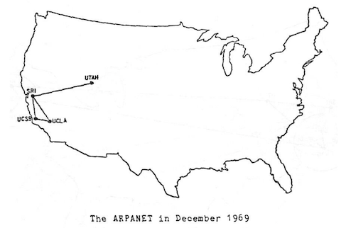
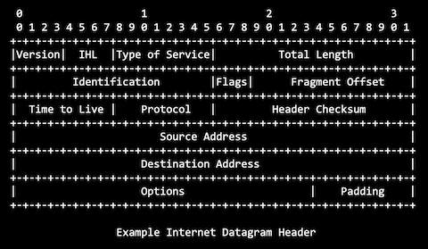
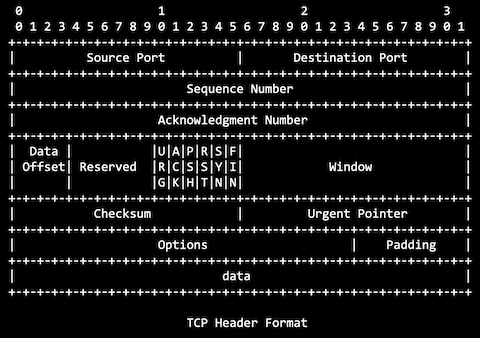
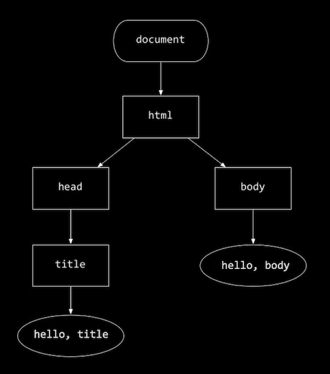

# Week 8: HTML, CSS, JavaScript

Instructor: **[David J. Malan](https://github.com/dmalan)**

---

## The Internet

- _Markup_ languages: `HTML`, `CSS`
- _Programming_ language: `JavaScript`

The `ARPANET`, a project from the US Department of Defence, connected the first points on the internet to one another.



A **router** - a device that connects two or more packet-switched networks or subnetworks.

---

## TCP/IP

**TCP/IP** - a pair of protocols:
- **IP** - Internet Protocol - every device has an IP address, you can share IP address. Standardize the data
in a packet, specifies the source and destination addresses. _Not guarantee delivery._
  - `#.#.#.#` - IPv4 format. Numeric dot-decimal notation (each between 0 and 255), 4 bytes or 32 bits.
  - `#.#.#.#.#.#.#.#` - IPv6 format. Alphanumeric hexadecimal notation. 128 bits.
- **TCP** "guarantees" the delivery of a packet. Make the sequence of packets.

Digital representation of a packet:



- Source address
- Destination address

Each package has a type indicator that identifies what is inside (message, video, archive, etc).

---

## Ports

Port number 
- `80` HTTP (Hypertext Transfer Protocol)
- `443` HTTPS (HTPSecure)
- ...




---

## DNS

Domain Name System Servers are another type of servers, naming system, specifies the IP address for the domain name.

DNS may fit the model of a dictionary with keys and values or a hash table:


| Fully Qualified Domain Name | IP Address |
|-----------------------------|------------|
| harvard.edu                 | #.#.#.#    |

---

## DHCP

Dynamic Host Configuration Protocol answers the question - _"What is my DNS server and router?"_, 
_"What IP address should I use?"_

---

## HTTP

Hypertext Transfer Protocol that governs how web browsers and web servers speak.

HTTPS uses encryption.

- `www` - World Wide Web, host name;
- `.com` - top level domain;
- `https` securely accessing the server;
- `https://www.example.com/` - root of a website, default folder;
- `https://www.example.com/path.html` - most servers hide `.html`;
- `https://www.example.com/folder/` - folder.

### Request server information

- `GET` - getting info;
- `POST` - sending info;
- ...

### `GET` example

Browser to server:

- `GET` / `HTTP` / `2`
- Host: `www.harvard.edu`
  - Key: host
  - Value: address
- ...

Server to browser:
- `HTTP`/ `2` `200`
- Content-Type: text/html
- ...

You can see the entire info through commandline:

```commandline
curl -I https://www.harvard.edu
```

- `curl` means connect to URL, command-line program simulates being a browser. Gets the package info only
without images.

```commandline
HTTP/2 200 
server: nginx
date: Fri, 25 Oct 2024 11:00:21 GMT
content-type: text/html; charset=UTF-8
vary: Accept-Encoding
x-hacker: If you're reading this, you should visit wpvip.com/careers and apply to join the fun, mention this header.
host-header: a9130478a60e5f9135f765b23f26593b
link: <https://www.harvard.edu/>; rel=shortlink
x-rq: ams5 111 254 443
accept-ranges: bytes
x-cache: HIT
cache-control: max-age=300, must-revalidate
```

---

## Developer tools

In the browser's private mode you have no history, no cookies, no sessions.

Let's open `network` in `developers tools`.

Without `www` we get this:
- Notice where was `HTTP/2 200` is now `HTTP/2 301`;

```commandline
curl -I https://harvard.edu
HTTP/2 301 
server: nginx
date: Fri, 25 Oct 2024 11:14:07 GMT
content-type: text/html; charset=utf-8
location: https://www.harvard.edu/
x-rq: ams5 111 254 443
x-cache: HIT
```


### Response codes

The most common codes:

- `200` OK

`3...` Redirects user to other places:
- `301` Moved Permanently - redirects to the default address
- `302` Found
- `304` Not Modified
- `304` Temporary Redirect

`4...` means troubles with user's request:
- `401` Unauthorized
- `403` Forbidden
- `404` Not Found
- `418` I'm a Teapot - joke

`5...` segfault (segmentation fault):
- `500` Internal Server Error
- `503` Service Unavailable

```commandline
$ curl -I http://safetyschool.org/
HTTP/1.1 301 Moved Permanently
Server: Sun-ONE-Web-Server/6.1
Date: Fri, 25 Oct 2024 11:32:44 GMT
Content-length: 122
Content-type: text/html
Location: http://www.yale.edu
Connection: close
```

---

## HTML

Markup text-based language. HTML is presenting information. Doesn't have functions and logic.

Has two vocabulary words:
- `tags`
- `attributes`

## hello.html

HTML sample:

```html
<!DOCTYPE html>

<html lang="en">
    <head>
        <title>
            hello, title
        </title>
    </head>
    <body>
        hello, body
    </body>
</html>
```

Command `http-server` zero-configuration command-line static HTTP server:

```commandline
http-server
Starting up http-server, serving ./

http-server settings: 
CORS: true
Cache: -1 seconds
Connection Timeout: 120 seconds
Directory Listings: visible
AutoIndex: not visible
Serve GZIP Files: false
Serve Brotli Files: false
Default File Extension: none

Available on:
  https://name-somenumbers-8080.app.github.dev
Hit CTRL-C to stop the server
```

When we follow the link, we get a directory listing:

```
Index of /
(-rw-------)	25-Oct-2024 14:44	166B	hello.html

http-server server running @ localhost:8080
```

Click on `hello.html` to see your site.

- `<html>` - html tag, start tag or open tag means start of something for browser;
- `<html lang="en">`
  - `lang` is an attribute. Everything after the tag name is an attribute;
  - `"en"` value of an attribute;
  - we have a key/value pair again.
- `</html>` - close tag or end tag:
  - forward slash `/` before the tag name means the end.

`html tag` has inside two elements inside:
- `<head>` head element;
  - `<title>` start of a page title;
- `<body>` body element.

Our `hello.html` code as a tree representation:



- `document` - the whole web page;
- `html` - a root element or an html element;
- `head` and `body` - two children;
- `title` child of a `title`;
- `hello, title` and `hello, body` - leaf notes or leaves, text notes.

Remember an email website: all new mails magically appear on the top of the "stack":
- all sites are working as a tree;
- JavaScript code is updating the tree for you to see the new mail.

## paragraphs.html

When we try to create paragraphs with the simple new line within code, it will create a plain text:

```html
<!DOCTYPE html>

<html lang="en">
    <head>
        <title>
            paragraphs
        </title>
    </head>
    <body>
        Lorem ipsum dolor sit amet, consectetur adipiscing elit, sed do eiusmod tempor incididunt ut labore et dolore magna aliqua. Ut enim ad minim veniam, quis nostrud exercitation ullamco laboris nisi ut aliquip ex ea commodo consequat. Duis aute irure dolor in reprehenderit in voluptate velit esse cillum dolore eu fugiat nulla pariatur. Excepteur sint occaecat cupidatat non proident, sunt in culpa qui officia deserunt mollit anim id est laborum.

        Lorem ipsum dolor sit amet, consectetur adipiscing elit, sed do eiusmod tempor incididunt ut labore et dolore magna aliqua. Ut enim ad minim veniam, quis nostrud exercitation ullamco laboris nisi ut aliquip ex ea commodo consequat. Duis aute irure dolor in reprehenderit in voluptate velit esse cillum dolore eu fugiat nulla pariatur. Excepteur sint occaecat cupidatat non proident, sunt in culpa qui officia deserunt mollit anim id est laborum.

        Lorem ipsum dolor sit amet, consectetur adipiscing elit, sed do eiusmod tempor incididunt ut labore et dolore magna aliqua. Ut enim ad minim veniam, quis nostrud exercitation ullamco laboris nisi ut aliquip ex ea commodo consequat. Duis aute irure dolor in reprehenderit in voluptate velit esse cillum dolore eu fugiat nulla pariatur. Excepteur sint occaecat cupidatat non proident, sunt in culpa qui officia deserunt mollit anim id est laborum.
    </body>
</html>
```

But if we use the special tag `<p>`, it will create a new line in our website:

```html
<!DOCTYPE html>

<html lang="en">
    <head>
        <title>
            paragraphs
        </title>
    </head>
    <body>
        <p>
            Lorem ipsum dolor sit amet, consectetur adipiscing elit, sed do eiusmod tempor incididunt ut labore et dolore magna aliqua. Ut enim ad minim veniam, quis nostrud exercitation ullamco laboris nisi ut aliquip ex ea commodo consequat. Duis aute irure dolor in reprehenderit in voluptate velit esse cillum dolore eu fugiat nulla pariatur. Excepteur sint occaecat cupidatat non proident, sunt in culpa qui officia deserunt mollit anim id est laborum.
        </p>
        <p>
            Lorem ipsum dolor sit amet, consectetur adipiscing elit, sed do eiusmod tempor incididunt ut labore et dolore magna aliqua. Ut enim ad minim veniam, quis nostrud exercitation ullamco laboris nisi ut aliquip ex ea commodo consequat. Duis aute irure dolor in reprehenderit in voluptate velit esse cillum dolore eu fugiat nulla pariatur. Excepteur sint occaecat cupidatat non proident, sunt in culpa qui officia deserunt mollit anim id est laborum.
        </p>
        <p>
            Lorem ipsum dolor sit amet, consectetur adipiscing elit, sed do eiusmod tempor incididunt ut labore et dolore magna aliqua. Ut enim ad minim veniam, quis nostrud exercitation ullamco laboris nisi ut aliquip ex ea commodo consequat. Duis aute irure dolor in reprehenderit in voluptate velit esse cillum dolore eu fugiat nulla pariatur. Excepteur sint occaecat cupidatat non proident, sunt in culpa qui officia deserunt mollit anim id est laborum.
        </p>
    </body>
</html>
```

## headings.html

Let's add headings to our paragraphs with `<h1>`, `<h2>`, `<h3>` tags:

```html
<!DOCTYPE html>

<html lang="en">
    <head>
        <title>
            headings
        </title>
    </head>
    <body>
        <h1>
            One
        </h1>
        <p>
            Lorem ipsum dolor sit amet, consectetur adipiscing elit, sed do eiusmod tempor incididunt ut labore et dolore magna aliqua. Ut enim ad minim veniam, quis nostrud exercitation ullamco laboris nisi ut aliquip ex ea commodo consequat. Duis aute irure dolor in reprehenderit in voluptate velit esse cillum dolore eu fugiat nulla pariatur. Excepteur sint occaecat cupidatat non proident, sunt in culpa qui officia deserunt mollit anim id est laborum.
        </p>
        <h2>
            Two
        </h2>
        <p>
            Lorem ipsum dolor sit amet, consectetur adipiscing elit, sed do eiusmod tempor incididunt ut labore et dolore magna aliqua. Ut enim ad minim veniam, quis nostrud exercitation ullamco laboris nisi ut aliquip ex ea commodo consequat. Duis aute irure dolor in reprehenderit in voluptate velit esse cillum dolore eu fugiat nulla pariatur. Excepteur sint occaecat cupidatat non proident, sunt in culpa qui officia deserunt mollit anim id est laborum.
        </p>
        <h3>
            Three
        </h3>
        <p>
            Lorem ipsum dolor sit amet, consectetur adipiscing elit, sed do eiusmod tempor incididunt ut labore et dolore magna aliqua. Ut enim ad minim veniam, quis nostrud exercitation ullamco laboris nisi ut aliquip ex ea commodo consequat. Duis aute irure dolor in reprehenderit in voluptate velit esse cillum dolore eu fugiat nulla pariatur. Excepteur sint occaecat cupidatat non proident, sunt in culpa qui officia deserunt mollit anim id est laborum.
        </p>
    </body>
</html>
```

## list.html

- `<ul>` - unordered list tag;
- `<ol>` - ordered list;
  - `<li>` - list item tag. 

```html
<!DOCTYPE html>

<html lang="en">
<head>
  <title>
    list
  </title>
</head>
<body>
<h2>Unordered list</h2>
<ul>
  <li>foo</li>
  <li>bar</li>
  <li>baz</li>
</ul>
<h2>Ordered list</h2>
<ol>
  <li>foo</li>
  <li>bar</li>
  <li>baz</li>
</ol>
</body>
</html>
```

## table.html

> #### Comments in HTML
> - `<!--` - start comment
> - `-->` - end comment
> ```html
> <!-- Comment here -->
> ```

- `<table>` - means table content inside;
  - `<tr>` - table row;
  - `<td>` - table data / table cell.

```html
<!DOCTYPE html>

<!-- Demonstrates table -->

<html lang="en">
    <head>
        <title>table</title>
    </head>
    <body>
        <table>
            <tr>
                <td>1</td>
                <td>2</td>
                <td>3</td>
            </tr>
            <tr>
                <td>4</td>
                <td>5</td>
                <td>6</td>
            </tr>
            <tr>
                <td>7</td>
                <td>8</td>
                <td>9</td>
            </tr>
            <tr>
                <td>*</td>
                <td>0</td>
                <td>#</td>
            </tr>
        </table>
    </body>
</html>
```

## image.html

`` - image tag, must contain an attribute with path to the image inside.
`src` - attribute for source;
`alt` - alternative attribute to describe the image.

```html
<!DOCTYPE html>

<!-- Demonstrates image -->

<html lang="en">
<head>
  <title>image</title>
</head>
<body>

</body>
</html>
```

## video.html

- `<video>` - video tag;
  - `controls` - video attribute, add control buttons on video;
  - `muted` - video attribute, mutes video by default;
- `<source>` - source children;
  - `type` - source attribute, helps specify type of the file.

```html
<!DOCTYPE html>

<!-- Demonstrates video -->

<html lang="en">
    <head>
        <title>video</title>
    </head>
    <body>
        <video controls muted>
            <source src="video.mp4" type="video /mp4">
        </video>
    </body>
</html>
```

## link.html

- `<a>` - anchor tag;
  - `href` - hyper reference attribute, needs an address.

```html
<!DOCTYPE html>

<!-- Demonstrates link -->

<html lang="en">
    <head>
        <title>link</title>
    </head>
    <body>
        Visit <a href="https://www.harvard.edu">Harvard</a>.
    </body>
</html>
```

## meta0.html

- `<meta>` - a tag within title;
  - `name`, `content` attributes helps to make a mobile friendly website;

```html
<!DOCTYPE html>

<!-- Demonstrates responsive design -->

<html lang="en">
    <head>
        <meta property="og:title">
        <title>meta</title>
    </head>
    <body>
        ...
    </body>
</html>
```

## meta1.html

- `<meta>` tags can create a "pretty" preview for your website when somebody shares it.

```html
<!DOCTYPE html>

<!-- Demonstrates Open Graph tags -->

<html lang="en">
    <head>
        <meta property="og:title" content="CS50">
        <meta property="og:description" content="Introduction to the intellectual enterprises of computer science and the art of programming.">
        <meta property="og:image" content="cat.jpg">
        <title>meta</title>
    </head>
    <body>
        ...
    </body>
</html>
```

## search.html

- `<form>` - form tag;
- `<input>` - input tag;
  - `autofocus` - makes focus by default on the input form;
  - `autocomplete="off"` - will not autocomplete user input;

```html
<!DOCTYPE html>

<html lang="en">
    <head>
        <title>search</title>
    </head>
    <body>
        <form action="https://www.google.com/search" method="get">
            <input autocomplete="off" autofocus name="q" placeholder="Query" type="search">
            <button>Google Search</button>
        </form>
    </body>
</html>
```

## regex

Regular expressions [guide](https://developer.mozilla.org/en-US/docs/Web/JavaScript/Guide/Regular_expressions).

- `type="email"` - attribute that prompt the user for an email only;
- `pattern` - inside this attribute you can place a regular expression or `regex`:
  - `.` any single character (except line terminators);
  - `*` zero or more times;
  - `+` one or more times;
  - `?` 0 or 1 time;
  - `{n}` n occurrences;
  - `{n,m}` at least n occurrences, at most m occurrences;
  - ...

`pattern=".+@.+\.edu"` = ". or any character --> one or more character before next sign / @ /
one or more character after previous sign / backslash escapes regex / .edu on the end of the input".

## register.html

```html
<!DOCTYPE html>

<html lang="en">
    <head>
        <title>register</title>
    </head>
    <body>
        <form>
            <input autocomplete="off" autofocus name="email" pattern=".+@.+\.edu" placeholder="Email" type="email">
            <button>Register</button>
        </form>
    </body>
</html>
```

> Developer tools within browser can help to avoid regex restrictions. So it is not safe to use them that way.
> Use client-side validation.

Character classes:
- `[0123456789]` any one of the enclosed characters;
- `[0-9]` any one of the range of characters;
- `\d` any digit;
- `\D` any character that is not a digit;
- ...

> Most common regular expression for validating email inputs nowadays:
> ```
> ^[a-zA-Z0-9.!#$%&'*+\/=?^_`{|}~-]+@[a-zA-Z0-9](?:[a-zA-Z0-9-]{0,61}[a-zA-Z0-9])?(?:\.[a-zA-Z0-9](?:[a-zA-Z0-9-]{0,61}[a-zA-Z0-9])?)*$
> ```

## Validator

[validator.w3.org](https://validator.w3.org/) - validator tool, a free web service from World Wide Web Consortium.
- choose "Validate by direct input" if you want to check your code.

[World Wide Web Consortium](https://www.w3.org/) (W3C) standardizes HTML language.

---

## CSS

**Cascading Style Sheets** is a style sheet language.

Attributes in **CSS** are called properties.

In **CSS**, you can specify selectors:
- `type selector` - name of the tag
- `class selector` - `.`
- `ID selector` - `#`
- `attribute selector`
- ...

There are a tag in **HTML** for `<style>` but you can include a separate **CSS** file within _header_:

```html
<html lang="en">
    <head>
        <link href="styles.css" rel="stylesheet">
        <title>
            hello, title
        </title>
    </head>
    <body>
        hello, body
    </body>
</html>
```

## home.html

We could add style in our HTML tags.

```html
<!DOCTYPE html>

<html lang="en">
    <head>
        <title>home</title>
    </head>
    <body style="text-align: center">
        <header style="font-size: large">
            John Harvard
        </header>
        <main style="font-size: medium">
            Welcome to my home page!
        </main>
        <footer style="font-size: small">
            Copyright &#169; John Harvard
        </footer>
    </body>
</html>
```

We could add style into header:

```html
<!DOCTYPE html>

<html lang="en">
    <head>
        <style>

            body
            {
                text-align: center;
            }

            header
            {
                font-size: large;
            }

            main
            {
                font-size: medium;
            }

            footer
            {
                font-size: small;
            }

        </style>
        <title>home</title>
    </head>
    <body>
        <header>
            John Harvard
        </header>
        <main>
            Welcome to my home page!
        </main>
        <footer>
            Copyright &#169; John Harvard
        </footer>
    </body>
</html>
```

### CSS Classes

You can create classes in CSS:
- `.` you can call them with the dot at the beginning

```html
<!DOCTYPE html>

<html lang="en">
<head>
  <style>
    .centered
    {
      text-align: center;
    }

    .large
    {
      font-size: large;
    }

    .medium
    {
      font-size: medium;
    }

    .small
    {
      font-size: small;
    }

  </style>
  <title>home</title>
</head>
<body class="centered">
<header class="large">
  John Harvard
</header>
<main class="madium">
  Welcome to my home page!
</main>
<footer class="small">
  Copyright &#169; John Harvard
</footer>
</body>
</html>
```

But let's make a separate CSS file for readability:

```html
<!DOCTYPE html>

<html lang="en">
    <head>
        <link href="home.css" rel="stylesheet">
        <title>home</title>
    </head>
    <body class="centered">
        <header class="large">
            John Harvard
        </header>
        <main class="madium">
            Welcome to my home page!
        </main>
        <footer class="small">
            Copyright &#169; John Harvard
        </footer>
    </body>
</html>
```

### Style an anchor tag

- `#` inside `<style>` before the name means id;
- `id="..."` within the tag means the id of that tag;

```html
<!DOCTYPE html>

<!-- Demonstrates link -->

<html lang="en">
    <head>
        <style>

            #harvard
            {
                color: red;
            }

            #yale
            {
                color: blue;
            }

            a
            {
                text-decoration: none;
            }

            a:hover
            {
                text-decoration: underline;
            }

        </style>
        <title>link</title>
    </head>
    <body>
        Visit <a href="https://www.harvard.edu" id="harvard">Harvard</a>
        or <a href="https://www.yale.edu" id="yale ">Yale</a>
    </body>
</html>
```

---

## Bootstrap

[Bootstrap](https://getbootstrap.com/docs/) - a free and open-source CSS framework directed at responsive,
mobile-first front-end web development. It contains HTML, CSS and JavaScript-based design templates for typography,
forms, buttons, navigation, and other interface components. [Wiki](https://en.wikipedia.org/wiki/Bootstrap_(front-end_framework))

Here is the phonebook without Bootstrap styling:

```html
<!DOCTYPE html>

<!-- Demonstrates table -->

<html lang="en">
    <head>
        <title>phonebook</title>
    </head>
    <body>
        <table>
            <thead>
                <tr>
                    <th>Name</th>
                    <th>Number</th>
                </tr>
            </thead>
            <tbody>
                <tr>
                    <td>Carter</td>
                    <td>+1-617-495-1000</td>
                </tr>
                <tr>
                    <td>David</td>
                    <td>+1-617-495-1000</td>
                </tr>
                <tr>
                    <td>John</td>
                    <td>+1-949-468-2750</td>
                </tr>
            </tbody>
        </table>
    </body>
</html>
```

And here is with Bootstrap:

```html
<!DOCTYPE html>

<!-- Demonstrates table with Bootstrap -->

<html lang="en">
    <head>
        <link href="https://cdn.jsdelivr.net/npm/bootstrap@5.3.2/dist/css/bootstrap.min.css" rel="stylesheet" integrity="sha384-T3c6CoIi6uLrA9TneNEoa7RxnatzjcDSCmG1MXxSR1GAsXEV/Dwwykc2MPK8M2HN" crossorigin="anonymous">
        <title>phonebook</title>
    </head>
    <body>
        <table class="table">
            <thead>
                <tr>
                    <th scope="col">Name</th>
                    <th scope="col">Number</th>
                </tr>
            </thead>
            <tbody>
                <tr>
                    <td>Carter</td>
                    <td>+1-617-495-1000</td>
                </tr>
                <tr>
                    <td>David</td>
                    <td>+1-949-468-2750</td>
                </tr>
            </tbody>
        </table>
    </body>
</html>
```

Our previous search.html with Bootstrap:

```html
<!DOCTYPE html>

<!-- Demonstrates layout with Bootstrap -->

<html lang="en">
    <head>
        <link href="https://cdn.jsdelivr.net/npm/bootstrap@5.3.2/dist/css/bootstrap.min.css" rel="stylesheet" integrity="sha384-T3c6CoIi6uLrA9TneNEoa7RxnatzjcDSCmG1MXxSR1GAsXEV/Dwwykc2MPK8M2HN" crossorigin="anonymous">
        <title>search</title>
    </head>
    <body>

        <div class="container-fluid">

            <ul class="m-3 nav">
                <li class="nav-item">
                    <a class="nav-link text-dark" href="https://about.google/">About</a>
                </li>
                <li class="nav-item">
                    <a class="nav-link text-dark" href="https://store.google.com/">Store</a>
                </li>
                <li class="nav-item ms-auto">
                    <a class="nav-link text-dark" href="https://www.google.com/gmail/">Gmail</a>
                </li>
                <li class="nav-item">
                    <a class="nav-link text-dark" href="https://www.google.com/imghp">Images</a>
                </li>
                <li class="nav-item">
                    <a class="nav-link text-dark" href="https://www.google.com/intl/en/about/products">
                        <svg xmlns="http://www.w3.org/2000/svg" width="16" height="16" fill="currentColor" class="bi bi-grid-3x3-gap-fill" viewBox="0 0 16 16">
                            <path d="M1 2a1 1 0 0 1 1-1h2a1 1 0 0 1 1 1v2a1 1 0 0 1-1 1H2a1 1 0 0 1-1-1V2zm5 0a1 1 0 0 1 1-1h2a1 1 0 0 1 1 1v2a1 1 0 0 1-1 1H7a1 1 0 0 1-1-1V2zm5 0a1 1 0 0 1 1-1h2a1 1 0 0 1 1 1v2a1 1 0 0 1-1 1h-2a1 1 0 0 1-1-1V2zM1 7a1 1 0 0 1 1-1h2a1 1 0 0 1 1 1v2a1 1 0 0 1-1 1H2a1 1 0 0 1-1-1V7zm5 0a1 1 0 0 1 1-1h2a1 1 0 0 1 1 1v2a1 1 0 0 1-1 1H7a1 1 0 0 1-1-1V7zm5 0a1 1 0 0 1 1-1h2a1 1 0 0 1 1 1v2a1 1 0 0 1-1 1h-2a1 1 0 0 1-1-1V7zM1 12a1 1 0 0 1 1-1h2a1 1 0 0 1 1 1v2a1 1 0 0 1-1 1H2a1 1 0 0 1-1-1v-2zm5 0a1 1 0 0 1 1-1h2a1 1 0 0 1 1 1v2a1 1 0 0 1-1 1H7a1 1 0 0 1-1-1v-2zm5 0a1 1 0 0 1 1-1h2a1 1 0 0 1 1 1v2a1 1 0 0 1-1 1h-2a1 1 0 0 1-1-1v-2z"/>
                        </svg>
                    </a>
                </li>
                <li class="nav-item">
                    <a class="btn btn-primary" href="https://accounts.google.com/ServiceLogin" role="button">Sign in</a>
                </li>
            </ul>

            <div class="text-center">

                <!-- https://knowyourmeme.com/memes/happy-cat -->
                

                <form action="https://www.google.com/search" class="mt-4" method="get">
                    <input autocomplete="off" autofocus class="form-control form-control-lg mb-4 mx-auto w-50" name="q" placeholder="Query" type="search">
                    <button class="btn btn-light">Google Search</button>
                    <button class="btn btn-light" name="btnI">I'm Feeling Lucky</button>
                </form>

            </div>

        </div>

    </body>
</html>
```

---

## Javascript

