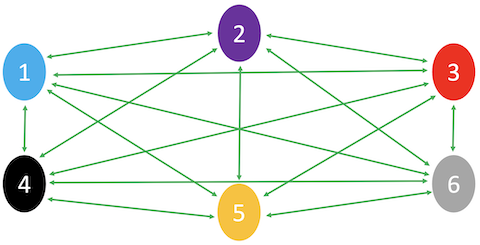
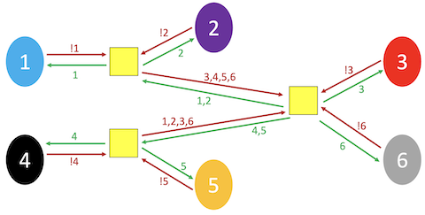
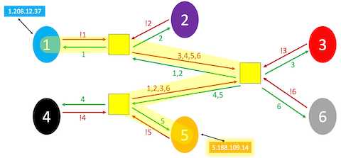
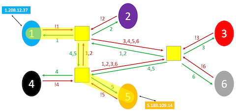

# IP

Instructor: **[Doug Lloyd](https://github.com/dlloyd09)**

---

## Internet Protocol (IP)

As discussed previously, “the Internet” is really an interconnected network comprised of smaller networks
woven together and agreeing to communicate with one another.
- How do these networks know how to communicate with one another? This is the responsibility
of the Internet Protocol (IP).

With only six networks, things are rapidly getting out of hand. And the modern Internet consists of a lot more
than six networks. We simply can’t afford to wire them together such that each directly connects with every other.

> But still, we need each network to be able to talk to each other network, or we end up with pieces of the network
> that are unable to speak to other parts of the network.
>
> This is where **routers** come back into play.

What if, instead of being connected to every other network, each network was connected to a limited number
of routers (each of which was connected to other nearby routers), and each router had instructions built
into it on how to move information toward its destination?

This information might be stored in a routing table, inside the router.

For this illustration, let’s assume each network has IP addresses in the range of n.x.x.x, where n
is its network number, and each x is in the range `[0, 255]`.

- `Networks` (ordered colored circles);
- `Routers` (yellow boxes);
- `Connections` (arrows).

Now the networks are not directly connected to each other at all, and rely on routers to distribute communications.

On a small scale, this configuration may actually be more inefficient than just having direct connections.

On a large scale, this configuration can dramatically reduce the costs of network infrastructure.

Assume that we want to send the data from network #1 to network #2, let's look at the probable path:
- Network #1 IP: `1.208.12.37`
- Network #2 IP: `5.188.109.14`

We could significantly raise the speed with additional connection between routers:

> In reality, if `1.208.12.37` (me) is sending an e-mail, FTP file transfer, or web browser request
> to `5.188.109.14` (you), the **_data isn’t being sent as one huge block_**.

Any slowdown that was caused by sending such a large amount of data would have a ripple effect that would throttle
the network for all the other users.

> Another crucial part of IP is splitting data into packets.
>
> IP is also known as a connectionless protocol. There is not necessarily a defined path from the sender
> to the receiver, and vice versa.

This means that in response to traffic that might be “clogging” up one particular path through the Internet,
some packets can be “re-routed” around the traffic jam to follow the most optimal path, based on the current
state of the network.

The routing table then probably consists of more information than just “where do I send this packet from here,”
but also information “what is the cost of using that particular route?”

> Another side of effect of being connectionless is that delivery cannot be guaranteed, since the path from 
> sender to receiver is not guaranteed to be consistent.
> 
> To avoid this issue we have
> **_Transmission Control Protocol_** (TCP).