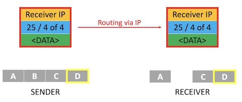

# TCP

Instructor: **[Doug Lloyd](https://github.com/dlloyd09)**

---

## Transmission Control Protocol (TCP)

If the Internet Protocol (IP) is thought of as the protocol for getting information from a sending machine
to a receiving machine, then Transmission Control Protocol (TCP) can be thought of as directing the transmitted
packet to the correct program on the receiving machine.

As you might imagine, it is important to be able to identify both where the receiver is and what the packet
is for, so TCP and IP are almost an inseparable pair: TCP/IP.

Each program/utility/service on a machine is assigned a port number. Coupled with an IP address, we can now
uniquely identify a specific program on a specific machine.

The other thing that TCP is crucial for is guaranteeing delivery of packets, which IP alone does not do.

TCP does this by including information about how many packets the receiver should expect to get, and in what order,
and transmitting that information alongside the data.

## Ports

Some ports are so commonly used that they have been standardized across all computers:
- FTP (file transfer) uses port 21.
- SMTP (e-mail) uses port 25.
- DNS uses port 53.
- HTTP (web browsing) uses port 80.
- HTTPS (secure web browsing) uses post 443.

## Steps of the TCP/IP process
1. When a program goes to send data, TCP breaks it into smaller chunks and communicates those packets
to the computer’s network software, adding a TCP layer onto the packet.
2. IP routes the individual packets from sender to receiver; this info is part of the IP layer surrounding the packet.
3. When the destination computer gets the packet, TCP looks at the header to see which program it belongs to;
and since the routes packets take may differ, TCP also must present those packets to the destination
program in the proper order.

---

Let's email from a sender to the receiver.

---

Our email is pretty small to break it into four packets: `A`, `B`, `C` and `D`.

---

We take the data from `A`.

---

- Then we wrap the data with TCP layer. Assume we have a port `25` and our data is piece 1 of 4;
- When we have all the info, we need to add the receiver address;
- Now we have one big data unit, that we cen send through the router network, using IP;
- Receiver get that piece of data and start to deconstruct it:
  1. Looks at the IP, the outside layer of this data, and check that it's his IP;
  2. Then look at the needed port, where he needs to receive the data;
  3. Check that it is the first part of 4 pieces.

---

Waits for other pieces.

---

There is no guarantee that the next piece of data will be `2`, it maybe `3`.

---

Assume we send the packet `4` and no data comes next. IP doesn't help with it.

But TCP knows that we received only 3 packets from 4, something is wrong.

---

TCP knows that we miss exactly packet `2` and makes a request in reverse direction.

---

When all the data received, we can assemble all of it together and interpret it as email.

---

If at any point along the way a router delivering information using the _Internet Protocol_ dropped a packet,
**_TCP_** would use additional information inside the headers to request that the sender pass along the extra packet
so it could complete assembly.

After the packets have arrived, **_TCP_** ensures they are organized the correct order and can then be reassembled
into the intended unit of data and delivered to the correct service.