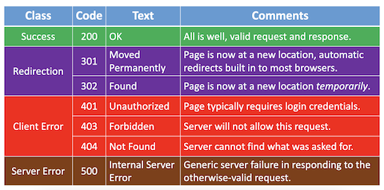

# HTTP

Instructor: **[Doug Lloyd](https://github.com/dlloyd09)**

---

In addition to protocols that dictate how information is communicated from machine to machine and application
to application (**IP** and **TCP**, respectively), it is frequently the case that the application itself has a system
of rules for how to interpret the data that was sent.

_**Hypertext Transfer Protocol**_ (HTTP) is one such example of an application layer protocol, which specifically
dictates the format by which clients request web pages from a server, and the format via which servers
return information to clients.

Other application layer protocols include:
- File Transfer Protocol (**FTP**)
- Simple Mail Transfer Protocol (**SMTP**)
- Data Distribution Service (**DDS**)
- Remote Desktop Protocol (**RDP**)
- Extensible Message and Presence Protocol (**XMPP**)

A line of the form:

| Method          | Request-target  | HTTP-version |
|-----------------|-----------------|--------------|
| `GET` or `POST` | Webpage address | `HTTP/1.1`   |

Is a simple example of an _HTTP request line_, a crucial part of an overall _HTTP request_ that
a client may make to a server.

_The host name_ (domain name of the server) is also included as a separate line of the overall HTTP request.

Taken together, _the host name_ and _the request target_ from the request line specify a specific resource being sought.

Based on whether the resource exists and whether the server is empowered to deliver that resource pursuant
to the client’s request, a number of status codes can result.

A _status code_ is part of the first line that a server will use to respond to an HTTP request:

| HTTP-version | Status                                    |
|--------------|-------------------------------------------|
| HTTP/1.1     | Status code: `200`, `301`, `404` or other |

Some status codes:

