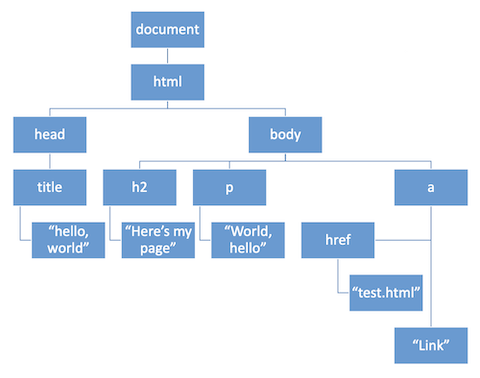

# DOM

Instructor: **[Doug Lloyd](https://github.com/dlloyd09)**

---

## Document Object Model

As we’ve seen, JavaScript objects are incredibly flexible, and can contain various fields, even when those fields
are other objects.

The _**document object**_ is one way of employing this paradigm, whereby that object organizes the entire contents
of a web page.

> By organizing an entire page into a JavaScript object, we can manipulate the page’s elements programmatically.

An example of simple HTML page:

```html
<html>
    <head>
        <title>Hello, world</title>
    </head>
    <body>
        <h2>Here’s my page</h2>
        <p>World, hello</p>
        <a href=“test.html”>Link</a>
    </body>
</html>
```

A tree structure of our page:



The document object itself, as well as all the objects contained within it, have a number of **properties**
and a number of **methods** that can be used to drill down to a very specific piece of your website.

By resetting those properties or calling certain methods, the contents of our web pages can change without us
needing to refresh the page.

---

## Console object

The Console object provides access to the browser’s debugging console. Go to the developer's tools in your browser,
choose console tab and type here methods you need. Let's have a look on one of them:

- `console.dir()` organizes the content of a page;

```commandline
console.dir(document)
```

You get the info about the document with all the children it have.

---

## DOM properties

| DOM Property | Description                                                    |
|--------------|----------------------------------------------------------------|
| `innerHTML`  | Holds the HTML inside a set of HTML tags.                      |
| `nodeName`   | The name of an HTML element or element’s attribute.            |
| `id`         | The “id” attribute of an HTML element.                         |
| `parentNode` | A reference to the node one level up in the DOM.               |
| `childNodes` | An array of references to the nodes one level down in the DOM. |
| `attributes` | An array of attributes of an HTML element.                     |
| `style`      | An object encapsulating the CSS/HTML styling of an element.    |

---

## DOM Methods

| DOM Method                  | Description                                                       |
|-----------------------------|-------------------------------------------------------------------|
| `getElementById(id)`        | Gets the element with a given ID below this point in the DOM.     |
| `getElementsByTagName(tag)` | Gets all elements with the given tag below this point in the DOM. |
| `appendChild(node)`         | Add the given node to the DOM below this point.                   |
| `removeChild(node)`         | Remove the specified child node from the DOM.                     |

If we start from document, we can get to any piece of our web page that we choose, through careful use
of DOM properties and methods.

---

## jQuery

Because DOM manipulation is so common with JavaScript, and because the JavaScript to do so can get quite lengthy,
people wanted alternatives.

jQuery is a popular open-source library, released in 2006, that is designed to simplify client-side scripting
(such as DOM manipulations).

```javascript
// Changes background color to green in JavaScript
document.getElementById('colorDiv').style.backgroundColor = 'green'
```

We can type a shorter line of the same code in jQuery:

```jquery
// Changes background color to green in jQuery
$(‘#colorDiv’).css(‘background-color’, ‘green’);
```

[jQuery Documentation](https://api.jquery.com)

---

## test.html

We can try to use several ways to change the background color:
1. Individual functions for background color
2. One single function for background color
3. Event handler for background color
4. jQuery for background color

```html
<!DOCTYPE html>

<html lang="en">
<head>
  <title>test</title>

  <!-- Four different ways of changing colors -->

  <!-- (a) Five separate color-changing functions -->
  <script src="js/five.js" type="text/javascript"></script>

  <!-- (b) One general color-changing function -->
  <script src="js/general.js" type="text/javascript"></script>

  <!-- (c) An event handler method -->
  <script src="js/event.js" type="text/javascript"></script>

  <!-- (d) Using jQuery only -->
  <script src="https://code.jquery.com/jquery-3.7.1.min.js" type="text/javascript"></script>
  <script src="js/jquerycolor.js" type="text/javascript"></script>

  <!-- CSS to format div -->
  <link href="css/div.css" rel="stylesheet" />

</head>
<body>
<div id="colorDiv">Change my color!</div>

<h3>Individual functions for background color</h3>
<div>
  <button onclick="turnPurple();">Purple</button>
  <button onclick="turnGreen();">Green</button>
  <button onclick="turnOrange();">Orange</button>
  <button onclick="turnRed();">Red</button>
  <button onclick="turnBlue();">Blue</button>
</div>

<h3>One single function for background color</h3>
<div>
  <button onclick="changeColor('purple')">Purple</button>
  <button onclick="changeColor('green');">Green</button>
  <button onclick="changeColor('orange');">Orange</button>
  <button onclick="changeColor('red');">Red</button>
  <button onclick="changeColor('blue');">Blue</button>
</div>

<h3>Event handler for background color</h3>
<div>
  <button onclick="changeColorEvent(event)">Purple</button>
  <button onclick="changeColorEvent(event)">Green</button>
  <button onclick="changeColorEvent(event)">Orange</button>
  <button onclick="changeColorEvent(event)">Red</button>
  <button onclick="changeColorEvent(event)">Blue</button>
</div>

<h3>jQuery for background color</h3>
<div>
  <button class="jQButton">Purple</button>
  <button class="jQButton">Green</button>
  <button class="jQButton">Orange</button>
  <button class="jQButton">Red</button>
  <button class="jQButton">Blue</button>
</div>
</body>
</html>
```

### 1. Individual functions for background color

```javascript
function turnPurple()
{
    document.getElementById('colorDiv').style.backgroundColor = 'purple';
}
function turnGreen()
{
    document.getElementById('colorDiv').style.backgroundColor = 'green';
}
function turnOrange()
{
    document.getElementById('colorDiv').style.backgroundColor = 'orange';
}
function turnRed()
{
    document.getElementById('colorDiv').style.backgroundColor = 'red';
}
function turnBlue()
{
    document.getElementById('colorDiv').style.backgroundColor = 'blue';
}
```

### 2. One single function for background color

```javascript
function changeColor(color)
{
    document.getElementById('colorDiv').style.backgroundColor = color;
}
```

### 3. Event handler for background color

```javascript
function changeColorEvent(event)
{
    var triggerObject = event.srcElement;
    document.getElementById('colorDiv').style.backgroundColor = triggerObject.innerHTML.toLowerCase();
}
```

### 4. jQuery for background color

```javascript
// When the document is fully loaded run anonymous function()
$(document).ready(function() {
    // When button is clicked run anonymous function()
    $('.jQButton').click(function() {
        $('#colorDiv').css('background-color', this.innerHTML.toLowerCase());
    });
});
```

> **Attention**
> To make jQuery work, you need to load the library:
> ```html
> <script src="https://code.jquery.com/jquery-3.7.1.min.js" type="text/javascript"></script>
> ```
> Check the latest releases [here](https://blog.jquery.com/).