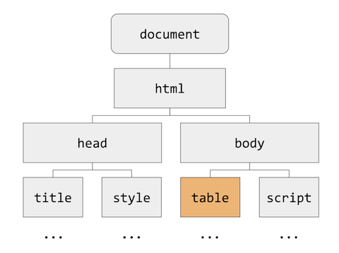
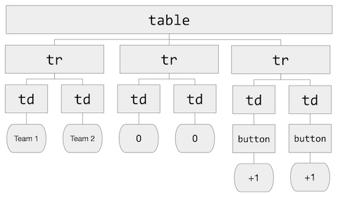

# Week 8: HTML, CSS, JavaScript / Section

Preceptor: **Julia**

---

## scoreboard0.html

We have a simple score page with two columns: "Team 1" and "Team 2". 

On this page right now we can:
- track the score;
- add points to the team.

```html
<!DOCTYPE html>
<html lang="en">
    <head>
        <title>Scoreboard</title>
        <style>

            table {
                border: 2px solid black;
                border-collapse: collapse;
                margin-left: auto;
                margin-right: auto;
                text-align: center;
            }

            td {
                border: 2px solid black;
            }
            
        </style>
    </head>
    <body>

        <table>
            <tr>
                <td>Team 1</td>
                <td>Team 2</td>
            </tr>
            <tr>
                <td id="score1">0</td>
                <td id="score2">0</td>
            </tr>
            <tr>
                <td>
                    <button id="add1">+1</button>
                </td>
                <td>
                    <button id="add2">+1</button>
                </td>
            </tr>
        </table>

        <script>
            let team1 = 0;
            let team2 = 0;

            document.querySelector('#add1').onclick = function() {
                team1 = team1 + 1;
                document.querySelector('#score1').innerHTML = team1;
            }

            document.querySelector('#add2').onclick = function() {
                team2 = team2 + 1;
                document.querySelector('#score2').innerHTML = team2;
            }

    </script>
  </body>
</html>
```

The **tree structure** or **DOM** for "scoreboard":



Let's have a closer look at the "table" in "body":



---

## Adding `elements`

`scoreboard1.html`

- `<main>`
- `<header>`
- `<footer>`
- `<h1>`
- `<p>`

```html
<!DOCTYPE html>
<html lang="en">
    <head>
        <title>Scoreboard</title>
        <style>

            table {
                border: 2px solid black;
                border-collapse: collapse;
                margin-left: auto;
                margin-right: auto;
                text-align: center;
            }

            td {
                border: 2px solid black;
            }
        </style>
    </head>
    <body>

        <!-- Title of a page -->
        <header>
            <h1> Left Team vs. Right Team </h1>
            <p> Click a button to change the score. </p>
        </header>

        <!-- Main part of a page -->
        <main>
            <table>
                <tr>
                    <td>Team 1</td>
                    <td>Team 2</td>
                </tr>
                <tr>
                    <td id="score1">0</td>
                    <td id="score2">0</td>
                </tr>
                <tr>
                    <td>
                        <button id="add1">+1</button>
                    </td>
                    <td>
                        <button id="add2">+1</button>
                    </td>
                </tr>
            </table>
        </main>

        <!-- Bottom of the page -->
        <footer>
            <p> Made by CS50 </p>

        </footer>

        <script>
            let team1 = 0;
            let team2 = 0;

            document.querySelector('#add1').onclick = function() {
                team1 = team1 + 1;
                document.querySelector('#score1').innerHTML = team1;
            }

            document.querySelector('#add2').onclick = function() {
                team2 = team2 + 1;
                document.querySelector('#score2').innerHTML = team2;
            }

        </script>
    </body>
</html>
```

Now our page is more readable and consistent.

---

## CSS

`scoreboard2.html`
Let's make our scoreboard more pretty with CSS.

```css
/* CSS basic template */
selector
{
    property: value;
    property: value;
}

/* We can assign ID in .html and change elements with this ID in CSS. Use unique ID. */
#score1
{
    ...
}

/* We can use classes */
.team
{
    ...
}
```

### `id` and `type` selectors

Let's add some colors to our table:
- `color`
- `background-color`
- `text-align`

```html
<!DOCTYPE html>
<html lang="en">
    <head>
        <title>Scoreboard</title>
        <style>

            table {
                border: 2px solid black;
                border-collapse: collapse;
                margin-left: auto;
                margin-right: auto;
                text-align: center;
            }

            td {
                border: 2px solid black;
            }

            p {
                text-align: center;
            }

            .team {
                background-color: #DC143C;
            }

            #score1 {
                color: #DC143C;
            }

            #score2 {
                color: #0f4d92;
            }

            #add1 {
                color: #DC143C;
            }

            #add2 {
                color: #0f4d92;
            }

        </style>
    </head>
    <body>

        <!-- Title of a page -->
        <header>
            <h1> Left Team vs. Right Team </h1>
            <p> Click a button to change the score. </p>
        </header>

        <!-- Main part of a page -->
        <main>
            <table>
                <tr>
                    <td class="team">Team 1</td>
                    <td class="team">Team 2</td>
                </tr>
                <tr>
                    <td id="score1">0</td>
                    <td id="score2">0</td>
                </tr>
                <tr>
                    <td>
                        <button id="add1">+1</button>
                    </td>
                    <td>
                        <button id="add2">+1</button>
                    </td>
                </tr>
            </table>
        </main>

        <!-- Bottom of the page -->
        <footer>
            <p> Made by CS50 </p>

        </footer>

        <script>
            let team1 = 0;
            let team2 = 0;

            document.querySelector('#add1').onclick = function() {
                team1 = team1 + 1;
                document.querySelector('#score1').innerHTML = team1;
            }

            document.querySelector('#add2').onclick = function() {
                team2 = team2 + 1;
                document.querySelector('#score2').innerHTML = team2;
            }

        </script>
    </body>
</html>
```

---

## JavaScript

Let's have a look on JavaScript that we already have in our scoreboard:

```html
<script>
    // Creates two variables
    let team1 = 0;
    let team2 = 0;

    // Look at id "add1" and when it clicked run function()
    document.querySelector('#add1').onclick = function()
    {
        // Add "1" to variable
        team1 = team1 + 1;
        document.querySelector('#score1').innerHTML = team1;
    }

    document.querySelector('#add2').onclick = function()
    {
        team2 = team2 + 1;
        document.querySelector('#score2').innerHTML = team2;
    }
</script>
```

- `document.querySelector('#add1').onclick = function()`
  - `#add1` is an ID. We are looking through the entire document for this ID;
  - `onclick` once the element with our ID is clicked;
  - `function()` call the function.

- `document.querySelector('#score1').innerHTML`
  - looking for ID '#score1';
  - `innerHTML` going into HTML tag with that ID;
  - do the necessary changes with it.
  
> `querySelector()` and `getElementById()` are _interchangeable_.
> 
> The difference is that `getElementById()` works only with ID, when `querySelector()` accepts ID, classes and tags.

### `scoreboard2.html`

Let's alert the user when a team has won the game with a certain number of points (5).

```html
<!DOCTYPE html>
<html lang="en">
    <head>
        <title>Scoreboard</title>
        <style>

            table {
                border: 2px solid black;
                border-collapse: collapse;
                margin-left: auto;
                margin-right: auto;
                text-align: center;
            }

            td {
                border: 2px solid black;
            }

            p {
                text-align: center;
            }

            .team {
                background-color: #DC143C;
            }

            #score1 {
                color: #DC143C;
            }

            #score2 {
                color: #0f4d92;
            }

            #add1 {
                color: #DC143C;
            }

            #add2 {
                color: #0f4d92;
            }

        </style>
    </head>
    <body>

        <!-- Title of a page -->
        <header>
            <h1> Left Team vs. Right Team </h1>
            <p> Click a button to change the score. </p>
        </header>

        <!-- Main part of a page -->
        <main>
            <table>
                <tr>
                    <td class="team">Team 1</td>
                    <td class="team">Team 2</td>
                </tr>
                <tr>
                    <td id="score1">0</td>
                    <td id="score2">0</td>
                </tr>
                <tr>
                    <td>
                        <button id="add1">+1</button>
                    </td>
                    <td>
                        <button id="add2">+1</button>
                    </td>
                </tr>
            </table>
        </main>

        <!-- Bottom of the page -->
        <footer>
            <p> Made by CS50 </p>

        </footer>

        <script>
            let team1 = 0;
            let team2 = 0;

            document.querySelector('#add1').onclick = function() {
                team1 = team1 + 1;
                document.querySelector('#score1').innerHTML = team1;

                // Alert the user if the team won
                if (team1 == 5)
                {
                    alert("Team 1 won!");
                }
            }

            document.querySelector('#add2').onclick = function() {
                team2 = team2 + 1;
                document.querySelector('#score2').innerHTML = team2;

                // Alert the user if the team won
                if (team2 == 5)
                {
                    alert("Team 2 won!");
                }
            }

        </script>
    </body>
</html>
```

### `scoreboard3.html`

Now let's get rid of an alert and add a message.

```html
<!DOCTYPE html>
<html lang="en">
<head>
    <title>Scoreboard</title>
    <style>

        table {
            border: 2px solid black;
            border-collapse: collapse;
            margin-left: auto;
            margin-right: auto;
            text-align: center;
        }

        td {
            border: 2px solid black;
        }

        p {
            text-align: center;
        }

        .team {
            background-color: #DC143C;
        }

        #score1 {
            color: #DC143C;
        }

        #score2 {
            color: #0f4d92;
        }

        #add1 {
            color: #DC143C;
        }

        #add2 {
            color: #0f4d92;
        }

    </style>
</head>
<body>

<!-- Title of a page -->
<header>
    <h1> Left Team vs. Right Team </h1>
    <p> Click a button to change the score. </p>

    <!-- Declares an empty paragraph with a result -->
    <p id="result"></p>
</header>

<!-- Main part of a page -->
<main>
    <table>
        <tr>
            <td class="team">Team 1</td>
            <td class="team">Team 2</td>
        </tr>
        <tr>
            <td id="score1">0</td>
            <td id="score2">0</td>
        </tr>
        <tr>
            <td>
                <button id="add1">+1</button>
            </td>
            <td>
                <button id="add2">+1</button>
            </td>
        </tr>
    </table>
</main>

<!-- Bottom of the page -->
<footer>
    <p> Made by CS50 </p>

</footer>

<script>
    let team1 = 0;
    let team2 = 0;

    document.querySelector('#add1').onclick = function() {
        team1 = team1 + 1;
        document.querySelector('#score1').innerHTML = team1;

        // Alert the user if the team won
        if (team1 == 5)
        {
            document.querySelector('#result').innerHTML = "Team 1 Won!";
        }
    }

    document.querySelector('#add2').onclick = function() {
        team2 = team2 + 1;
        document.querySelector('#score2').innerHTML = team2;

        // Alert the user if the team won
        if (team2 == 5)
        {
            document.querySelector('#result').innerHTML = "Team 2 Won!";
        }
    }

</script>
</body>
</html>
```

- `<p id="result"></p>` adds an empty element;
- `document.querySelector('#result').innerHTML = "Team 2 Won!";` creates a message.

### `scoreboard4.html`

Let's make our code shorter and more readable. We can make separate .css file.
- `<link href="css/styles.css" rel="stylesheet" />`

```html
<!DOCTYPE html>
<html lang="en">
    <head>
        <title>Scoreboard</title>
        
        <!-- Link CSS file -->
        <link href="css/styles.css" rel="stylesheet" />
        
    </head>
    <body>

        <!-- Title of a page -->
        <header>
            <h1> Left Team vs. Right Team </h1>
            <p> Click a button to change the score. </p>

            <!-- Declares an empty paragraph with a result -->
            <p id="result"></p>
        </header>

        <!-- Main part of a page -->
        <main>
            <table>
                <tr>
                    <td class="team">Team 1</td>
                    <td class="team">Team 2</td>
                </tr>
                <tr>
                    <td id="score1">0</td>
                    <td id="score2">0</td>
                </tr>
                <tr>
                    <td>
                        <button id="add1">+1</button>
                    </td>
                    <td>
                        <button id="add2">+1</button>
                    </td>
                </tr>
            </table>
        </main>

        <!-- Bottom of the page -->
        <footer>
            <p> Made by CS50 </p>

        </footer>

        <script>
            let team1 = 0;
            let team2 = 0;

            document.querySelector('#add1').onclick = function() {
                team1 = team1 + 1;
                document.querySelector('#score1').innerHTML = team1;

                // Alert the user if the team won
                if (team1 == 5)
                {
                    // alert("Team 1 won!");
                    document.querySelector('#result').innerHTML = "Team 1 Won!";
                }
            }

            document.querySelector('#add2').onclick = function() {
                team2 = team2 + 1;
                document.querySelector('#score2').innerHTML = team2;

                // Alert the user if the team won
                if (team2 == 5)
                {
                    // alert("Team 2 won!");
                    document.querySelector('#result').innerHTML = "Team 2 Won!";
                }
            }

        </script>
    </body>
</html>
```