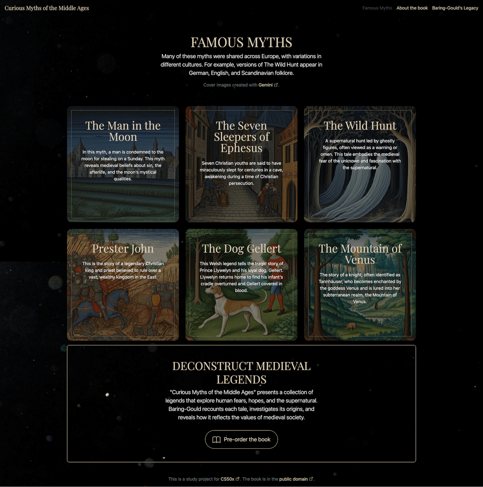

# Problem set 8: Homepage

I developed a webpage dedicated to the book **"Curious Myths of the Middle Ages"** by **Sabine Baring-Gould**.

The website is built using [Bootstrap](https://getbootstrap.com/), ensuring the content works on desktops, tablets, and smartphones. The Bootstrap original templates were customized to better fit the visual style.

The webpage includes:

- 4 pages: `index.html`, `myths.html`, `book.html`, `author.html`
- A comprehensive list of all HTML tags and CSS properties used, which you can view [here](https://github.com/raydtutto/harvard-cs50x-2024/blob/main/src/week_8_html_css_javascript/problem_set_8/homepage/specification.txt).
- Custom-designed layouts across all pages, with illustrations generated using [Gemini](https://gemini.google.com/) and video backgrounds sourced from [Pexels](https://www.pexels.com/).

### [index.html](https://github.com/raydtutto/harvard-cs50x-2024/blob/main/src/week_8_html_css_javascript/problem_set_8/homepage/index.html)

### [myths.html](https://github.com/raydtutto/harvard-cs50x-2024/blob/main/src/week_8_html_css_javascript/problem_set_8/homepage/myths.html)

### [book.html](https://github.com/raydtutto/harvard-cs50x-2024/blob/main/src/week_8_html_css_javascript/problem_set_8/homepage/book.html)

### [author.html](https://github.com/raydtutto/harvard-cs50x-2024/blob/main/src/week_8_html_css_javascript/problem_set_8/homepage/author.html)

### Modal windows

